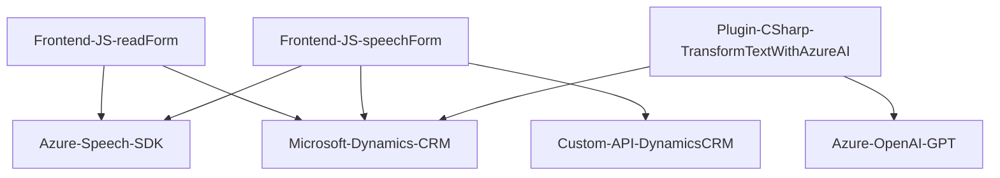

### Breve resumen técnico
El repositorio parece estar diseñado para ofrecer una solución combinada que interactúa con Microsoft Dynamics CRM para gestión de datos, dinámica de voz y reconocimiento/transcripción utilizando Azure Speech SDK y Azure OpenAI. Incluye dos componentes principales basados en frontend (JavaScript) y un backend (plugin para Dynamics CRM en C#).

---

### Descripción de arquitectura
El repositorio utiliza una **arquitectura de integración modular entre frontend y backend**. Los archivos de frontend trabajan con APIs y SDK locales (Azure Speech), mientras que el backend, implementado como un plugin de Dynamics CRM, se encarga de procesar entradas y transformarlas usando Azure OpenAI. La solución podría calificarse como un **Monolito extendido** dado que la lógica del backend se encuentra dentro del ambiente CRM, y el frontend interactúa en tiempo real para mantener sincronización.

---

### Tecnologías usadas
1. **Frontend (JavaScript):**
   - Azure Speech SDK: Reconocimiento y síntesis de voz.
   - Dynamics CRM API: Manipulación de formularios y datos.

2. **Backend (C#):**
   - Dynamics CRM SDK: Para desarrollo de plugins.
   - Azure OpenAI: Procesamiento mediante GPT (uso de modelos avanzados como GPT-4).

3. **Patrones de desarrollo:**
   - Modularidad y separación de intereses: Por ejemplo, funciones de extracción visibles (`getVisibleFieldData` en JS) versus funciones de actualización masiva (`Execute` en C#).
   - SDK wrappers: Aprovechamiento de SDKs externos (Azure Speech y Dynamics CRM) encapsulados en métodos específicos.
   - Service-Oriented Architecture (SOA): Integración con servicios cloud como Azure OpenAI a través de APIs REST.

---

### Dependencias o componentes externos
1. **Azure Speech SDK:** Utilizado para reconocimiento y síntesis de voz.
2. **Azure OpenAI (GPT):** Procesamiento inteligente para transformación automática de texto.
3. **Dynamics CRM APIs:** Manipulación contextualmente dependiente del modelo CRM-WebApi y sus plugins.
4. **HTTP Client libraries:** Para establecer comunicación con servicios REST externos (como OpenAI).

---

### Diagrama Mermaid válido para GitHub Markdown

---

### Conclusión final
La solución es una combinación de frontend y backend altamente integrada dentro de un entorno Dynamics CRM. El frontend interactúa con el navegador y SDKs externos para transcribir, sintetizar voz, y actualizar formularios dinámicamente. El backend complementa esta funcionalidad procesando información avanzada con Azure OpenAI. La arquitectura es efectiva pero depende de múltiples servicios externos (Azure Speech, OpenAI), lo que introduce dependencias cruciales que deben gestionarse cuidadosamente.