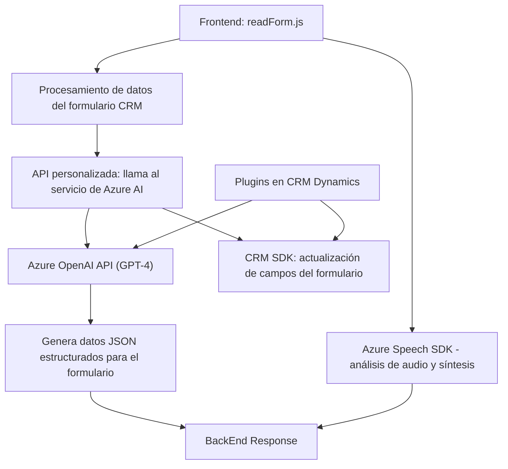

### Análisis técnico del repositorio

---

#### **Breve resumen técnico**
Este repositorio integra tecnologías diversas para implementar una solución empresarial basada en reconocimiento de voz, interacción por voz en formularios, y procesamiento de texto con **Azure AI** en un **CRM Dynamics 365**. Está compuesto por múltiples módulos repartidos entre frontend (JavaScript) y backend (C# plugins), utilizando arquitectura modular y servicios externos.

---

#### **Descripción de arquitectura**
La solución utiliza un **modelo de integración de servicios externos** y combina patrones **n-capas** para la separación de frontend, backend y servicios externos. La arquitectura está estructurada como sigue:
1. **Frontend en JavaScript**: Procesa la interacción de usuario con formularios (entrada y salida por voz) utilizando **Azure Speech SDK**.
2. **Backend en C# (Plugins)**: Extiende la funcionalidad del CRM mediante lógica personalizada con integración **Azure OpenAI** para estructuración dinámica de datos.
3. **Dependencias externas**:
   - Azure Speech SDK para reconocimiento y síntesis de voz.
   - Azure OpenAI (GPT-4) para modelar estructura de texto.
   - CRM Dynamics como plataforma principal.

El enfoque **Event-Driven** aparece principalmente en los scripts frontend, mientras que los plugins muestran separación estricta de responsabilidades. La solución sugiere **arquitectura híbrida**, ya que las funcionalidades están distribuidas entre clientes (JavaScript en frontend) y microservicio (Azure AI).

---

#### **Tecnologías usadas**
1. **Front-end**:
   - **JavaScript** para lógica de interacción.
   - Uso del pattern **Dynamic SDK loading** para cargar Azure Speech SDK en tiempo de ejecución.
   
2. **Back-end (Dynamics CRM)**:
   - **C#** con SDK de Dynamics CRM (`Microsoft.Xrm.Sdk`) para plugins.
   - **System.Net.Http** para realizar solicitudes a Azure OpenAI.
   - **Newtonsoft.Json.Linq** para manipulación avanzada de JSON.

3. **Servicios externos**:
   - **Azure Speech SDK** para reconocimiento de voz y síntesis.
   - **Azure OpenAI** (GPT-4) para procesamiento y transformación de texto.

---

#### **Diagrama Mermaid**

---

### **Conclusión Final**
Este repositorio contiene tres piezas principales de una solución empresarial interactiva diseñada para utilizar servicios AI y reconocimiento de voz en un entorno CRM:

1. **Tipo de solución:** Una combinación de **frontend interactivo basado en entrada/salida de voz (WUI)** con complementos backend para un sistema de **CRM Dynamics** interoperable mediante API y servicios externos.
2. La arquitectura utiliza una mezcla de **arquitectura n-capas** para frontend y backend dentro de una solución de integración de servicios externos, incluyendo comunicación con servicios basados en **Azure**.
3. Tecnologías clave en el repositorio: **Azure Speech SDK**, **Azure OpenAI GPT-4**, y **Dynamics CRM SDK**. 
4. Los patrones aplicados son de tipo **modularidad**, **event-driven design** en frontend, y **plugin architecture** en el backend.
