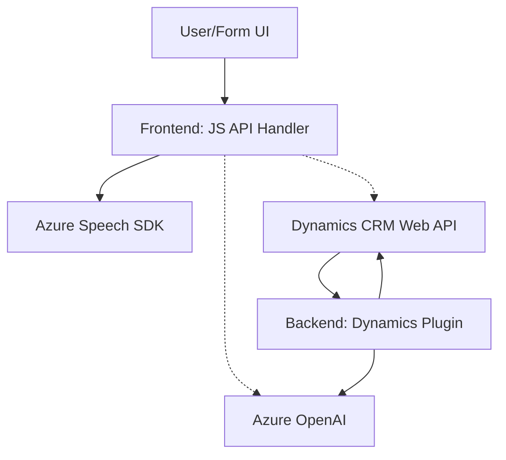

# Breve Resumen Técnico
El repositorio analiza soluciones para la gestión y transformación de datos en aplicaciones CRM de Dynamics 365, integrando funcionalidades de voz y procesamiento de texto mediante Azure Speech SDK y Azure OpenAI. Los archivos se dividen en una parte frontend que interactúa con servicios de síntesis y API personalizada, y una parte backend que implementa un plugin para procesamiento avanzado de texto.

---

# Descripción de Arquitectura
La solución tiene una arquitectura híbrida compuesta por:
1. **Frontend**:
   - Implementa lógica de presentación y comunicación con los servicios `Azure Speech SDK` y APIs personalizadas alojadas en el backend de Dynamics 365.
   - Modularizado con funciones para:
     - Extracción de datos de formularios.
     - Conversión de texto hablado a texto escrito y viceversa.
     - Normalización y asignación de valores en campos de Dynamics CRM.

2. **Backend**:
   - Basado en la **arquitectura de plugin** de Microsoft Dynamics CRM.
   - Extiende la lógica CRM mediante el plugin `TransformTextWithAzureAI`, que utiliza Azure OpenAI para transformar texto y generar contenido estructurado en JSON.
   - Maneja solicitudes HTTP hacia Azure y operaciones de CRM mediante `OrganizationService`.

---

# Tecnologías Usadas
1. **Frontend**:
   - **Lenguajes:** JavaScript.
   - **Servicios:** Azure Speech SDK.
   - **Dependencias**: Contexto de formularios de Dynamics; servicios externos como APIs personalizadas.

2. **Backend**:
   - **Lenguajes:** C#.
   - **Framework:** Dynamics CRM SDK.
   - **Servicios:** Azure OpenAI.
   - **Dependencias:** Newtonsoft.Json, System.Net.Http.

3. **Patrones**:
   - Estructura Modular (Frontend).
   - Facade para encapsular llamadas externas a APIs.
   - Inyección de dependencias y extensibilidad en CRM (Backend).

---

# Diagrama Mermaid válido para GitHub

---

# Conclusión Final
### Valor técnico:
La solución está bien estructurada, utiliza servicios robustos (Azure Speech SDK y Azure OpenAI) y muestra un diseño modular, facilitando el mantenimiento. Combina una arquitectura de **n capas** (frontend, backend) con patrones propios de **plugins** en Dynamics CRM, extendiendo las capacidades predeterminadas del CRM.

### Áreas de mejora:
1. **Gestión de credenciales/API keys**:
   - Implementar un sistema más seguro para almacenar las claves y endpoints sensibles.
   - Utilizar `Azure Key Vault` o variables de entorno en lugar de incluirlas directamente en el código.

2. **Manejo de errores**:
   - Ampliar las validaciones de entrada y las respuestas para evitar errores de ejecución por datos inválidos.

3. **Performance**:
   - La carga dinámica del SDK puede causar retrasos; podría optimizarse pre-cargando recursos clave según la predicción de uso.

La solución es un ejemplo práctico de cómo integrar servicios externos de nube con funcionalidades de CRM para potenciar la experiencia del usuario y mejorar los flujos de trabajo empresariales.