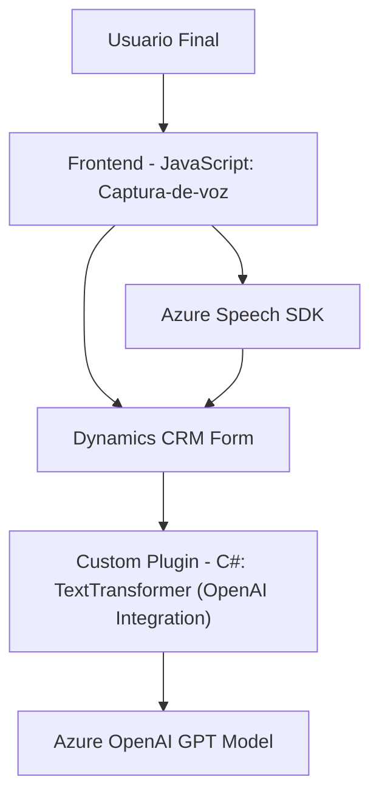

### Breve resumen técnico

La solución presentada abarca una arquitectura orientada a integrar **Dynamics 365** con servicios externos de Microsoft Azure (Speech SDK y OpenAI). Está estructurada para la interacción bidireccional entre usuarios y formularios dinámicos, utilizando entrada y procesamiento de voz, así como operaciones avanzadas de transformación de texto.

---

### Descripción de la arquitectura

La arquitectura empleada es híbrida:
1. **Componentes del Frontend:** Procesan datos provenientes de formularios utilizando funciones básicas de SDK en el navegador, incluyendo captura de voz (por Azure Speech SDK) y manipulación directa de atributos del CRM.
   
2. **Backend con Plugins:** Utilizan una arquitectura **de extensibilidad tipo plugin** en Dynamics CRM. Procesan datos más avanzados con soporte de servicios externos como **Azure OpenAI** y responden al flujo de trabajo del CRM.

3. **Patrones utilizados:**
   - **Event Triggered Architecture:** Los plugins y el frontend responden a eventos dentro del sistema, como la activación de botones o entrada de voz.
   - **Conversión de Entrada-Voz:** Se utiliza el patrón **Adaptador** para traducir la entrada de voz a texto estructurado acorde con los campos del CRM.
   - **Microservicios API:** Los componentes interactúan con servicios externos como Azure Speech SDK y Azure OpenAI, siguiendo un modelo orientado a microservicios para delegar funcionalidades específicas fuera del núcleo.

---

### Tecnologías usadas

1. **Frontend:**
   - **JavaScript/Node.js:** Para lógica procesal en el navegador, como captura de voz y manejo de campos CRM.
   - **Azure Speech SDK:** Integración directa con el servicio de síntesis y reconocimiento de voz.
   - **Dynamics 365 Form Integration:** Acceso a `formContext` y parámetros del modelo.

2. **Backend:**
   - **Microsoft Dynamics CRM SDK:** Para acceso y manipulación de datos dinámicos del CRM (`IOrganizationService`, manejo de plugins).
   - **Azure OpenAI GPT Service:** Procesamiento de texto avanzado, implementado para transformar entrada a datos JSON.
   - **.NET Framework/C#:** Para elaborar plugins personalizados.
   - **Newtonsoft.Json y System.Text.Json:** Utilizados para manejo de datos en formato JSON.

---

### Diagrama **Mermaid**

---

### Conclusión final

La solución presentada es una **arquitectura híbrida** que combina herramientas entre el frontend y el backend. Utiliza microservicios conectados a **Azure Speech SDK** para captura y síntesis de voz. Además, emplea servicios altamente especializados como el plugin de procesamiento de texto con **Azure OpenAI**. Esto permite una integración fluida de inteligencia artificial y voz en sistemas CRM dinámicos. Es una solución elegante que separa claramente las responsabilidades haciendo uso de patrones modernos como adaptación e integración externa.