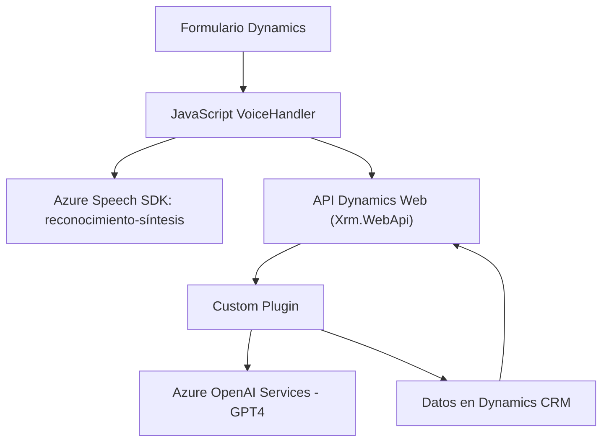

# Análisis y Explicación Técnica del Repositorio

## Breve Resumen Técnico
El repositorio analizado pertenece a una solución que integra reconocimiento de voz, síntesis de voz, transformación de texto mediante IA y manipulación de formularios en la plataforma Dynamics 365. La solución utiliza una combinación de componentes frontend con JavaScript, un plugin en C# que opera sobre Dynamics 365, y servicios externos como Azure Speech SDK y Azure OpenAI Service para implementar funcionalidades avanzadas relacionadas con inteligencia artificial.

---

## Descripción de la Arquitectura
La arquitectura de esta solución es híbrida, combinando un modelo **cliente-servidor (frontend)** con una integración extensiva en una plataforma de terceros (Dynamics 365) y servicios proporcionados por cloud computing (Azure Speech SDK y Azure OpenAI). La conexión entre estos componentes es diseñada siguiendo patrones específicos:
1. **Cliente (JavaScript Frontend)**: El código frontend se ejecuta en un navegador mientras interactúa con los Formularios de Dynamics 365 y servicios externos como el Azure Speech SDK mediante APIs.
2. **Servidor (C# Plugin)**: Un plugin para manipular datos y realizar transformaciones adicionales utilizando reglas y una REST API basada en un modelo GPT en Azure OpenAI.
3. **Comunicación API**:
    - El plugin llama al servicio Azure OpenAI mediante HttpClient, actuando como un cliente REST habilitado por Azure Active Directory para autenticación.
    - El JavaScript del cliente también realiza llamadas a APIs de Dynamics 365 y Azure Speech SDK.

### Tipo de Arquitectura:
La arquitectura puede clasificarse como una **arquitectura n-capas** debido a su separación lógica en los siguientes niveles:
1. **Presentación**: Código JavaScript que interactúa con los usuarios y el cliente de Dynamics 365.
2. **Negocio**: Manejadores de voz e inteligencia artificial en el plugin con lógica específica como interpretación JSON.
3. **Acceso a Datos**: APIs internas de Dynamics y acceso a servicios Azure como OpenAI y Speech SDK.

También exhibe características de **arquitectura dirigida por eventos**, donde los flujos son desencadenados por eventos (e.g., interacción del usuario en Dynamics).

---

## Tecnologías, Frameworks y Patrones Usados
### Tecnologías:
1. **Frontend**:
   - **JavaScript**: Manejo del reconocimiento y síntesis de voz, manipulación de formularios.
   - **Dynamics 365 Web API (Xrm.WebApi)**: Facilita la interacción entre el frontend y los formularios de Dynamics.
   - **Azure Speech SDK**: Para reconocimiento y síntesis de voz.
   - **Promises & Async/Await**: Para manejar operaciones asíncronas.

2. **Backend**:
   - **C# (.NET Framework)**: Programación del plugin destinado a Dynamics CRM.
   - **Azure OpenAI Service**: Usado para transformar texto mediante modelos GPT.

3. **Cloud Services**:
   - **Microsoft Azure**: Para IA (GPT) y servicios de voz (Azure Speech SDK).

### Patrones:
1. **Modularización**: Componentes como funciones JavaScript y clases/métodos C# tienen propósitos separados y específicos.
2. **Carga Dinámica**: Uso de `ensureSpeechSDKLoaded` para cargar bibliotecas necesarias solamente cuando lo requieran los flujos.
3. **Separación de Preocupaciones (SoC)**: División del frontend, lógica de negocio en el plugin, y acceso a datos mediante APIs.
4. **Integración basada en eventos**: El plugin responde dinámicamente a los eventos del sistema Dynamics CRM (`IPluginExecutionContext`).

---

## Dependencias o Componentes Externos Presentes
1. **Azure Speech SDK**: Para reconocimiento y síntesis de voz (cargado dinámicamente en JavaScript).
2. **Azure OpenAI Service**: Plugin en C# se conecta mediante REST API para la transformación del contenido.
3. **Dynamics 365 Web API (Xrm.WebApi)**: Para leer y escribir datos en formularios desde JavaScript.
4. **Newtonsoft.Json**: Lib para manejo de JSON en el plugin C#.
5. **HttpClient**: Usado en el plugin para conectar con el endpoint de Azure OpenAI.

---

## Diagrama Mermaid 100% Compatible con GitHub Markdown

---

## Conclusión Final
La solución representa una arquitectura moderna que combina funcionalidad avanzada de reconocimiento de voz (frontend) con lógica de negocio en un plugin (backend) que interactúa con un potente modelo de IA en Azure OpenAI Services. Esto permite una integración fluida en la plataforma de Dynamics 365, automatizando tareas complejas con algoritmos de voz y AI. La modularidad y separación de capas hacen que la solución sea escalable, mantenible y orientada a los servicios cloud.