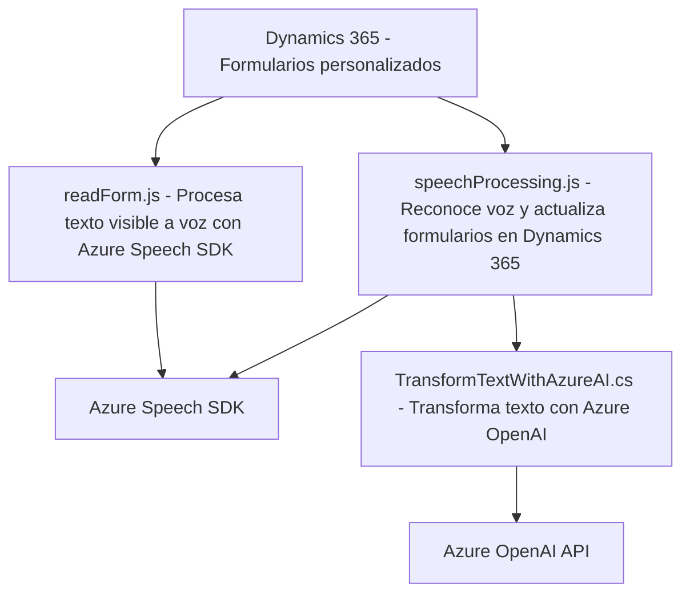

### Breve resumen técnico

El repositorio contiene tres componentes principales que trabajan de manera integrada para procesar datos de formularios en Dynamics 365 utilizando reconocimiento de voz, síntesis de texto a voz y transformación avanzada de texto con inteligencia artificial. Los archivos analizados cubren estas funcionalidades:

1. **`readForm.js`**: Sintetiza datos visibles de formularios en voz utilizando Azure Speech SDK.
2. **`speechProcessing.js`**: Reconoce voz, transcribe audio y asigna valores procesados a campos en formularios de Dynamics 365.
3. **`TransformTextWithAzureAI.cs`**: Plugin de Dynamics CRM que valida y transforma texto mediante Azure OpenAI.

---

### Descripción de arquitectura

La solución implementa una **arquitectura modular** que puede ser descrita como **n-capas**. Los componentes interactúan en varios niveles:

1. **Presentación**: Los scripts JavaScript (`readForm.js` y `speechProcessing.js`) trabajan del lado del cliente, integrándose con APIs de Dynamics 365 para interactuar con los formularios.
2. **Lógica de Aplicación**: Utilizan lógica personalizada para extracción y procesamiento de datos, delegando al SDK de Azure algunos procesos como reconocimiento y síntesis de voz.
3. **Lógica de Negocio**: El plugin en C# (`TransformTextWithAzureAI.cs`) se posiciona como un subset del servidor de Dynamics 365, respondiendo a eventos definidos.
4. **Servicios Externos**: Estos incluyen Azure Speech SDK para reconocimiento/síntesis de voz y Azure OpenAI para transformación avanzada de datos.

---

### Tecnologías usadas

1. **Frontend**:
   - **JavaScript**: Principal lenguaje para las operaciones con formulación dinámica.
   - **Dynamics 365 APIs**: Para interacción y manipulación de formularios.
   - **Azure Speech SDK**: API de Microsoft para reconocimiento y síntesis de voz.

2. **Backend** (Plugin en C#):
   - **Microsoft Dynamics SDK**: Framework para desarrollo de plugins dentro del ecosistema Dynamics CRM.
   - **Azure OpenAI**: API de inteligencia artificial para transformación de texto.
   - **C#**: Lenguaje principal del plugin.
   - **Librerías de .NET**:
     - `System.Net.Http` para comunicación con APIs externas.
     - `Newtonsoft.Json` para manejo estructurado de JSON.

3. **Patrones arquitectónicos**:
   - **Modularización** para encapsular lógica en componentes independientes.
   - **Event-based Programming** en el plugin basado en los eventos de negocio de Dynamics.
   - **API Gateway** como mediador entre el sistema y Azure OpenAI para externalizar procesamiento de texto.
   - **Cliente enriquecido** en el frontend con Microsoft Dynamics API y SDK de Speech.

---

### Diagrama Mermaid

Un diagrama básico para representar la interacción entre los componentes sería:

---

### Conclusión final

La solución es una integración avanzada orientada a automatizar la entrada y transformación de datos en un sistema Dynamics 365 mediante tecnologías en la nube. Los puntos clave incluyen:

1. **Tipo de solución**: API y Frontend integrados con Dynamics 365.
2. **Dependencias externas destacadas**:
   - Azure Speech SDK para reconocimiento de voz y síntesis.
   - Azure OpenAI para transformación avanzada de texto.
3. **Arquitectura**: Predomina una arquitectura de **n-capas**, donde cada componente cumple una responsabilidad clara y delega tareas específicas a servicios externos. Esto asegura escalabilidad y separación de responsabilidades.

Por último, el uso de inteligencia artificial en el plugin demuestra potencial para integrar tecnologías cognitivas y formular estrategias de automatización y negocio más avanzadas.