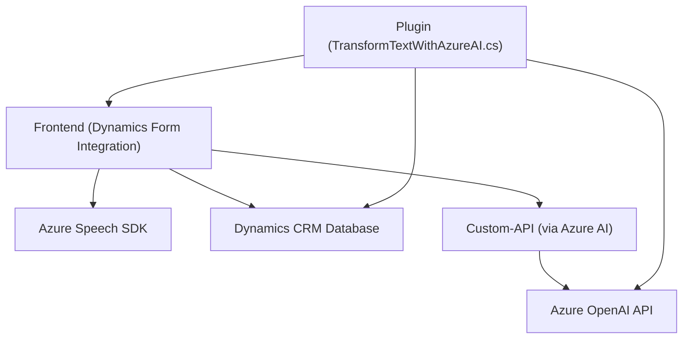

## Breve resumen técnico
El repositorio contiene un conjunto de archivos que, en conjunto, implementan una solución híbrida basada en **Microsoft Dynamics CRM** y **Azure AI**. La solución integra procesos de reconocimiento y generación de voz, junto con operaciones sobre formularios y datos almacenados en el CRM. Se emplean tecnologías como **Azure Speech SDK**, **Dynamics CRM SDK**, y **Azure OpenAI** para habilitar funcionalidades avanzadas, principalmente transcripción de voz a texto, síntesis de voz, transformación dinámica de texto, y administración de datos en el CRM.

---

## Descripción de arquitectura
La arquitectura del sistema puede clasificarse como una **n-capas**, donde cada componente de la solución implementa una capa lógica de la aplicación:
1. **Capa de presentación**: Representada por las soluciones frontend (`readForm.js`, `speechForm.js`) que interactúan directamente con el usuario final y los formularios de Dynamics CRM. Aquí ocurre la transcripción de voz y se gestionan los inputs del usuario.
2. **Capa de lógica de negocio**: Representada por el plugin `TransformTextWithAzureAI.cs`, que encapsula la lógica de negocios sobre la transformación de texto según normas específicas, delegando parte de la lógica al servicio de Azure OpenAI.
3. **Integración con microservicios/infraestructura externa**: Uso de servicios de Microsoft Azure: Speech SDK y Azure OpenAI, junto con integración directa a la solución Dynamics CRM mediante su SDK y APIs.

La arquitectura responde a principios de modularidad y eventos (callbacks y promesas), lo que le proporciona capacidad de escala y facilidad para añadir nuevas funcionalidades.

---

## Tecnologías usadas
1. **Frontend**:
   - Lenguaje: JavaScript.
   - Frameworks: No se mencionan frameworks específicos; código ejecutado en el navegador.
   - Integración: Dynamics 365 (formularios y APIs).
   - Librerías: Azure Speech SDK.

2. **Backend/plugin**:
   - Lenguaje: C#.
   - Framework: Microsoft Dynamics SDK para la comunicación con el CRM.
   - Integración: Azure OpenAI API para transformación de texto.

3. **Patrones de diseño/arquitectura**:
   - Modularización: Cada función o clase está diseñada para realizar una única responsabilidad.
   - Eventos y callbacks: Uso de promesas y control dinámico del flujo de ejecución en el frontend.
   - Capa de plugin: Emplea el estándar de implementación para Dynamics CRM (`IPlugin`).
   - Interacción con servicios externos: Se comunica con el SDK y servicios de Azure mediante HTTP, siguiendo el patrón **request-response**.

4. **Servicios externos**:
   - **Speech SDK**: Para transcripción de voz a texto y síntesis de voz (es-ES).
   - **Dynamics CRM API**: Para interacción, consulta y actualización de formularios y datos en el sistema.
   - **Azure OpenAI (GPT)**: Para transformar texto a través de inteligencia artificial.
   - **NuGet**: Posible dependencia externa para manejar las bibliotecas de Dynamics CRM y JSON parsing.

---

## Diagrama Mermaid

---

## Conclusión final
Este repositorio describe una solución completa que habilita el reconocimiento de voz, síntesis de texto y modificaciones dinámicas en formularios de Dynamics CRM, con soporte extendido para procesamiento de texto mediante IA en Microsoft Azure OpenAI. La arquitectura sigue un diseño n-capas con integración modular de servicios externos, lo que permite escalar y mejorar el sistema sin comprometer el núcleo de la lógica empresarial y de presentación. Es ideal para soluciones que requieren interfaces dinámicas y alta interoperabilidad con los servicios de Microsoft en entornos corporativos.