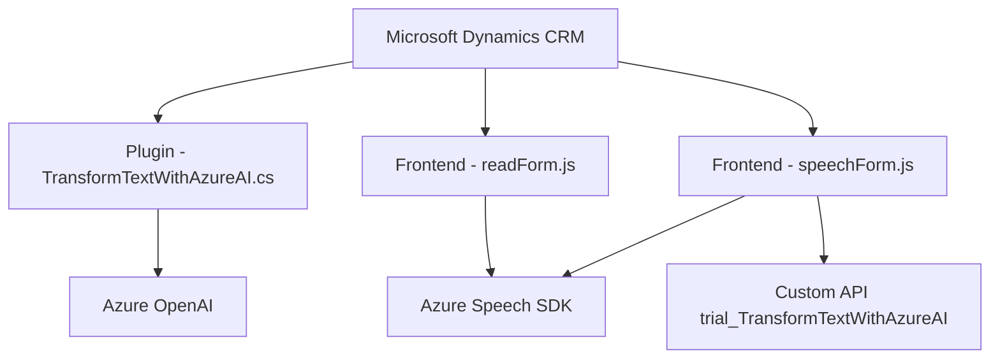

### Breve resumen técnico:
El repositorio contiene diversas implementaciones orientadas tanto al frontend como al backend, con notable integración de soluciones basadas en servicios de **Microsoft Azure**, específicamente **Azure Speech SDK** y **Azure OpenAI**. Este código define una solución para procesar datos de formularios mediante voz y texto, integrando inteligencia artificial en un sistema de **Microsoft Dynamics CRM**.

---

### Descripción de la arquitectura:
La arquitectura está basada en principios de integración API y modularidad. Los archivos tienen tareas específicas:
1. **Frontend/JS**:
   - Procesamiento de datos de entrada desde formularios (Datos visibles o mediante grabación de voz).
   - Manejo de la interacción con SDKs como Azure Speech.
   - Integración de APIs para procesamiento adicional, usando patrones de cliente-servicio.
2. **Plugins/TransformTextWithAzureAI.cs**:
   - Implementación de un plugin en Dynamics CRM usando la interfaz de **IPlugin**.
   - Transformación de texto mediante una API de inteligencia artificial (Azure OpenAI).

Los módulos están organizados en capas funcionales:
- **Frontend**: Presenta lógica de interacción y procesamiento de datos del formulario.
- **Backend Plugin**: Amplía la funcionalidad del CRM para realizar transformaciones avanzadas de texto con Azure OpenAI.

La arquitectura se puede catalogar como una solución de **n capas** (presentación, integración, lógica de procesamiento) que combina elementos de **hexagonal** para abstraer servicios externos (Azure Speech SDK y OpenAI API).

---

### Tecnologías utilizadas:
- **Frontend**:
  - **JavaScript/ES6**: Para la lógica de control y procesamiento en el navegador.
  - **Azure Speech SDK**: Servicios de reconocimiento, síntesis y manejo de voz.
  - **Dynamic script loading**: Para cargar dependencias dinámicamente.
  
- **Backend**:
  - **C#/.NET Framework**: Base para plugins en Dynamics CRM.
  - **Microsoft Dynamics CRM SDK**: Componentes nativos del entorno CRM.
  - **Newtonsoft.Json** y **System.Text.Json**: Para trabajar eficientemente con datos JSON.
  - **Azure OpenAI (GPT-4)**: Transformación avanzada de texto a estructuras JSON.

- **Integración externa**:
  - **Azure Speech SDK API**: Síntesis y reconocimiento de voz.
  - **Azure OpenAI API**: Procesamiento de texto en lenguaje natural.

---

### Dependencias externas:
1. **Azure Speech SDK**: Para funciones de voz (síntesis y reconocimiento).
   - Endpoint: `https://aka.ms/csspeech/jsbrowserpackageraw`.

2. **Azure OpenAI API**: En el backend, utilizada para transformar texto en JSON estructurado utilizando modelos como `GPT-4`.

3. **Microsoft Dynamics SDK**: Framework para ejecución de plugins CRM.

4. **Formato JSON y procesamiento**:
   - **System.Text.Json**: Para manipulación moderna de datos JSON.
   - **Newtonsoft.Json.Linq**: Capa avanzada para trabajar con estructuras JSON más complejas.
   
5. **API externas personalizadas**: `trial_TransformTextWithAzureAI`.

---

### Diagrama Mermaid:

---

### Conclusión final:
Esta solución utiliza una arquitectura modular de **n capas**, organizada en frontend, lógica de integración (API/SDK) y backend. La implementación es extensible y efectiva para integrar reconocimiento de voz y procesamiento avanzado de texto en un sistema CRM. Además, los patrones usados aseguran buena distribución de responsabilidades. Sin embargo, destaca la necesidad de mejorar aspectos como la validación de datos y manejo de errores en las consultas de API.