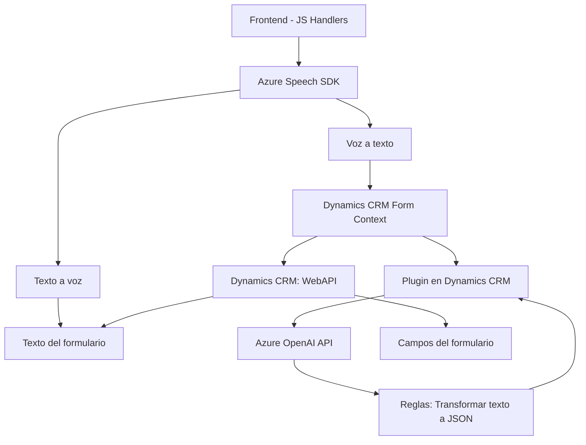

### Breve Resumen Técnico
El repositorio implementa una solución multidimensional que permite la integración de funcionalidades de voz y texto con Dynamics CRM. Se observa un enfoque modular con un frontend para la interacción con el cliente, servicios de procesamiento de voz por medio de Azure Speech SDK y un plugin para extensión de funcionalidad en Dynamics CRM a través de Azure OpenAI API.

---

### Descripción de Arquitectura
La solución sigue una arquitectura orientada a servicios (SOA) configurada en capas:
1. **Frontend**: Proporciona interacción directa entre el usuario y los servicios de voz (Azure Speech SDK) para sintetización y reconocimiento.
2. **Backend en Dynamics CRM**:
   - Usa plugins para capturar eventos en el sistema, implementar lógica avanzada y llamar servicios externos (Azure OpenAI).
3. **Servicios externos integrados**:
   - **Azure Speech SDK y Azure OpenAI API**: Procesan tanto la entrada de voz como la transformación de datos textuales usando inteligencia artificial.

Los patrones observados incluyen programación modular, separación en capas funcionales y un enfoque de integración a través de APIs.

---

### Tecnologías Usadas
#### **Frontend**
- **JavaScript**:
  - Funciones asíncronas para control de flujo de datos.
  - Manipulación DOM para carga dinámica del SDK.
- **Azure Speech SDK**:
  - Implementaciones de reconocimiento y síntesis de voz.
  - Comunicación mediante claves privadas y configuración regional.

#### **Backend**
- **C# en Plugins**:
  - Dependencias de `Microsoft.Xrm.Sdk` para integrarse con Dynamics CRM.
  - Plugin para procesar texto con lógica avanzada mediante Azure OpenAI.
- **Azure OpenAI API**:
  - Endpoint para transformar texto basado en modelos GPT.

#### **Frameworks de Integración**
- Dynamics CRM como base para los plugins.
- HTTP API para comunicación con Azure OpenAI.
  
---

### Dependencias y Componentes Externos
1. **Azure Speech SDK**:
   - Funcionalidad de reconocimiento y síntesis de voz.
   - Cargado dinámicamente desde un servidor externo.
2. **Azure OpenAI API**:
   - Procesamiento de texto mediante AI (GPT) alojado en la nube de Azure.
3. **Dynamics CRM**:
   - Para la capa de datos y eventos desencadenados del sistema.
4. **JavaScript**:
   - Funciones frontales y manipulación del contexto del DOM/formulario.
5. **Servicios HTTP en C#**:
   - Realiza solicitudes a Azure OpenAI API.

---

### Diagrama Mermaid válido para GitHub Markdown

---

### Conclusión Final
El sistema presenta una arquitectura modular y orientada a servicios, que integra tecnologías de nube (Azure Speech SDK y Azure OpenAI) para enriquecer la experiencia de los usuarios de Dynamics CRM. Combina ambos paradigmas de frontend y backend con una dependencia fuerte en APIs externas. La separación de responsabilidades en el código es adecuada, lo que facilita su mantenibilidad y escalabilidad. 
