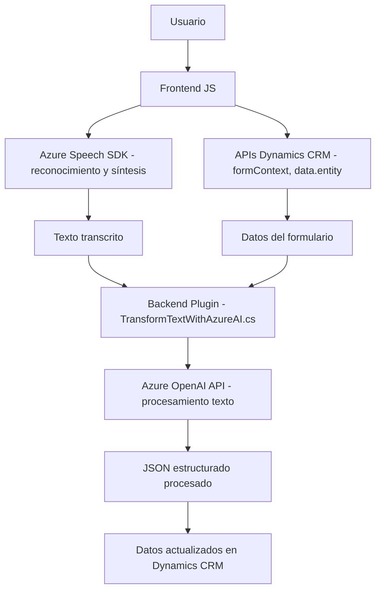

### Breve Resumen Técnico

La solución combina funcionalidades frontend y plugins backend en un entorno de Dynamics 365 CRM, integrando servicios avanzados de inteligencia artificial, como Azure OpenAI y Azure Speech SDK. Proporciona capacidades de síntesis de voz, reconocimiento de voz y procesamiento de texto con integración directa con APIs de Dynamics y servicios externos. Está diseñada para mejorar la interacción usuario-sistema en aplicaciones CRM mediante voz y transcripción avanzada.

---

### Descripción de Arquitectura

#### 1. **Tipo de solución**:
Es una solución **CRM extendida**, donde los archivos frontend manejan interacción con el usuario (voz y transcripción) y los plugins backend amplían capacidades mediante servicios avanzados. El **frontend** proporciona herramientas para integrar interacción basada en voz, mientras que el **plugin backend** utiliza Azure OpenAI para procesamiento de texto avanzado.

#### 2. **Arquitectura**:
La solución sigue un modelo de arquitectura **n capas**. Cada componente está estructurado para interactuar con:
   - **Capa de presentación**: Archivos **readForm.js** y **speechForm.js**.
   - **Capa de negocio y lógica empresarial**: Plugin **TransformTextWithAzureAI.cs**.
   - **Servicios externos y APIs**: Integración con Azure Speech SDK, Azure OpenAI y APIs de Dynamics CRM.

Utiliza patrones como:
   - **Plugin Pattern** (en backend).
   - **Service-Oriented Architecture** (interacción con SDKs y APIs externas).
   - **Lazy Loading** para cargar SDKs en el frontend dinámicamente según sea necesario.

---

### Tecnologías Usadas
1. **Frontend**:
   - **JavaScript con Modularidad**: Funciones modulares para síntesis y reconocimiento de voz.
   - **Azure Speech SDK**: Reconocimiento y síntesis de voz.
   - APIs embebidas en Dynamics CRM (`formContext` y `Xrm.WebApi`).

2. **Backend**:
   - **Dynamics CRM SDK**: Integra extensiones con su Stack.
   - **Azure OpenAI API**: Procesamiento avanzado de texto.
   - **.NET con C#**: Utilizado en el plugin con bibliotecas como `System.Text.Json` y `Newtonsoft.Json.Linq`.

3. **Común**:
   - Comunicación asíncrona.
   - Protocolos HTTP para invocar APIs externas.
   - JSON como formato estándar de intercambio de datos.

---

### Dependencias y Componentes Externos
1. **Azure Speech SDK**:
   - Synthesis y reconocimiento de voz.
   - Versión cargada dinámicamente desde CDN (`https://aka.ms/csspeech/jsbrowserpackageraw`).

2. **Azure OpenAI API**:
   - Procesa texto y genera respuestas estructuradas, transformadas por IA.

3. **Dynamics 365 APIs/Internal SDK**:
   - APIs integradas al contexto de ejecución del formulario (`Xrm.WebApi.online`).

4. **Otras dependencias backend**:
   - **Newtonsoft.Json**: Procesamiento de JSON.
   - **System.Net.Http**: Solicitudes a servicios.
   - **Dynamics CRM SDK interfaces**: `IPluginExecutionContext`, `InputParameters`, `OutputParameters`.

---

### Diagrama Mermaid válido para GitHub

---

### Conclusión Final

La solución representa una arquitectura bien definida, altamente modular y extensible. Combina servicios avanzados de inteligencia artificial (Azure Speech y OpenAI) con las capacidades nativas de Dynamics CRM. Ofrece:
1. Herramientas de síntesis y reconocimiento de voz para formularios dinámicos.
2. Procesamiento avanzado de textos con transformación mediante reglas definidas.

El uso de **n capas** asegura una separación clara entre presentación (frontend), lógica empresarial (plugin backend) y servicios externos. Aunque la arquitectura está optimizada para su entorno, se debe tener cuidado con la seguridad de las claves API y carga dinámica de asignaturas externas para evitar vulnerabilidades.