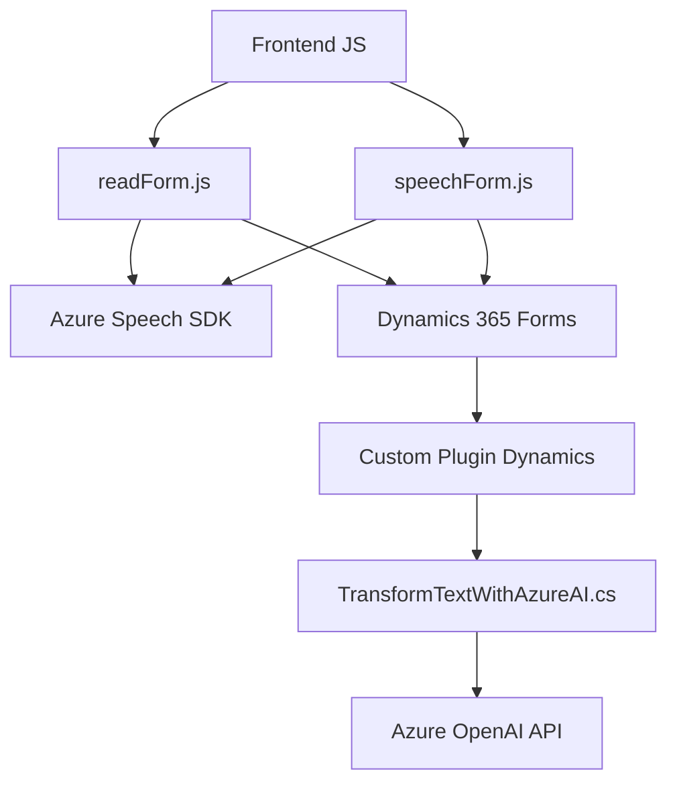

### Breve resumen técnico:
Este repositorio tiene una solución híbrida que combina lógica de frontend basada en JavaScript y una integración backend con Microsoft Dynamics CRM utilizando Azure OpenAI y Azure Speech SDK. La funcionalidad principal se centra en dos aspectos:
1. **Procesamiento y lectura de datos de formularios mediante síntesis de voz** (frontend).
2. **Transformación y procesamiento de datos mediante inteligencia artificial** a través de un plugin en Dynamics CRM.

---

### Descripción de arquitectura:
1. **Frontend**:
   - Sigue una arquitectura modular simple con funciones declaradas independientemente. Sin clases o patrones avanzados, pero con una clara separación de responsabilidades para cada operación.
   - Se integra con Azure Speech SDK para proporcionar síntesis de voz y entrada por voz en tiempo real.

2. **Backend**:
   - Implementación de arquitectura de plugins dentro de Dynamics CRM.
   - Utiliza Azure OpenAI para transformar texto en objetos JSON estructurados. El diseño es monolítico, basado en el ciclo de eventos del CRM.
   
3. **Arquitectura Global**:
   - La solución combina una arquitectura híbrida, donde el frontend y el plugin trabajan en paralelo para crear una experiencia de usuario integrada con servicios de AI y entrada por voz.

---

### Tecnologías usadas:
- **Frontend**:
  - **JavaScript**: Lenguaje base para implementar funcionalidades de interfaz. 
  - **Azure Speech SDK**: Servicio para síntesis de voz y reconocimiento de voz en tiempo real.
  
- **Backend**:
  - **Microsoft Dynamics CRM SDK**: Proporciona contexto y servicios para ejecutar plugins y manipular datos en formularios CRM.
  - **Azure OpenAI API**: Utilizado para transformar texto utilizando inteligencia artificial generativa.
  - **Net Framework (C#)**: Implementación del plugin en un entorno de CRM utilizando `IPlugin`.

- **Dependencias adicionales**:
  - `Newtonsoft.Json.Linq`: Para manejo de objetos JSON en `TransformTextWithAzureAI.cs`.
  - `System.Net.Http` y `System.Text.Json`: Para llamadas HTTP (integración con APIs externas).

---

### Diagrama Mermaid:

---

### Conclusión final:
Esta solución representa una integración perfecta entre frontend y backend para la automatización de procesos en formularios CRM utilizando reconocimiento de voz y transformación de datos con inteligencia artificial. La arquitectura es híbrida:
- **El frontend** funciona principalmente como un cliente que consume servicios externos de Azure (Speech SDK).
- **El backend** utiliza una arquitectura de plugin monolítica dentro de Dynamics CRM, con integración de AI vía llamada externa.

Es una solución sólida, aunque podría beneficiarse de refinamientos como:
1. **Manejo más robusto de errores**: Especialmente en las dependencias de APIs de Azure.
2. **Patrones avanzados**: Para fomentar la extensibilidad y modularidad, especialmente en el backend.
3. **Testing y monitoreo**: Implementar pruebas unitarias en frontend y backend para asegurar la calidad y robustez frente a cambios en Azure APIs.

