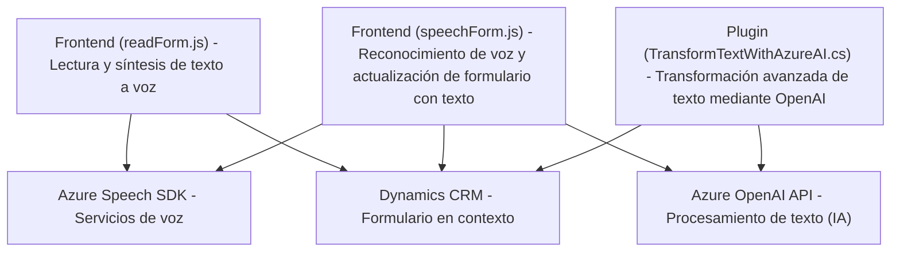

### Breve resumen técnico
- El repositorio incluye tres componentes principales: `readForm.js`, `speechForm.js` y un plugin para Dynamics CRM denominado `TransformTextWithAzureAI.cs`.
- Combina funcionalidades de entrada y síntesis vocal mediante Azure Speech SDK, así como procesamiento de texto avanzado mediante AI (Azure OpenAI).
- Utilizado en un entorno CRM dinámico, facilita interacciones mediante voz, procesamiento basado en IA, y actualización de datos en formularios.

---

### Descripción de arquitectura
- **Tipo de solución:** Una combinación entre microservicios (interacciones con APIs externas como Azure) y una arquitectura multinivel (interacción en capa de presentación, lógica, y datos).
- **Arquitectura:**  
   - Componentes JavaScript (`readForm.js` y `speechForm.js`) funcionan en la capa de presentación dentro de formularios CRM, activando la entrada de voz y lectura mediante SDKs externos.  
   - El plugin `.cs` opera en la capa de lógica empresarial de Dynamics CRM para manejar un flujo avanzado de transformación de texto con AI.  
   - Dependiente de servicios remotos de Azure (Speech y OpenAI).

---

### Tecnologías y patrones utilizados
1. **JavaScript:**
   - Se utiliza para interactuar en la capa de presentación del CRM.
   - Dependencias: Azure Speech SDK, APIs internas de Dynamics CRM (`executionContext`).

2. **C#:**
   - Microsoft Dynamics CRM Plugin basado en la interfaz `IPlugin`.
   - Llamadas de red con `HttpClient` al servicio de Azure OpenAI.
   - Serialización y deserialización de JSON.

3. **Frameworks/Servicios:** 
   - **Azure Speech SDK:** Para síntesis de voz y reconocimiento de voz.
   - **Azure OpenAI API:** Para transformación avanzada de texto en JSON.
   - **Microsoft Dynamics CRM SDK:** API y herramientas para manipular los datos de formularios CRM.

4. **Patrones de diseño:** 
   - Modularización funcional: Cada módulo realiza una tarea específica clara.
   - Separación de responsabilidades: Los archivos JS manejan la capa de presentación, mientras que el plugin maneja la lógica empresarial.
   - Integración con servicios externos: Conexión limpia y organizada con APIs de Azure.
   
---

### Dependencias o componentes externos presentes
1. **Externos:**
   - **Azure Speech SDK**: Utilizado en los módulos de frontend para reconocimiento y síntesis de voz.
   - **Azure OpenAI API**: Para la transformación de texto en formato JSON.
   
2. **Internos:**
   - **Xrm.WebApi**: Abstracción para acceder al modelo de datos relacional interno del CRM.
   - Microsoft Dynamics CRM SDK para la operación del plugin en la lógica empresarial.

---

### Diagrama Mermaid válido para GitHub Markdown

---

### Conclusión final
El repositorio presenta una solución que expande las capacidades de interacción en Dynamics CRM mediante integración con Azure Speech SDK y Azure OpenAI. Se trata de un sistema híbrido que combina una arquitectura multinivel en un entorno CRM con microservicios en APIs externas, proporcionando una interacción avanzada de usuario con voz, procesamiento textual y actualización dinámica de formularios. Su estructura modular garantiza facilidad de mantenimiento y escalabilidad.