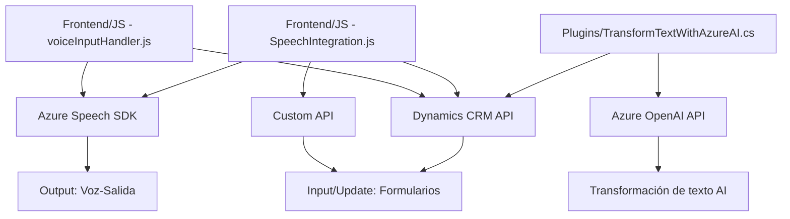

### Breve Resumen Técnico
Este repositorio contiene implementaciones relacionadas con integración de tecnologías de entrada/salida de voz y procesamiento de datos mediante servicios de Azure (Speech SDK y OpenAI). Se adapta principalmente para formularios de Dynamics 365 CRM, facilitando capacidades avanzadas de accesibilidad, transcripción y procesamiento por IA.

---

### Descripción de Arquitectura
El proyecto implementa una arquitectura **cliente-servidor combinada con servicios externos**. Los módulos frontend manejan interacciones de usuario, transcripción y síntesis de voz, mientras que los plugins implementados integran servicios de backend como Dynamics CRM y Azure OpenAI. Su diseño sigue un modelo **modular**, con funcionalidades independientes y cohesivas que interactúan por eventos y reglas predefinidas.

#### Arquitectura Específica:
1. **Frontend**:
   - Componentes escritos en JavaScript siguen una aproximación de arquitectura cliente autónoma.
   - Modularidad en funciones que encapsulan tareas específicas como procesamiento de formularios visibles, mapeo de campos, entrada/salida de voz.
   - Integración vía SDKs externos como Azure Speech SDK para procesamiento en tiempo real.

2. **Backend (Plugins)**:
   - Arquitectura basada en plugins de Dynamics CRM, adaptada para servicio de transformación de texto mediante Azure OpenAI.
   - Modelo de diseño como **facade** para simplificar llamadas externas (API OpenAI) mientras abstrae la lógica del flujo de datos.

Esta separación asegura una **integración directa entre cliente y servicios cloud**, ampliando las capacidades de CRM con accesibilidad e inteligencia artificial.

---

### Tecnologías Usadas
1. **Frontend**:
   - **JavaScript**: Lenguaje principal del proyecto.
   - **Azure Speech SDK**: Para síntesis y transcripción de voz.
   - **Dynamics CRM API (Xrm.WebApi)**: Para interactuar con los formularios del CRM.

2. **Backend** (en .NET):
   - **Microsoft.Xrm.Sdk**: Para programación de plugins en Dynamics CRM.
   - **Azure OpenAI GPT-4 API**: Para transformación avanzada de textos.
   - **System.Net.Http**: Envío seguro de solicitudes HTTP.
   - **Newtonsoft.Json** y **System.Text.Json**: Manejo y transformación de contenido JSON.

3. **Integraciones externas**:
   - **Endpoints de Azure Speech SDK**.
   - **Azure OpenAI** para procesamiento avanzado de textos.
   - **Dynamics CRM** como plataforma base.

---

### Diagrama Mermaid (GitHub Markdown Compatible)

---

### Conclusión Final
Este repositorio define un ecosistema completo e integrado para mejorar la accesibilidad y funcionalidad de formularios en Dynamics CRM, apoyado por tecnologías modernas como Azure Speech SDK y Azure OpenAI. Siguiendo patrones de modularidad e integración externa, la solución logra implementar capacidades avanzadas de transcripción y síntesis de voz con un enfoque en optimización, escalabilidad y accesibilidad.

La arquitectura es híbrida funcional, combinando clientes autónomos (frontend) y servicios backend (plugins y APIs). La implementación se encuentra alineada con estándares para mejorar capacidades tecnológicas en plataformas comerciales como Dynamics CRM.