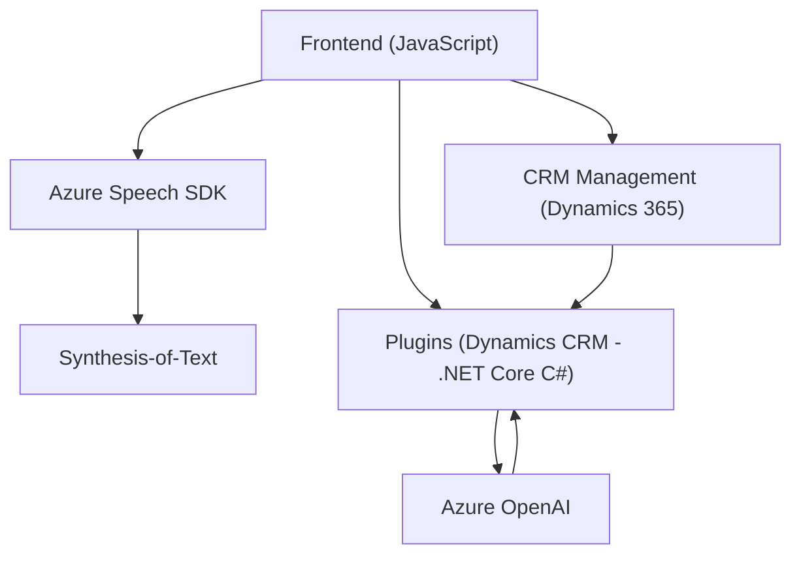

**Resumen técnico:**

El repositorio describe múltiples archivos relacionados con aplicaciones que integran tecnologías como Microsoft Dynamics 365 CRM y Azure SDK (Speech y OpenAI). Estas soluciones habilitan el reconocimiento de entrada de voz, síntesis de voz y transformación avanzada de texto. Predominará su uso en formularios empresariales, especialmente en contextos de CRM.

---

**Descripción de arquitectura:**

1. **Tipo de solución:**  
   - Módulo frontend:
     - Facilita interacción interfaz-usuario mediante entrada y salida de voz.  
   - Módulo backend:
     - Plugins diseñados para procesamiento en Dynamics 365, integrados con servicios externos como Azure AI.  
   - El diseño sigue una arquitectura de integración de componentes en un ambiente existente de CRM.

2. **Tipo de arquitectura:**  
   - **Frontend:** Modular, basado en cliente (JavaScript).  
   - **Backend:** Plugins con arquitectura basada en eventos (Microsoft Dynamics).  
   - **General:** Clientes y servicios están orientados hacia una arquitectura **n-capas** con fuerte dependencia entre cliente, capa lógica (plugins) y API de terceros (Azure).

3. **Patrones utilizados:**  
   - **Event-Driven Architecture:** Acciones desencadenadas por contextos en el formulario.  
   - **Plugin architecture:** Para extender la lógica de Dynamics 365 CRM mediante un SDK.  
   - **Integration with external APIs:** Azure Speech SDK y Azure OpenAI integrados mediante REST y dependencias dinámicas.  
   - **Service-Oriented:** Division entre procesamiento en cliente o servicios dinámicos (Azure, HTTP).

4. **Dependencias/componentes externos presentes:**  
   - **Azure Speech SDK:** Reconocimiento y síntesis de voz.  
   - **Azure OpenAI:** Procesamiento avanzado de lenguaje natural.  
   - **Microsoft Dynamics CRM SDK:** Contexto `executionContext` para formularios.  
   - **APIs personalizadas:** Usadas para hacer consultas específicas en Dynamics o servicios de AI.

---

**Diagrama Mermaid:**

El diagrama muestra la interacción entre componentes, especialmente el flujo de datos entre el frontend (interfaz/cliente) y servicios de Azure, así como la lógica de backend en Dynamics CRM.

---

**Conclusión final:**

El repositorio implementa una solución avanzada para optimizar la interacción con formularios empresariales dentro de un entorno de CRM mediante el uso de tecnologías externalizadas en la nube (Azure Speech y Azure AI). La arquitectura está orientada a un diseño modular y de integración, promoviendo eficiencia y escalabilidad. Esto permite automatizar tareas empresariales que tradicionalmente son manuales, como reconocimiento de voz, síntesis de información visual y procesamiento avanzado mediante inteligencia artificial.