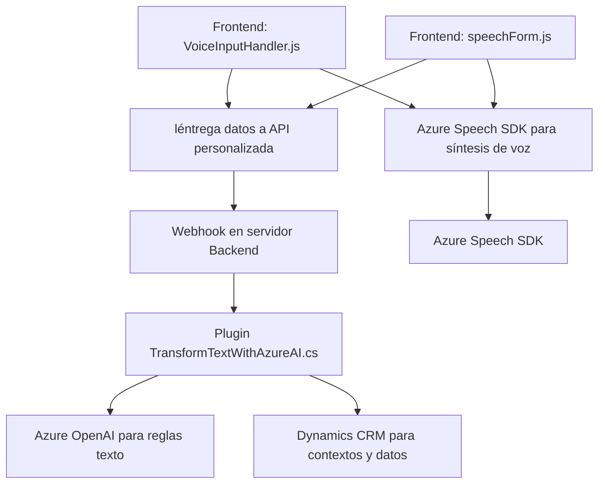

## Análisis Técnico de la Solución

### **Breve Resumen Técnico**
El repositorio contiene archivos organizados en carpetas que implementan diferentes funcionalidades relacionadas con procesamiento de formularios y uso de servicios de inteligencia artificial (IA) externos como Azure Speech SDK y Azure OpenAI. Es principalmente una solución híbrida de **frontend** y **serverside plugins**, diseñada para extender capacidades de Dynamics CRM y facilitar la entrada de datos por voz o interacción con IA.

---

### **Descripción de Arquitectura**
La solución está dividida en dos grandes componentes:  
1. **Frontend:** Código escrito en JavaScript para manipulación de formularios y extensiones en la interfaz (VoiceInputHandler.js, speechForm.js). Utiliza un modelo procedural y eventos para implementar reconocimiento de voz y síntesis de texto a voz.
2. **Plugin de backend:** Código escrito en C# que extiende la lógica del backend de Dynamics CRM a través de la interfaz `IPlugin`. Este plugin realiza tareas específicas como transformación de texto mediante reglas utilizando Azure OpenAI Service.

La arquitectura de la solución puede clasificarse como **multicapa**, ya que separa la lógica de frontend (interacción visual y función del usuario) y el backend con integración mediante servicios en la nube (Azure Speech y OpenAI), siguiendo principios de modularidad y separación de responsabilidades.

---

### **Tecnologías Usadas**
1. **Frontend:** 
   - **JavaScript:** Para la implementación de la lógica de manipulación del DOM, interacción con formularios y comunicación con APIs externas.
   - **Azure Speech SDK:** Para conversión de texto a voz y reconocimiento de voz.
   - **REST API:** Empleada para invocar servicios como APIs personalizadas y mi integración con el SDK de Azure.

2. **Backend/plugin:**  
   - **C#**
   - **Microsoft Dynamics CRM SDK:** Para obtener el contexto del plugin y manipular entidades del CRM.
   - **Azure OpenAI Service:** Empleada para procesamiento y transformación de texto mediante IA.

### **Patrones de Diseño Utilizados**
1. **Event-driven architecture:** El frontend utiliza eventos (por ejemplo, callbacks) para cargar dinámicamente SDK o interactuar con input/output de voz.  
2. **Inyección de dependencias:** Uso del servicio Dynamics CRM (`IOrganizationService`) en el plugin y del SDK.  
3. **Modularidad y separación:** Cada función tiene responsabilidades específicas, tanto en el frontend como en el backend.  
4. **API-first architecture:** Aprovechamiento de servicios externos con integración directa con APIs REST.

---

### **Dependencias o Componentes Externos**
1. **Azure Speech SDK:** Para entrada y salida de voz en el frontend.  
   - URL de carga: `https://aka.ms/csspeech/jsbrowserpackageraw`.  
2. **Azure OpenAI Service:** En el backend/plugin para transformar texto mediante IA.  
   - API externa: `https://openai-netcore.openai.azure.com/`.  
3. **Microsoft Dynamics CRM SDK:** Usado en el plugin para manipulación de datos de entidad y ejecución de lógica personalizada.  
4. **HttpClient:** Para realizar peticiones HTTP en el backend.  
5. **JSON Serialization Libraries (como JsonSerializer):** Para manipular y construir estructuras JSON.

---

### **Diagrama Mermaid**

---

### **Conclusión Final**
El repositorio representa una solución híbrida donde el frontend se centra en la interacción del usuario con voz y visualización de datos de formularios mediante Azure Speech SDK, mientras que el backend extiende Dynamics CRM mediante un plugin para trabajar con reglas de IA y APIs externas. La arquitectura es **multicapa**, diseñada para mejorar el flujo de procesamiento de datos con modularidad, aprovechando la integración de servicios en la nube. Es una solución eficiente para entornos empresariales que necesitan optimizar interacciones con IA y voz.