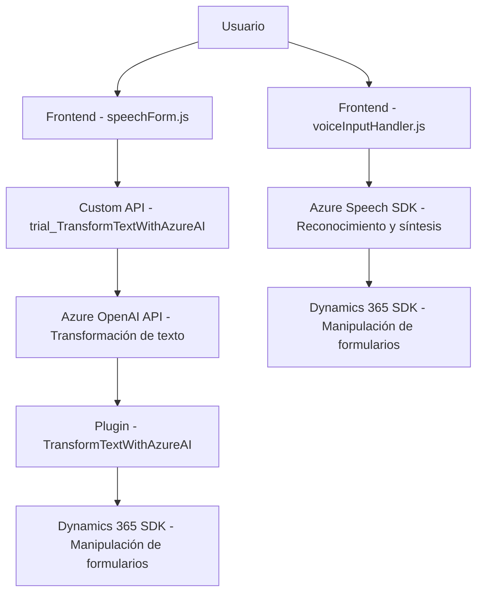

# Análisis técnico detallado

## Breve resumen técnico
El repositorio presenta una solución compuesta que combina múltiples tecnologías para implementar funcionalidades tanto en frontend como en backend. Utiliza el **Azure Speech SDK**, **Azure OpenAI API**, **Microsoft Dynamics CRM SDK**, y una **Custom API** de análisis textual. La finalidad general del sistema parece ser la integración de tecnología de asistencia por voz y análisis de texto para formularios dinámicos de Dynamics 365.

## Descripción de arquitectura
La solución tiene una arquitectura **modular y de capas**:
- **Frontend:** Enfocado en leer formularios, sintetizar voz y reconocimiento de voz, con integración directa al SDK de Azure Speech y manipulación dinámica de atributos en formularios de Dynamics 365.
- **Backend:** Uso de **plugins para Dynamics 365** con integración a **Azure OpenAI** para transformar texto procesado y retornarlo estructurado.
- **API Gateway:** Uso de una **Custom API** (trial_TransformTextWithAzureAI), que conecta las funcionalidades de reconocimiento de voz y análisis de texto del frontend con capacidades avanzadas de inteligencia artificial en Azure.

La arquitectura probablemente se acerque al modelo de **monolito**, ya que parece estar especializado en el contexto de Dynamics 365 y se basa en sus eventos y contexto de ejecución. Sin embargo, también muestra intenciones de integrar servicios externos y SDKs usando un patrón de **capas**.

## Tecnologías y patrones usados
### Tecnologías:
1. **Frontend:**
   - **JavaScript:** Manejo de formularios y sintaxis de componentes.
   - **Azure Speech SDK:** Para reconocimiento y síntesis de voz.
   - **Dynamics 365 SDK Xrm.WebApi:** Para manipulación de formularios y acceso a campos dinámicos.

2. **Backend:**
   - **Microsoft Dynamics CRM SDK:** Personalización de eventos y aplicación de lógica de negocio.
   - **Azure OpenAI API:** Uso para transformar texto basado en IA.
   - **Newtonsoft.Json:** Procesamiento de datos JSON recibido de Azure AI.

### Patrones:
- **Callback y carga dinámica:** El SDK de Azure Speech se carga de forma asíncrona para optimizar la integración.
- **Plugin Design Pattern:** Los plugins de Dynamics 365 son diseñados para ejecutarse sin estado, integrándose con eventos específicos del sistema.
- **Layered Architecture:** Separación por capas (frontend, backend, integraciones externas).
- **Service Interaction:** Integración de servicios remotos como REST APIs y SDKs.

## Dependencias y componentes externos
1. **Azure Speech SDK (Frontend):** Para la síntesis y reconocimiento de voz.
2. **Azure OpenAI API (Backend):** Transformación de texto con IA.
3. **Dynamics 365 SDK:** Manipulación de formularios, CRUD, atributos y lógica.
4. **Custom API trial_TransformTextWithAzureAI:** Procesamiento de datos en lenguaje natural usando patrones personalizados.

## Diagrama Mermaid
A continuación se muestra el diagrama Mermaid compatible con GitHub:

## Conclusión final
La solución presentada integra múltiples tecnologías dentro del contexto de Dynamics 365 para ofrecer funcionalidades avanzadas de síntesis y reconocimiento de voz, junto con análisis semántico y manipulación dinámica de formularios. Los patrones aplicados demuestran modularidad y separación de responsabilidades, aunque el enfoque parece orientado más al diseño en capas y plugins dentro de un entorno organizacional, lo que podría limitar su escalabilidad hacia un modelo puro de microservicios.