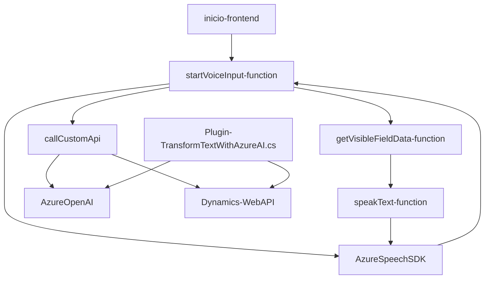

### Resumen técnico
El repositorio analizado contiene archivos clave para el desarrollo de funcionalidades que integran **procesamiento de texto y voz** mediante el SDK de **Azure Speech**, APIs personalizadas y plugins en un contexto de **Microsoft Dynamics 365 CRM**. Las soluciones están orientadas hacia la interacción mediante la entrada y salida de voz, el procesamiento optimizado de formularios, y la transformación de texto con IA.

---

### Descripción de arquitectura
1. **Tipo de solución:** API, frontend y plugins. Se observa un esquema mixto, donde hay componentes frontend en JavaScript que interactúan directamente con APIs internas y externas (Azure Speech SDK y Dynamics 365 Web API), y plugins en .NET que extienden la lógica del backend de Dynamics.
2. **Arquitectura:** 
   - En el frontend, se sigue una arquitectura **modular** para organizar las funcionalidades específicas (modularización de funciones que sintetizan voz, procesan transcripciones y actualizan formularios).
   - En el backend, los plugins (.NET) se ejecutan según el patrón de **arquitectura de capas** característico de Dynamics 365. El sistema depende de servicios externos (Azure OpenAI y Speech SDK) con una orientación hacia la **arquitectura orientada a eventos**.
3. **Patrones destacados:**
   - Modularidad para separar responsabilidades: archivos como `readForm.js` y `speechForm.js`.
   - Arquitectura basada en servicios: interacción con Azure Speech SDK y APIs OData de Dynamics 365.
   - Diseño orientado al evento: Uso de callbacks y asincronismo.
   - Plugin design pattern en el backend (.NET).

---

### Tecnologías usadas
1. **Lenguajes y Frameworks:**
   - **JavaScript** (Frontend): Implementación de interfaces y procesamiento de datos en el navegador.
   - **C# (.NET)** (Plugins): Extensiones en Dynamics CRM.
2. **Servicios externos integrados:**
   - **Azure Speech SDK**: Reconocimiento de voz y síntesis de texto.
   - **Azure OpenAI GPT-4 API**: Transformación de texto en JSON estructurado.
   - **Dynamics 365 Web API**: CRUD y operaciones con entidades.
3. **Librerías principales:**
   - **Newtonsoft.Json**, `System.Net.Http` en .NET: Para manipulación y consumo de APIs.
   - **JavaScript Promises**: Para asincronismo en el frontend con SDK y APIs.

---

### Dependencias externas
La solución depende de los siguientes servicios y componentes:
- **Microsoft Dynamics 365 Framework**: Entorno principal para los formularios y plugins.
- **Azure Speech SDK**: Reconocimiento y síntesis de voz utilizada en los scripts frontend.
- **Azure OpenAI GPT API**: Transformación avanzada de texto en el plugin.
- **Web APIs de Dynamics**: Permiten llamadas para manipular entidades de CRM.
- **Browser APIs**: Requeridas para ejecutar las funciones del SDK de Azure en el cliente.

---

### Diagrama Mermaid válido para GitHub

---

### Conclusión final
Esta solución combina frontend, APIs externas (Azure) y plugins en .NET para potenciar un entorno de **procesamiento inteligente de voz y texto** dentro de Dynamics 365. La arquitectura es modular y escalable en el frontend, mientras que el backend se basa en el modelo establecido por la plataforma. Las funciones están organizadas de manera precisa para cumplir con los principios del **evento asíncrono**, permitiendo una interacción fluida entre usuarios y sistemas.