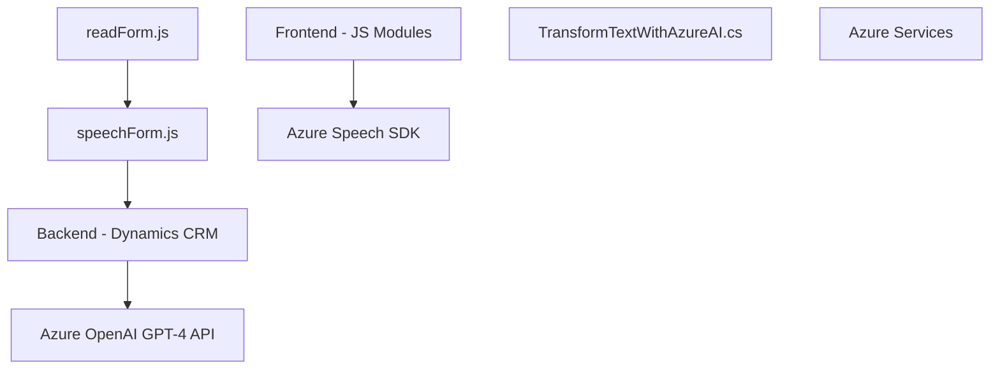

### Breve resumen técnico
Este repositorio implementa una solución híbrida que integra el reconocimiento y síntesis de voz, interacción por comandos hablados con formularios de **Dynamics 365**, y un plugin que utiliza **Azure OpenAI GPT-4** para estructuración del texto. Principalmente, contiene archivos relacionados con el frontend interactivo, reconocimiento de voz, y un plugin para procesamiento de texto optimizado.

---

### Descripción de arquitectura
La arquitectura general puede describirse como **modular y orientada a servicios**, con tres capas principales:
1. **Frontend (JavaScript)**:
   - Maneja la interacción del usuario mediante reconocimiento de voz y síntesis.
   - Implementa lógica para manipular formularios en Dynamics 365, integrando datos de entrada procesados por voz.
2. **Backend API personalizada (Dynamics CRM)**:
   - Transforma el texto procesado mediante un plugin que interactúa con Azure OpenAI para estructuración avanzada.
3. **Servicios de Azure**:
   - **Azure Speech SDK**: Reconocimiento y síntesis de voz para interacción directa desde frontend.
   - **Azure OpenAI API**: Transforma texto en JSON estructurado.

---

### Tecnologías usadas
1. **Front-end**:
   - JavaScript (paradigma funcional y modular).
   - Azure Speech SDK para reconocimiento y síntesis de voz.
   - DOM API para manipular HTML dinámico.
2. **Backend**:
   - **Microsoft Dynamics CRM SDK** para interacción de plugins.
   - **Newtonsoft.Json** para manipulación de objetos JSON.
   - **Azure OpenAI API** para procesamiento avanzado con modelos GPT.
   - **System.Net.Http** para comunicación HTTP con APIs externas.
3. **Patrones**:
   - Modularidad (con funciones reutilizables en el frontend).
   - Interfaz por voz.
   - Plugin basado en eventos del CRM (modelo publisher/subscriber).
   - Middleware para integración entre servicios de Dynamics y Azure.

---

### Diagrama Mermaid válido para GitHub

---

### Conclusión final
La solución representa una combinación de un enfoque **modular en el frontend** y **orientado a eventos en el backend**, con una clara división de responsabilidades:
- **Front-end** interactivo basado en voz: Diseñado para habilitar interfaces avanzadas accesibles mediante reconocimiento y síntesis de voz. Utiliza paradigmas funcionales y SDKs externos (Azure Speech).
- **Back-end procesador con plugins Dynamics CRM**: Principios de responsabilidad única y capacidad de extender funcionalmente el CRM, utilizando Azure OpenAI para procesamiento textual avanzado.
  
Aunque funcionalmente robusto, podría implementarse un sistema centralizado para gestión de configuraciones sensibles (`azureKey`, `azureRegion`, etc.) a través de entornos seguros o variables de configuración globales.