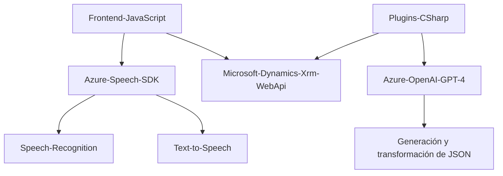

## Breve resumen técnico

El repositorio parece estar orientado a implementar una solución integrada con Microsoft Dynamics CRM que utiliza el **Azure Speech SDK** y **Azure OpenAI (GPT-4)**. La funcionalidad combina procesamiento de datos de formularios a través de interacción de voz (speech-to-text y text-to-speech) y transformación de texto mediante IA avanzada. Esto puede ser utilizado para mejorar la experiencia de usuario y facilitar la automatización de tareas en interfaces CRM.

---

## Descripción de arquitectura

Este sistema tiene componentes que interactúan entre sí en una arquitectura de **n capas**. Los archivos están diseñados según la siguiente distribución:
1. **Frontend/JS**:
   - Maneja la interfaz y funcionalidades relacionadas con la interacción de los usuarios, como la adquisición de datos (formulario) y generación de respuestas en voz.
   - Dependencias como el **Azure Speech SDK** se cargan dinámicamente.
   - Aplicación de patrones como adaptación de SDK y gestión dinámica de dependencias.

2. **Backend Plugins**:
   - Contiene **plugins** de Dynamics CRM.
   - Uno de los principales plugins conecta con **Azure OpenAI** para transformar texto con reglas específicas.
   - Usan patrones como integración con APIs externas y carga de servicios.

---

## Tecnologías usadas

### Frontend:
- **JavaScript**: Para interacción con formularios y generación de respuestas en voz.
- **Azure Speech SDK**: Para la conversión de texto a voz y voz a texto.
- **Microsoft Dynamics CRM (Xrm.WebApi)**: Manipulación de datos y APIs integradas.

### Backend:
- **C#**: En desarrollo de plugins para Dynamics CRM.
- **Azure OpenAI GPT-4**: Usado para integración con servicios de IA.
- **System.Net.Http**: Peticiones REST al servicio de OpenAI.
- **System.Text.Json / Newtonsoft.Json.Linq**: Serialización y manejo avanzado de JSON.
- **Microsoft.Xrm.Sdk**: Plug-ins extendidos y conexión con Dynamics CRM.

---

## Diagrama Mermaid

---

## Conclusión final

Este repositorio implementa una solución basada en **Azure Speech SDK** y **Azure OpenAI** integrada con **Microsoft Dynamics CRM**. Se trata de una arquitectura de **n capas** con frontend en JavaScript para manejar interacción del usuario y backend en C# para procesamiento avanzado de texto con inteligencia artificial. La solución es modular, extensible, y bien orientada a cubrir necesidades específicas como mapeo de formularios y automatización basada en entrada de voz. Sin embargo, el almacenamiento de claves de API directamente en el código es un factor de riesgo que debería resolverse usando algún sistema como **Azure Key Vault**.