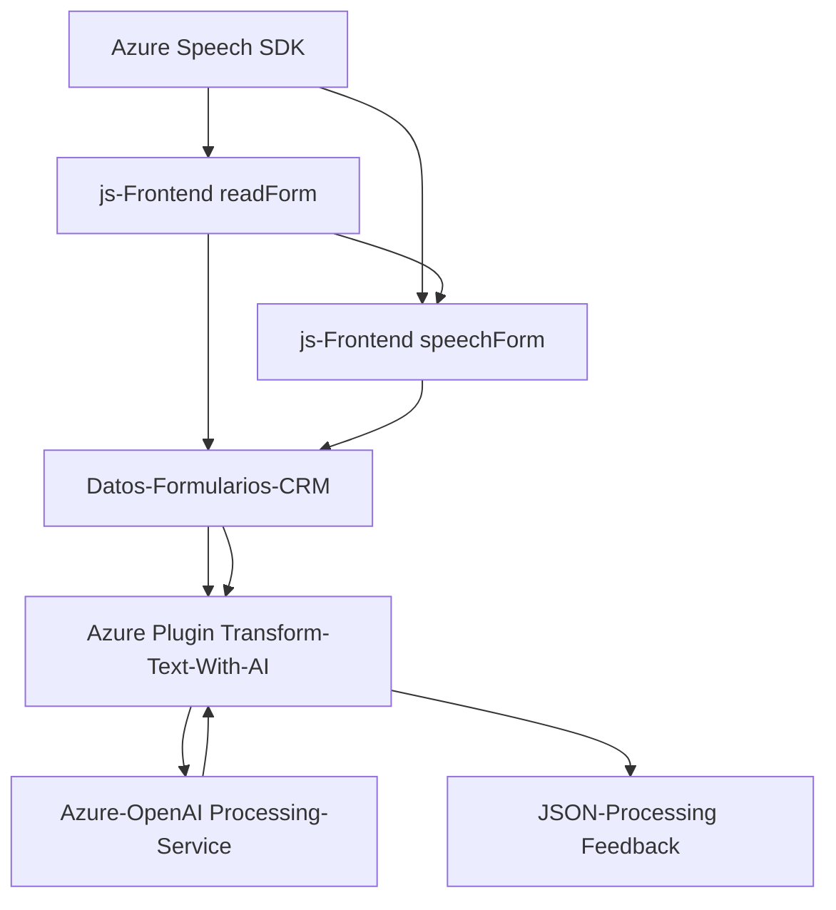

### **Resumen Técnico**
El proyecto parece corresponder a una **solución integrada para Microsoft Dynamics CRM** que introduce entrada/salida de voz, procesamiento de lenguaje natural, e integración con APIs de inteligencia artificial (IA). Consta de tres módulos principales:
1. **Frontend:** Implementado en JavaScript. Proporciona las funcionalidades para captura de entrada de voz, extracción de datos desde formularios CRM, y síntesis de voz.
2. **Backend Plugin:** Un plugin en C# que transforma texto usando Azure OpenAI, enviando respuestas estructuradas JSON al sistema.
3. **Servicios Externos:** Uso de Azure Speech SDK y Azure OpenAI para flujos de procesamiento.

---

### **Descripción de Arquitectura**
La solución sigue una arquitectura híbrida combinando principios de **plugin-based architecture** y **integración con microservicios externos**:
1. **Frontend:** Modular y desacoplado; funciones responsables de entrada/salida de voz y datos de formularios. Arquitectura **cliente-servidor**, donde el cliente se comunica con el Azure Speech SDK y APIs personalizadas.
2. **Backend Plugin:** **Plugin para Dynamics CRM** desarrollado en C#, integrado como extensión del sistema (procesamiento de texto mediante Azure OpenAI).
3. **Servicios Externos:** Microservicios de procesamiento de voz (Azure Speech SDK y OpenAI), cargados dinámicamente.

Patrones de diseño utilizados:
- **Modularización:** Separación de responsabilidades en funciones y clases claras.
- **Callback Pattern:** Uso de fórmulas asíncronas para garantizar cargas dinámicas del SDK.
- **Integración de Servicios Externos:** Llamadas a Azure para IA y voz.
- **Mapping Layer:** Gestión de transformaciones entre datos de formularios y sus claves internas.

---

### **Tecnologías Usadas**
- **JavaScript:** Implementación del Frontend (manipulación y extracción de datos dinámicamente).
- **C#/.NET Framework:** Plugin para Microsoft Dynamics CRM.
- **Azure Speech SDK:** Para entrada/salida de voz.
- **Azure OpenAI:** Para procesamiento de lenguaje natural.
- **Microsoft Dynamics CRM APIs (Xrm.WebApi):** Manipulación y flujo de datos entre CRM y servicios.
- **Newtonsoft.Json:** Operaciones JSON en el Plugin.
- **System.Net.Http:** Comunicación con Azure OpenAI.

---

### **Diagrama Mermaid**

---

### **Conclusión Final**
La solución es un ejemplo de una **aplicación específica para Dynamics CRM**, extendida con tecnologías de IA y servicios de voz para mejorar la experiencia de usuario mediante input/output de voz y transcripción inteligente de datos. Su arquitectura integra funcionalidades de **frontend modular**, un **plugin backend**, y servicios externos con **sólidos patrones de integración**. Aunque no es un sistema completamente basado en microservicios, utiliza servicios externos como componentes críticos, y está diseñado para ser extensible y adaptable.