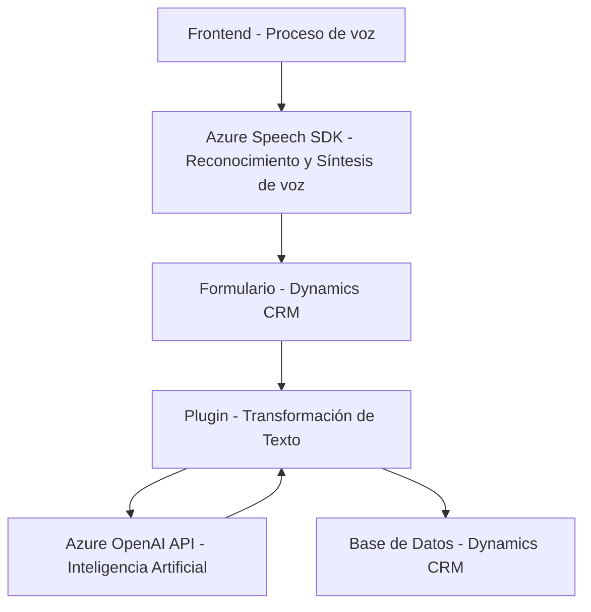

### Breve Resumen Técnico

El repositorio contiene múltiples componentes que integran funcionalidades específicas de entrada y salida de voz, manejo de formularios dinámicos, y transformación de texto con inteligencia artificial en Dynamics CRM. La solución combina un frontend implementado en JavaScript con Azure Speech SDK y backend en C#, utilizando Azure OpenAI para procesamiento de texto avanzado. Los archivos sugieren componentes de reconocimiento de voz, síntesis de voz, y plugins para integración directa con sistemas CRM.

---

### Descripción de la Arquitectura

1. **Solución Global**:
   - La solución es un **sistema híbrido** que combina un frontend basado en JavaScript con servicios de reconocimiento y síntesis de voz (Azure Speech SDK) y un backend plugin alojado en Dynamics CRM que utiliza la API de Azure OpenAI para el procesamiento avanzado de texto.

2. **Tipo de arquitectura**:
   - **Arquitectura Mixta**:
     - El frontend sigue una arquitectura de tipo **modular** que organiza métodos específicos para tareas discretas, como extracción de datos y comunicación con servicios externos de nube (Azure SDK).
     - El backend implementa una **arquitectura basada en plugins**, utilizando `IPlugin` para extender Microsoft Dynamics CRM.
   - **Capas distribuídas**:
     - El sistema integra una capa de presentación (frontend), una capa de lógica (backend con plugins) y una capa externa de servicios en la nube (Azure Speech SDK y Azure OpenAI API).
   - Elementos de **n capas** y uso de servicios en la nube, lo cual integra microservicios en la solución general.

---

### Tecnologías Utilizadas

#### **Frontend**
- **JavaScript**:
  - Funcionalidades de manejo de formularios y ejecución de reconocimiento/síntesis de voz.
- **Azure Speech SDK**:
  - Cargado dinámicamente desde un CDN. Permite convertir texto a audio y habla en texto.
- **DOM Manipulación**:
  - Manejo del formulario (elementos visibles y valores) mediante métodos nativos del DOM.

#### **Backend**
- **C#**
  - Programación orientada a objetos para extensibilidad en Microsoft Dynamics CRM.
  - Uso de interfaces estándar como `IPlugin`.
- **Azure OpenAI API**:
  - Procesamiento avanzado de texto.
  - Interacción mediante `HttpClient` para enviar solicitudes POST y recibir respuestas estructuradas.

#### **Infraestructura**
- **Microsoft Dynamics CRM SDK**:
  - Automación de procesos dentro del CRM.
- **JSON y REST APIs**:
  - Para manipulación y comunicación entre frontend/backend y servicios externos.
- **Cloud Integration**:
  - Uso extensivo de servicios en Azure (Speech y OpenAI).

---

### Principales Dependencias y Componentes Externos

1. Azure Speech SDK: Utilizado para reconocimiento y síntesis de voz desde el frontend.
2. Azure OpenAI API: Procesamiento avanzado de texto en el backend.
3. Dynamics CRM SDK: Extensiones y manipulación del sistema CRM.
4. HTTP Request Libraries (`System.Net.Http`): Implementación de llamadas REST API en backend.
5. JSON Libraries (e.g., `System.Text.Json`, `JObject`, etc.): Procesamiento estructurado de contenido.

---

### Diagrama Mermaid

---

### Conclusión Final

Este repositorio implementa una solución híbrida diseñada para mejorar la interacción de formularios mediante voz y procesamiento avanzado de texto, integrando servicios de nube como Azure Speech SDK y Azure OpenAI API. La arquitectura utiliza un frontend modular para la entrada y salida de voz, un backend plugin en C# para integrar procesos con Dynamics CRM, y patrones como n capas con elementos de microservicios (API en Azure). Se recomienda garantizar la seguridad de dependencias externas (ejemplo: claves API) y optimizar los métodos para mejorar el rendimiento, especialmente para implementaciones en producción.