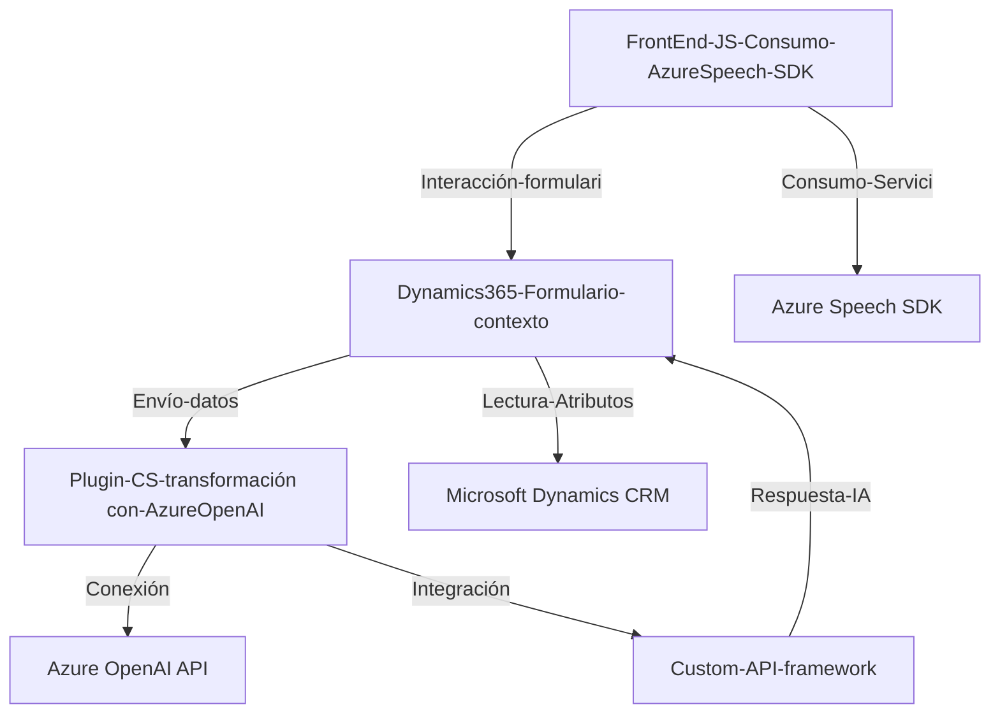

### Breve resumen técnico
El repositorio analiza múltiples componentes integrados dentro de una solución empresarial que combina funcionalidades de reconocimiento de voz, procesamiento de texto, y almacenamiento estructurado en formularios corporativos basados en Dynamics 365. Los archivos observados muestran una solución híbrida que orquesta servicios externos como **Azure Speech SDK** y **Azure OpenAI API** en conjunto con la infraestructura CRM.

---

### Descripción de arquitectura
La solución sigue una **arquitectura de integración de servicios** y combina patrones como **n-layers** para el procesamiento interno de lógica del cliente, junto con un enfoque de **plugin-based architecture** dentro de Dynamics 365. Se observa un flujo de control que toma datos de entrada del usuario (voz), los procesa de manera modular con SDKs y APIs, y los transforma/estructura en un contexto corporativo, utilizando microservicios externos.

Los tres principales niveles de la arquitectura son:

1. **Frontend**:
   - Reside en los scripts JavaScript (carpeta `FRONTEND/JS`), donde se manejan las interacciones del usuario y las integraciones con Azure Speech SDK.
   - Sistemas como formularios de Dynamics 365 son manipulados directamente mediante objetos como `executionContext`.

2. **Middleware/Plugins**:
   - El archivo C# (`Plugins/TransformTextWithAzureAI.cs`) funciona como un contexto dinámico que implementa un plugin en el ambiente de Dynamics CRM. Aquí se utiliza un patrón de microservicio minimizado para conectarse de manera programática al servicio Azure OpenAI API.

3. **Servicios externos**:
   - La solución depende de servicios como Azure Speech SDK y extensiones IA basadas en Azure OpenAI para la transcripción de voz, síntesis de voz y procesamiento natural del lenguaje.

---

### Tecnologías usadas
1. **Microsoft Dynamics CRM** para formularios y gestión de datos.
2. **Azure Speech SDK** para habilitar entrada de voz, transcripción y síntesis de voz.
3. **Azure OpenAI API** para procesamiento avanzado de lenguaje y generación de respuestas en JSON.
4. **Vanilla JavaScript** para desarrollar funciones frontend.
5. **C#** para el desarrollo de plugins en Dynamics CRM.
6. **System.Net.Http**, **Newtonsoft.Json.Linq**, **System.Text.Json** para procesamiento y solicitudes API HTTP en C#.

---

### Diagrama Mermaid

---

### Conclusión final
La solución combina dos dominios principales: reconocimiento de voz y procesamiento natural del lenguaje, y se integra estrechamente con los formularios de Dynamics CRM. Este enfoque muestra características centradas en servicios externos y modularidad, típicos de una arquitectura de capas con integración de **microservicios**. La elección de tecnologías Microsoft como Dynamics 365 y Azure plantea un ecosistema robusto y corporativo. Sin embargo, esta arquitectura puede conllevar alta dependencia de servicios específicos, por lo que la escalabilidad y el costo operativo deben considerarse en proyectos a gran escala.