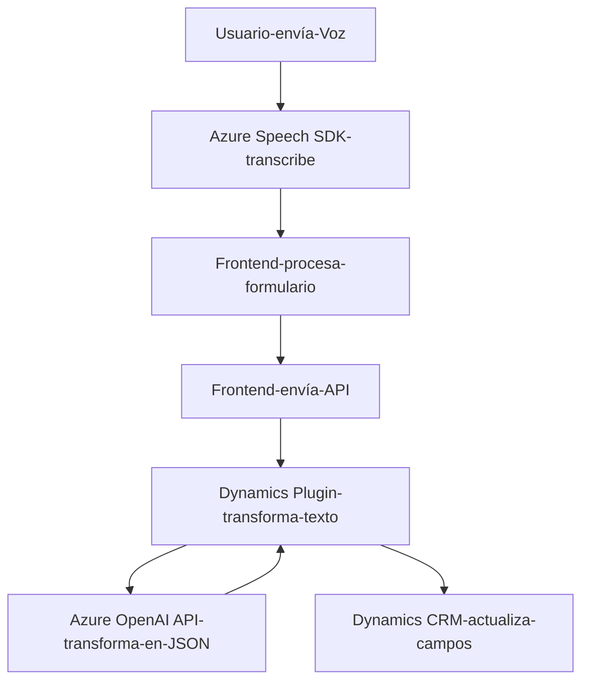

### Breve resumen técnico:
El repositorio contiene una solución integrada que permite la interacción mediante voz con formularios y datos en Dynamics 365, procesando información mediante Azure Speech SDK y Azure OpenAI. Esto incluye:
- Entradas de voz en el frontend (JavaScript) procesadas por APIs de Azure Speech.
- Transformación de texto a JSON estructurado mediante un plugin de Dynamics utilizando Azure OpenAI.

---

### Descripción de arquitectura:
La solución se basa en una arquitectura **modular y distribuida**:
1. **Frontend basado en cliente**:
   - Procesa entradas de voz desde formularios visibles en Dynamics 365.
   - Usa Azure Speech SDK para transcripción y síntesis de voz en español.
   - Implementa funciones para leer, sintetizar y actualizar formularios con voz y comandos procesados.
2. **Backend integrado en Dynamics CRM**:
   - Plugin desarrollado en C#, que transforma texto en JSON estructurado mediante Azure OpenAI API.
   - Inyectado como parte del runtime de Dynamics CRM.
3. **Servicios de terceros**:
   - Azure Speech SDK para procesamiento de voz.
   - Azure OpenAI API para transformación del texto.

La arquitectura combina **MVC basado en cliente** (frontend) y **SOA** mediante servicios externos para el backend (Dynamics CRM y Azure).

---

### Tecnologías usadas:
1. **Frontend**:
   - JavaScript (DOM API).
   - Azure Speech SDK para procesamiento de voz.
2. **Backend (Plugins)**:
   - C#.
   - Dynamics CRM SDK (Microsoft.Xrm.Sdk).
   - API estándar de Dynamics (`Xrm.WebApi`).
3. **Servicios externos**:
   - Azure OpenAI API.
   - Azure Speech SDK.
4. **Patrones de programación**:
   - Modularización funcional.
   - Patrón de plugins para Dynamics CRM.
   - Patrón de SOA para servicios externos.

---

### Diagrama Mermaid válido para GitHub:

---

### Conclusión final:
Esta solución implementa una arquitectura distribuida que combina frontend inteligente y un backend especializado en Dynamics CRM con servicios externos en la nube. Se destaca la modularidad, el uso de patrones como SOA y plugins, y la integración eficiente de servicios de Azure (Speech SDK y OpenAI). Es ideal para contextos empresariales donde se necesitan automatizaciones avanzadas basadas en voz y procesamiento de datos estructurados.