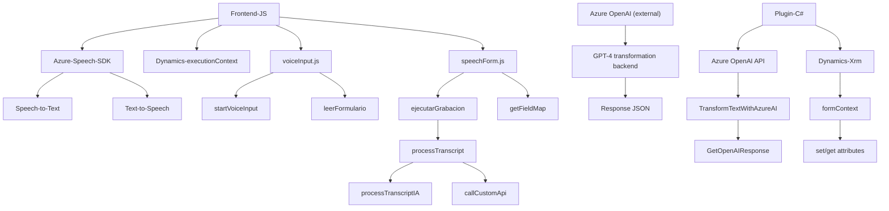

### Breve resumen técnico
El repositorio presenta tres archivos que trabajan en conjunto para una solución que utiliza **Azure Speech SDK** y **Azure OpenAI** en integración con Microsoft Dynamics CRM. La funcionalidad principal gira en torno al procesamiento de texto y voz para mejorar la interacción y gestión de registros en formularios de un sistema CRM.

---

### Descripción de arquitectura
La arquitectura está diseñada para integrarse con Microsoft Dynamics CRM en un entorno empresarial. Se divide en tres componentes principales:  
1. **Frontend de integración:** Desarrollo en **JavaScript** con uso del **Azure Speech SDK**, permitiendo lectura y síntesis de texto de formularios en voz y captura de entrada por reconocimiento de voz. Implementa un patrón modular y utiliza APIs externas.
2. **Plugin basado en C#:** Desarrollado usando la interfaz de Dynamics CRM (`IPlugin`), interactúa directamente con servicios de Azure OpenAI para realizar transformaciones de texto mediante modelos GPT-4 y emplea diseño orientado a servicios (SOA).
3. **Modelo de tres capas integradas:** Cliente frontend para UX, lógica de negocio en el backend (plugins y APIs), y funcionalidad de almacenamiento centralizado en Dynamics CRM. 

Este enfoque puede considerarse una **arquitectura en n-Capas**, donde el frontend, el backend, y el servicio de CRM están separados y se comunican a través de APIs y plugins.

---

### Tecnologías usadas
1. **Frontend:**  
   - **JavaScript** para lógica del cliente.  
   - **Azure Speech SDK:** Servicio de nube para reconocimiento y síntesis de voz.  
   - **Dynamics CRM context APIs** (`executionContext`, `formContext`) para interactuar con el frontend del CRM.  

2. **Backend:**  
   - **C#**: Desarrollo de plugins y manejo de lógica de negocio.  
   - **Dynamics CRM Plugin Framework:** Interfaz `IPlugin` para extender funcionalidades del sistema CRM.  
   - **Azure OpenAI API:** Integración con el modelo GPT-4 para procesamiento avanzado de texto.  
   - **RESTful APIs:** Utilización de HTTP Client para comunicar con servicios externos como Azure.  
   - **JSON Libraries:** Serialización y deserialización de datos con `System.Text.Json` y `Newtonsoft.Json`.

3. **Patrones Arquitectónicos:**  
   - **Evento-Asíncrono:** Uso de Promises (JavaScript) y ejecución lenta con callbacks para cargar dependencias externas.  
   - **Modularidad:** Separación lógica de funcionalidades en funciones y clases específicas.  
   - **API Gateway:** Centralización de interacciones con Azure Speech y OpenAI a través de HTTP requests.  
   - **Repository Pattern:** Uso de métodos para acceso estructurado a datos (formulario CRM).  
   - **Plugin-based Architecture:** Extensión directa del CRM con plugins.  

---

### Diagrama **Mermaid** válido para GitHub

---

### Conclusión Final
La solución es una **hybrid** que combina un entorno web frontend basado en JavaScript y servicios de nube con un backend basado en plugins para Dynamics CRM. La comunicación principal entre capas utiliza APIs y plugins: un diseño que facilita las integraciones con plataformas externas y reduce el acoplamiento entre frontend y backend.

- **Ventajas:**   
  - Extensible infraestructura mediante Dynamics plugins y API.  
  - Potente resolución de problemas mediante servicios de IA como GPT-4 de Azure OpenAI.  
  - Incorpora reconocimiento y síntesis de voz, mejorando la accesibilidad.  

- **Limitaciones:**  
  - Dependencia fuerte en servicios específicos de Azure (Speech SDK y OpenAI).  
  - Requiere configuración avanzada del contexto CRM y claves de servicios de nube.