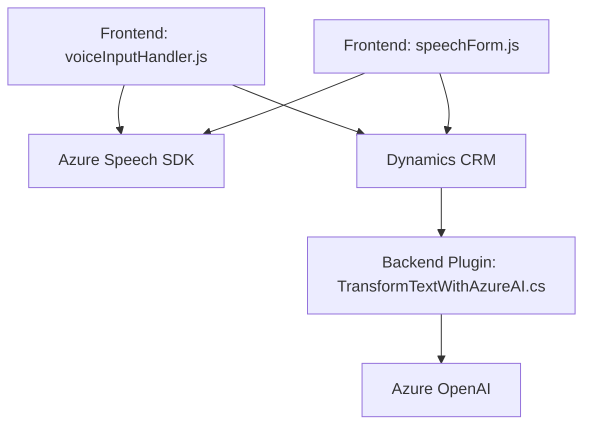

### Resumen técnico
El repositorio combina la funcionalidad **frontend** (interacción de usuario en formularios) con un **backend** (plugins de Dynamics CRM) que se conecta a servicios de IA de Azure, principalmente **Azure Speech SDK** y **Azure OpenAI**. Está orientado a una solución CRM con capacidades de reconocimiento y síntesis de voz, así como interpretación de datos mediante IA.

---

### Descripción de arquitectura
La arquitectura general es **modular**, basada en una integración entre capas:
1. **Frontend JS**:
   - Maneja la interacción del usuario mediante lectura de formularios, síntesis de voz e interpretación. Utiliza **Azure Speech SDK** para la interacción de voz.
2. **Backend Plugin (C#)**:
   - Extiende las funcionalidades de Microsoft Dynamics CRM. Trabaja como un microservicio basado en un **plugin** que conecta el CRM con **Azure OpenAI** para la interpretación avanzada de datos y generación de JSON transformado.

En términos arquitecturales:
- Seguimiento del modelo **Cliente-Servidor**.
- **API Gateway** mediante plugins y servicios externos como Azure Speech SDK y Azure OpenAI.
- **Patrón Modular** claramente visible en la separación de lógica (frontend para interacción y backend para procesamiento avanzado).

---

### Tecnologías y patrones utilizados
1. **Tecnologías**:
   - **Frontend**: Azure Speech SDK, ES6 (Javascript moderno).
   - **Backend**: Microsoft Dynamics CRM SDK, Azure OpenAI, .NET Framework/C#.
2. **Patrones arquitectónicos**:
   - Integración modular.
   - **Callback pattern** para cargar SDK de forma dinámica.
   - **Microservicios y API-driven** para integrar servicios externos como Azure Speech SDK y Azure OpenAI.
   - Principio **"SRP"**: separación de responsabilidades en funciones.

---

### Dependencias o componentes externos
1. **Azure Speech SDK**:
   - Reconocimiento y síntesis de voz en tiempo real.
2. **Azure OpenAI API**:
   - Para ejecutar transformaciones textuales basadas en reglas con inteligencia artificial.
3. **Microsoft Dynamics CRM SDK**:
   - Gestión del contexto del formulario CRM, actualización de campos y registros.
4. **Custom API (`TransformTextWithAzureAI.cs`)**:
   - Se utiliza como punto de entrada para comunicación entre el CRM y Azure OpenAI.

---

### Diagrama Mermaid

---

### Conclusión final
Este repositorio parece ser parte de una solución **CRM extendida**, diseñada para interactuar con registros personalizados en **Dynamics CRM** mediante tecnologías de voz y texto. Las dependencias con servicios de **Azure Speech SDK** y **Azure OpenAI** refuerzan las capacidades de IA, brindando una experiencia más inteligente y adaptativa para el usuario.

La arquitectura está basada en una combinación de tecnología **cliente-servidor** y **microservicios**, donde cada módulo está optimizado para un propósito específico (frontend para UX, backend para análisis avanzado). Sin embargo, las dependencias en servicios de Azure implican también limitaciones relacionadas con conectividad y costos de uso de servicios externos.