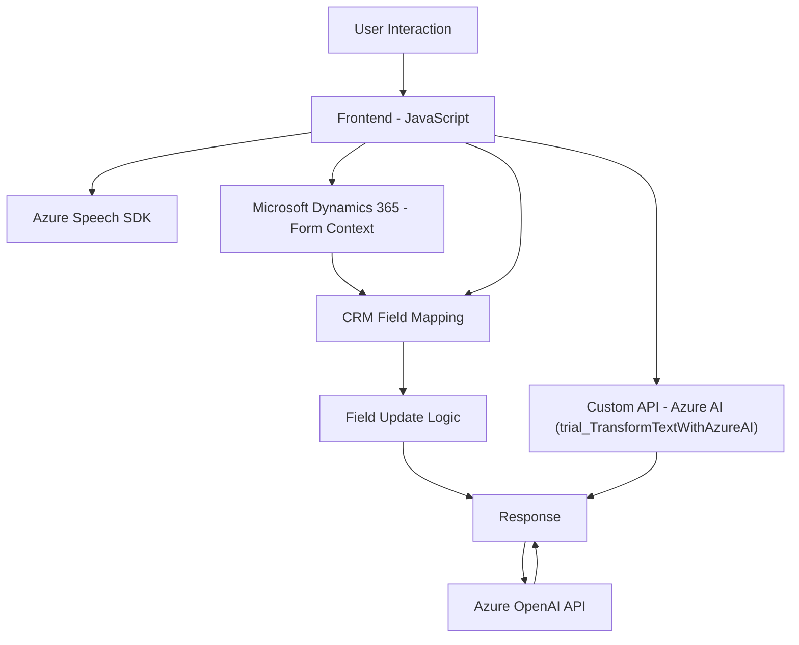

### Breve resumen técnico

Estos archivos representan una solución que integra **Microsoft Dynamics 365**, **Azure Speech SDK** y **Azure OpenAI**, con funcionalidades específicas para:  
1. **Lectura de formularios con síntesis de voz** (Frontend).
2. **Reconocimiento de voz para completar formularios dinámicos** (Frontend).
3. **Procesamiento de texto con inteligencia artificial mediante un plugin en Dynamics 365** (Backend).

La solución tiene componentes de frontend y backend bien diferenciados, enfocados en mejorar la experiencia de usuario mediante la interacción por voz y automatización con APIs externas.

---

### Descripción de arquitectura

La arquitectura tiene características híbridas:  
1. **Frontend** basado en JavaScript para interacción directa con el cliente (explotando SDK de Azure y eventos de usuario).  
2. **Plugin Backend** para transformar datos dentro de Dynamics 365 (utilizando el patrón de diseño de plugins e integrándose con una API externa de Azure OpenAI).  
3. **Servicios externos** utilizados para tareas específicas, como reconocimiento, síntesis de voz y procesamiento de texto.

Aunque no es estrictamente una arquitectura completamente distribuida, la solución tiene elementos de **arquitectura basada en capas** con integración hacia los servicios externos que aportan modularidad y flexibilidad.

---

### Tecnologías usadas

1. **Frontend**:
   - **JavaScript**: Principal lenguaje de desarrollo para la lógica del cliente en los archivos `readForm.js` y `speechForm.js`.
   - **Azure Speech SDK**: Interacción con servicios de reconocimiento y síntesis de voz en la nube.
   - **Microsoft Dynamics 365 APIs**: Manipulación de formularios dinámicos (CRM).

2. **Backend**:
   - **C# .NET**: Desarrollo del plugin para Dynamics 365.
   - **Microsoft Dynamics 365 SDK**: Extensión de funcionalidad dentro del ecosistema CRM.
   - **Azure OpenAI API**: Procesamiento de texto mediante inteligencia artificial hospedada en Azure.

3. **Interacción con servicios externos**:
   - **Azure AI Services**: Reconocimiento de voz, síntesis de texto y análisis de datos.
   - **Custom APIs**: Gestión de procesos de transformación automatizados en la nube.

---

### Diagrama Mermaid válido para GitHub

---

### Conclusión final

Esta solución combina diferentes tecnologías y servicios (Azure Speech SDK, Azure OpenAI, Microsoft Dynamics 365) organizados en una arquitectura **n-capas** con características de integración basadas en servicios externos. Utiliza **patrones de eventos** en el frontend para activar acciones dinámicas y orienta su diseño hacia la modularidad funcional mediante la separación de responsabilidades por componentes y servicios.

El diseño es robusto y permite la extensión en múltiples direcciones: mejora de las APIs externas, incorporación de nuevas funciones de AI, y escalabilidad del sistema integrando más microservicios. Sin embargo, en su estado actual, esta solución no es completamente microservicios, pero tiene los fundamentos para transformarse en una arquitectura más distribuida, si así lo requiere el proyecto.