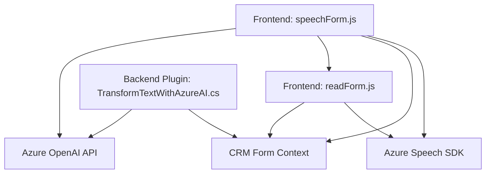

### Breve resumen técnico
El repositorio parece ser parte de una solución para integración de voz y procesamiento de texto en formularios de CRM. Contiene tres archivos principales: dos manejan la interacción del frontend con un formulario web y servicios externos de reconocimiento de voz y síntesis de texto (Azure Speech SDK), y el tercero es un backend plugin para procesar texto mediante Azure OpenAI en Dynamics CRM.

---

### Descripción de arquitectura
El proyecto utiliza una arquitectura modular con componentes independientes que interactúan entre sí. No sigue una arquitectura puramente n-capas ni un microservicio completo, sino que combina elementos de la arquitectura orientada a servicios (SOA) para integrar funcionalidades de reconocimiento y síntesis de voz (Azure Speech SDK) con APIs personalizadas y servicios como OpenAI. El plugin en C# pertenece a Dynamics CRM y se utiliza como un componente adicional para extender capacidades del sistema con Azure AI.

---

### Tecnologías usadas
1. **Frontend:**  
   - **JavaScript** para manipular formularios y cargar dinámicamente bibliotecas externas.  
   - **Azure Speech SDK** para reconocimiento y síntesis de voz.  

2. **Backend:**  
   - **C#** para desarrollo de un plugin CRM.  
   - **Microsoft Dynamics CRM SDK** para operaciones con formularios CRM.  
   - **Azure OpenAI API** para transformación de texto.  
   - **Newtonsoft.Json** y **System.Text.Json** para manejo avanzado de JSON.  
   - **HTTPClient** para comunicación con servicios externos.

3. **Servicios externos:**  
   - Azure Speech SDK como API para procesamiento de audio.  
   - Azure OpenAI API para generación de JSON estructurado.

---

### Diagrama Mermaid
A continuación, el diagrama representa las interacciones de los componentes del repositorio:

---

### Conclusión final
El repositorio combina frontend y backend para integrar funcionalidades avanzadas de voz y procesamiento de texto en un CRM. Utiliza Azure Speech SDK para síntesis y reconocimiento de voz, junto con Azure OpenAI para transformar texto en estructuras de datos útiles como JSON. La arquitectura es modular con integración de servicios externos y componentes extendidos en Dynamics CRM, lo que proporciona flexibilidad y escalabilidad para manejar formularios dinámicos en entornos empresariales.