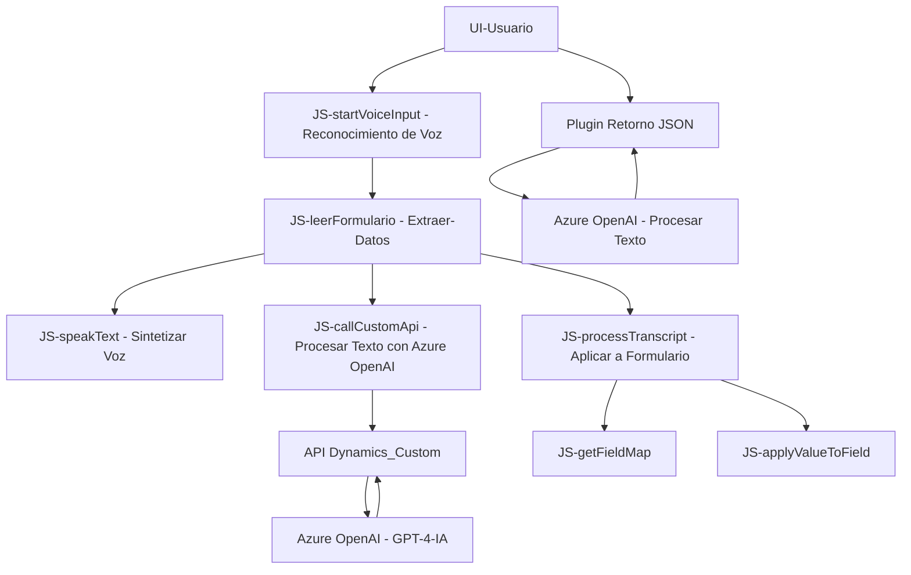

### **Breve resumen técnico**
El repositorio contiene una solución para integrar funcionalidades avanzadas de reconocimiento y síntesis de voz junto con procesamiento de texto generado mediante un modelo de inteligencia artificial (Azure OpenAI) en un ambiente de trabajo orientado a formularios dinámicos, como los de Microsoft Dynamics CRM. La solución tiene dos componentes principales: un frontend basado en JavaScript que se ejecuta en el navegador del cliente y un backend implementado como un plugin en C# para Dynamics CRM.

---

### **Descripción de la arquitectura**
La solución utiliza una arquitectura **n-capas** con separación entre el frontend (cliente) y backend (servidor), que interactúa con APIs externas (Azure Speech SDK y Azure OpenAI API), junto con funcionalidades directamente ligadas al contexto de Microsoft Dynamics CRM. Los flujos se distribuyen como sigue:

1. **Frontend/Browser (JS):**
   - Funciones para reconocimiento de voz y generación de síntesis de texto hablado utilizando el Azure Speech SDK.
   - Aplicación dinámica de valores al contexto del formulario.
   - Comunicación con APIs personalizadas alojadas en Dynamics CRM.

2. **Backend/Server (C#):**
   - Plugin que se ejecuta en eventos específicos de CRM (basado en IPlugin).
   - Procesamiento de texto avanzado utilizando Azure OpenAI y transformación a formato JSON estructurado.
   
Esta arquitectura no es monolítica, pero tampoco alcanza niveles de microservicios ya que el sistema se organiza como módulos que interactúan bajo la dependencia de los servicios ofrecidos por Dynamics CRM.

---

### **Tecnologías usadas**
1. **Frontend:**
   - **JavaScript (ES6)**: Lógica implementada para reconocimiento/síntesis de voz y manejo del contexto del formulario.
   - **Azure Speech SDK**: Reconocimiento y síntesis de voz en tiempo real.
   
2. **Backend:**
   - **C#**: Implementación del plugin para procesamiento de texto.
   - **Dynamics CRM SDK** (Microsoft.Xrm.Sdk): Integración directa con la infraestructura de CRM.
   - **Azure OpenAI (GPT-4)**: Procesamiento de texto para retorno de datos estructurados.
   - **Newtonsoft.Json** y **System.Text.Json**: Serialización y manejo de estructuras JSON.

3. **Patrones y enfoques:**
   - Modulares y orientados a roles específicos (lectura de voz, manejo de transcripciones, procesamiento de texto).
   - Integración asíncrona y basada en eventos para procesamiento externo.
   - Uso de servicios HTTP y SDK dinámico.

---

### **Diagrama Mermaid**

---

### **Conclusión final**
La solución está diseñada para maximizar la interactividad con sistemas CRM mediante tecnologías emergentes como reconocimiento de voz y procesamiento de texto con IA. La arquitectura combinada incluye modularidad en el frontend mediante JavaScript y capacidades integradas en el backend de Dynamics CRM mediante plugins que procesan texto de manera avanzada utilizando servicios externos como Azure OpenAI. Este tipo de aplicación es ideal para entornos corporativos que buscan automatización, accesibilidad y extensibilidad en sistemas CRM.