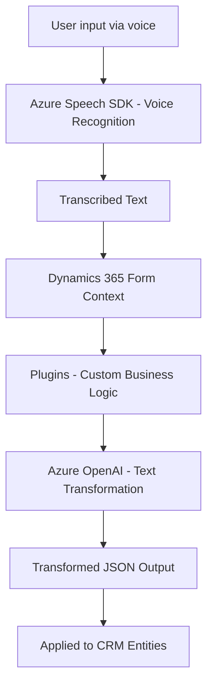

### Breve resumen técnico:

El análisis del repositorio muestra un sistema orientado a la integración de tecnologías de reconocimiento de voz y síntesis (Azure Speech SDK) con formularios contextualizados en Dynamics 365. Además, emplea plugins en C# que interactúan con el servicio Azure OpenAI para transformar texto en formatos específicos. La implementación utiliza una mezcla de componentes frontend (JavaScript), backend (C# plugin), y servicios externos (Azure Speech SDK y OpenAI).

---

### Descripción de la arquitectura:

La arquitectura es híbrida y consiste en:
1. Una **capa de presentación** ocupada por los scripts de frontend `readForm.js` y `voiceInputHandler.js` que interactúan con Dynamics 365.
2. Una **capa de negocio personalizada** basada en plugins (`TransformTextWithAzureAI.cs`) que ejecutan lógica empresarial bajo eventos predefinidos de Dynamics CRM (Microsoft API).
3. Una **capa de servicios externos** que usa APIs como Azure Speech SDK y Azure OpenAI para la gestión de voz y transformación de texto.

La arquitectura general es **n-capas**, con fuerte integración de componentes externos (SaaS) y uso de patrones como modularidad y eventos.

---

### Tecnologías usadas:

1. **Frontend:**
   - **Lenguajes:** JavaScript.
   - **Frameworks y bibliotecas externas:**
     - Azure Speech SDK: Para la síntesis de voz y reconocimiento de entrada.
   - **Frameworks internos:** Dynamics 365 JavaScript API, usado para interactuar con formularios y atributos.

2. **Backend:**
   - **Lenguaje:** C#.
   - **Framework:** ASP.NET Core Plugin basado en Microsoft Dynamics CRM.
   - **Bibliotecas:**
     - Microsoft Xrm SDK: Para integración con el modelo CRM.
     - Newtonsoft.Json.Linq: Manipulación de datos estructurados (JSON).
     - System.Net.Http: Realización de solicitudes HTTP hacia Azure OpenAI.

3. **Servicios externos:**
   - Azure Speech SDK: Reconocimiento y síntesis de voz.
   - Azure OpenAI: Transformación y enriquecimiento semántico de texto.

---

### Diagrama Mermaid (compatible con GitHub Markdown):

---

### Conclusión final:

El repositorio describe una solución basada en **integración de voz y automatización inteligente** en el ecosistema de Dynamics 365. La arquitectura es **modular y basada en n-capas**, siendo adaptable y extensible gracias al uso de servicios externos como **Azure Speech SDK** y **Azure OpenAI**. A través de plugins en Dynamics y scripts frontend, el sistema habilita funcionalidad avanzada como la introducción de datos mediante voz y su enriquecimiento semántico.

Las tecnologías están bien conectadas entre sí, aunque la solución depende considerablemente de la estabilidad de los servicios externos y de Dynamics CRM, lo que podría ser un reto en términos de rendimiento y costos operativos.