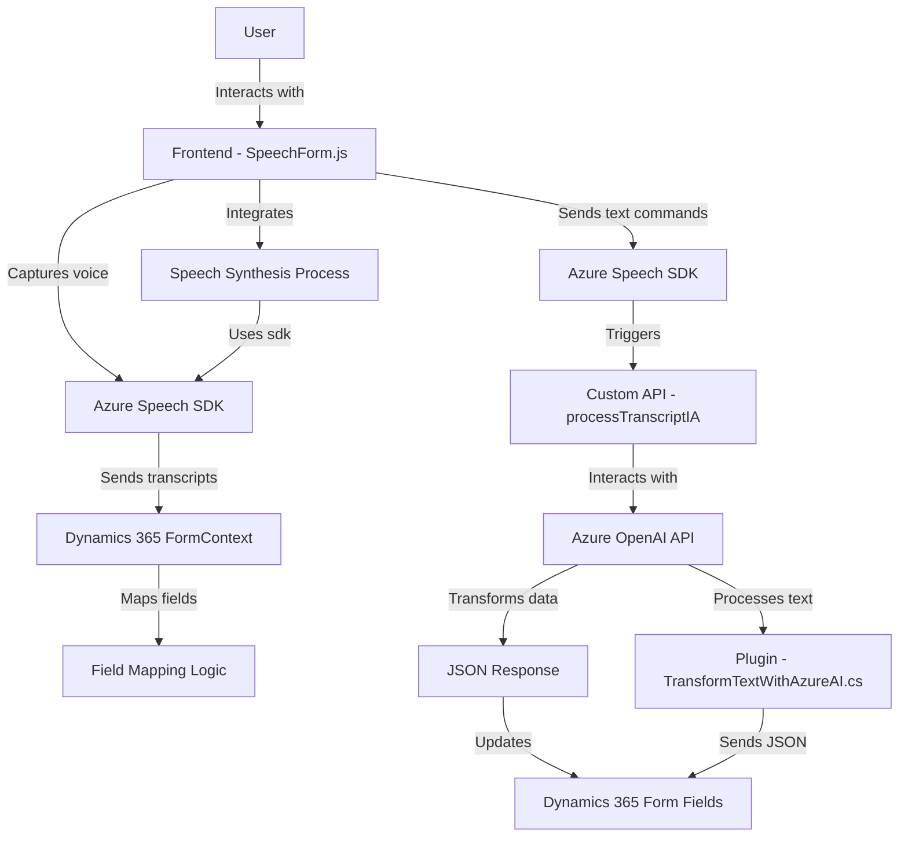

### Breve resumen técnico
El repositorio contiene tres archivos: `readForm.js` y `speechForm.js` implementan un frontend en JavaScript que interactúa con formularios en Dynamics 365, mientras que `TransformTextWithAzureAI.cs` es un plugin para Microsoft Dynamics CRM que procesa texto mediante la API de Azure OpenAI. El sistema está diseñado para generar síntesis de voz, interpretar comandos de voz, y transformar datos de forma avanzada con IA.

---

### Descripción de arquitectura
La solución tiene:

1. **Arquitectura orientada a servicios** (SOA): Involucra interacción entre componentes internos (Dynamics 365) y externos como APIs de Azure.
2. **Multicapa**:
   - **Frontend**: Gestión de interacción directa con usuarios (captura y síntesis de voz).
   - **Backend (Plugin)**: Manipulación de texto basado en IA y reglas dinámicas en un contexto de CRM.
3. **Eventos y callbacks**: Manejo reactivo en el frontend (SDKs dinámicos para voz) y el backend (plugins activados por eventos en Dynamics CRM).
4. **Modularidad**: Uso de funcionalidades separadas como mapeo de campos, procesamiento de datos transcritos, y consumo de APIs externas.

---

### Tecnologías usadas
1. **Frontend**:
   - **Azure Speech SDK**: Reconocimiento y síntesis de voz.
   - **JavaScript**: Para manipulación de formularios y lógica de voz.
   - **Dynamics 365 Xrm.WebApi**: Para interactuar con el backend de Dynamics 365.

2. **Backend (Plugin)**:
   - **Microsoft Dynamics CRM SDK**: Gestión de contexto CRM y servicios internos.
   - **Azure OpenAI API**: Procesamiento de texto con reglas avanzadas usando IA.
   - **C#/.NET Framework**: Programación del plugin.

3. **General**:
   - **REST API Integration**: Para el consumo de servicios de Azure.
   - **JSON Handling**: Para comunicación entre el frontend, backend, y APIs externas.

---

### Diagrama Mermaid compatible con GitHub Markdown

---

### Conclusión final
La solución es una arquitectura orientada a servicios (SOA) y utiliza una combinación del frontend en JavaScript y un backend basado en plugins en Dynamics 365. La interacción está basada en eventos y callbacks, que conectan el SDK de Azure Speech para voz y la API de Azure OpenAI para procesar texto. Se sigue una estructura modular para habilitar funcionalidades avanzadas, como la síntesis y transformación de texto en formularios de CRM.

Sin embargo, deben implementarse prácticas de seguridad adecuadas, como un manejo seguro de API Keys y mejoras en el control de errores. Es una solución potente pero tiene una dependencia alta en servicios externos de Azure.