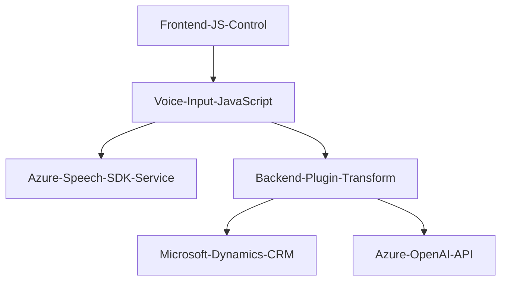

### Breve Resumen Técnico
El repositorio combina tres elementos principales: frontend JavaScript para interacción con formularios y transcripción de voz mediante el Azure Speech SDK, consumo de API personalizada estableciendo comunicación con Microsoft Dynamics CRM y un plugin implementado con C# para la transformación de texto utilizando Azure OpenAI API dentro del entorno de Dynamics CRM. La solución está pensada para entornos de negocio, en particular aplicaciones CRM (Customer Relationship Management).

---

### Descripción de Arquitectura
La arquitectura tiene componentes diseñados bajo el paradigma de **microservicios** que interactúan con ecosistemas de Microsoft Dynamics CRM y Azure Cloud. Cada funcionalidad (género de voz, reconocimiento de voz, transformación de texto mediante OpenAI) está claramente dividida en módulos o archivos, con responsabilidades muy específicas. Esto permite una arquitectura desacoplada y extensible:

1. **Frontend JavaScript**:
   - Modular y basado en funciones.
   - Depende de la librería **Azure Speech SDK** para reconocimiento y generación de voz.
   
2. **Plugin en C#**:
   - Usando la arquitectura de plugins de Dynamics CRM (plugin-based architecture).
   - Consume el servicio **Azure OpenAI API** para transformar texto en estructuras JSON usando normas predefinidas.
   - Comunicación entre servicios usando HTTP.

3. **Patrones Aplicados**:
   - **Modularidad funcional** (en el Frontend).
   - **Plugin Architecture** (para CRM).
   - **Cliente / Servidor** (interacción entre frontend y servicios CRM backend mediante APIs).
   - **External API integration** para interactuar con Azure Speech SDK y Azure OpenAI API.
   - **Service Factory** en la capa del plugin.

---

### Tecnologías Usadas
1. **Frontend**:
   - **JavaScript** (Vanilla JS sin frameworks adicionales).
   - **Azure Speech SDK** para generación y reconocimiento de voz.
   - Comunicación API mediante `Xrm.WebApi`, específico para Microsoft Dynamics CRM.

2. **Backend** (CRM Plugin):
   - Lenguaje **C#**.
   - Framework de desarrollo **Microsoft Dynamics CRM SDK**.
   - Bibliotecas como `System.Text.Json`, `Newtonsoft.Json.Linq`, `System.Net.Http` para JSON y peticiones web.
   - **Azure OpenAI API** para transformación de texto.

---

### Diagrama Mermaid (GitHub compatible)

---

### Conclusión Final
Este repositorio representa una solución dentro del contexto de **Microsoft Dynamics CRM** que enriquece la experiencia del usuario con capacidades avanzadas de inteligencia artificial y servicios externos de Azure. Está organizado como una solución modular: tiene un frontend que interactúa con formularios de Dynamics para la entrada de datos utilizando voz, junto con un backend gestionado por un plugin que procesa los datos utilizando el servicio Azure OpenAI. La arquitectura implementada puede considerarse una aproximación a **microservicios**, debido a la separación en módulos funcionales desacoplados. 
