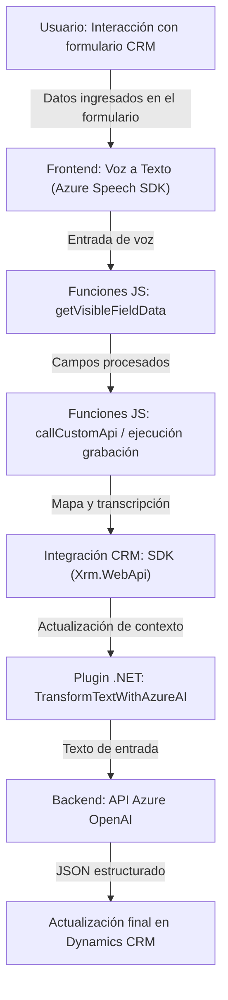

### Breve resumen técnico

Esta solución combina múltiples componentes para procesar datos de formularios en Dynamics CRM de manera avanzada. El frontend facilita la interacción con el usuario a través de funciones de entrada y salida vocal usando Azure Speech SDK, mientras que los plugins en el backend enriquecen el modelo de datos utilizando Azure OpenAI para transformar texto en formatos JSON estructurados. La solución integra servicios externos de Microsoft Azure, utilizando un enfoque basado en APIs y SDKs, acompañado de una arquitectura modular orientada a eventos.

---

### Descripción de arquitectura

La arquitectura general combina elementos **modulares profundamente acoplados** en un entorno de Dynamics CRM, con la integración de servicios de terceros (como Azure Speech SDK y Azure OpenAI). La arquitectura puede considerarse **n-capas**, donde cada capa (frontend, middleware/CRM y APIs externas) realiza una tarea específica:

1. **Capa de frontend (JavaScript)**: 
   - Implementa interacción directa entre usuarios y el formulario de Dynamics CRM. Maneja eventos, mapeo de datos y comandos de voz.
   - Realiza sintetización de texto a voz (speech synthesis) y transcripción de voz en comandos (speech-to-text).

2. **Capa de backend (Plugins para Dynamics CRM)**: 
   - Procesa y transforma datos provenientes de formularios usando reglas específicas.
   - Interactúa con Azure OpenAI REST API para la estandarización de texto a JSON estructurado, integrando el contenido generado en Dynamics CRM.

3. **Servicios externos** (Azure Speech y OpenAI):
   - Azure Speech SDK: Maneja transcripción de voz y sintetización de texto.
   - Azure OpenAI: Procesa texto y genera dinámicamente un JSON estructurado como respuesta basada en IA.

---

### Tecnologías usadas

- **Frontend:**
  - **JavaScript**: Lenguaje base para las funciones de voz y extracción de datos de los formularios.
  - **Azure Speech SDK**: API para sintetización de voz y transcripción.
  - **Microsoft Dynamics CRM SDK (`Xrm.WebApi`)**: Interacción con el entorno del CRM para modificar datos directamente.

- **Backend:**
  - **.NET Framework / .NET**: Base para los plugins del CRM.
  - **Dynamics CRM SDK**: Extiende funcionalidades del CRM mediante `IPlugin`.
  - **Azure OpenAI (REST API)**: Inteligencia artificial para procesamiento de texto avanzado.
  - **JSON parsers**: `Newtonsoft.Json.Linq` y `System.Text.Json` para manejar datos estructurados en formato JSON.
  - **HttpClient**: Envío de solicitudes HTTP a servicios externos.

---

### Diagrama **Mermaid** válido para GitHub

---

### Conclusión final

La solución presentada es un sistema híbrido con una arquitectura de componentes integrados, orientada al servicio de formularios en Microsoft Dynamics CRM. Combina una estructura **front-to-back (n-capas)** con patrones event-driven y plugins configurables. Las dependencias externas son fundamentales, específicamente el **Azure Speech SDK** para la interacción por voz y el **API de Azure OpenAI** para el procesamiento avanzado de texto. Aunque no está explícitamente definido como microservicios o arquitectura hexagonal, se concluye que utiliza un modelo **monolítico extendido con servicios externos**, perfectamente adaptado a su nicho en soluciones empresariales basadas en Dynamics CRM.