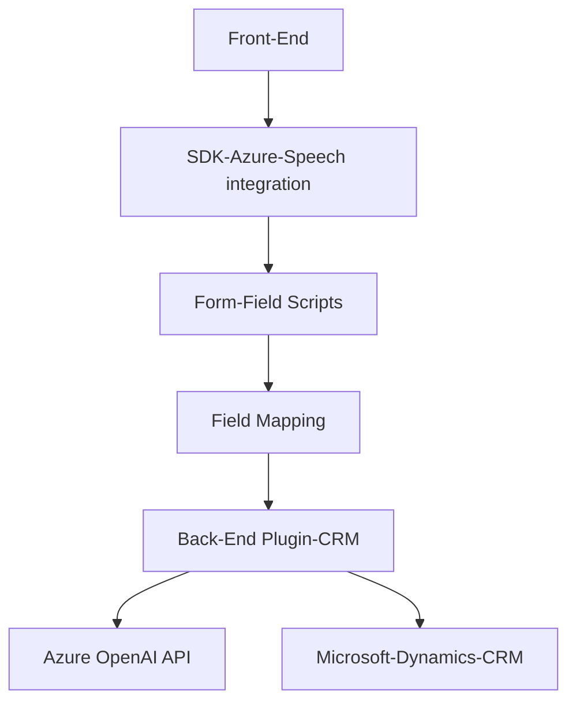

## Análisis y descripción técnica

### Breve resumen técnico
El repositorio contiene principalmente tres archivos, cada uno diseñado para un propósito específico:

- **Frontend/JS/readForm.js y speechForm.js**: Scripts escritos en JavaScript que utilizan el SDK de Azure Speech para interacción con formularios HTML dinámicos, lectura de valores visibles y actualización de datos en un entorno CRM mediante reconocimiento de voz.
- **Plugins/TransformTextWithAzureAI.cs**: Plugin de Microsoft Dynamics CRM escrito en C#. Procesa texto utilizando Azure OpenAI para generar transformaciones en formato JSON, asegurando compatibilidad con normas predefinidas.

Los archivos están diseñados con el objetivo de integrar funcionalidades de interacción avanzada con el usuario, basadas en el uso de IA (Azure OpenAI) y SDKs específicos (Azure Speech SDK).

---

### Descripción de arquitectura
La arquitectura presentada es **modular**, con componentes divididos por tareas específicas, en donde:
- **Frontend**: Maneja interacción con el usuario mediante reconocimiento de voz y síntesis. Este componente utiliza patrones de cargador dinámico y procesamiento en pasos en cadena (pipeline processing).
- **Backend (CRM Plugin)**: Extiende la funcionalidad del sistema CRM utilizando el patrón plugin para ejecutar lógica personalizada en eventos y recopilar datos procesados por la IA para actualizar o utilizar en el entorno CRM.
  
La interacción entre el sistema de reconocimiento de voz y el plugin CRM utilizando Azure OpenAI sugiere una arquitectura basada en servicios (SOA), donde se delegan tareas específicas de transformación a servicios externos (Azure Speech SDK y Azure OpenAI).

---

### Tecnologías y frameworks usados
- **Frontend**:
  - Lenguaje: JavaScript.
  - SDK: Azure Speech SDK.
  - Framework: Ninguno explícito (probablemente está embebido en HTML).
- **Backend**:
  - Lenguaje: C#.
  - SDKs de Microsoft Dynamics CRM (`Microsoft.Xrm.Sdk`).
  - Biblioteca para JSON: `Newtonsoft.Json.Linq`.
  - HTTP Operations: `System.Net.Http`.
  - Azure OpenAI API: Idiomas naturales y reglas de procesamiento avanzado.

---

### Dependencias y componentes externos
1. **Azure Speech SDK**: Para reconocimiento de voz y síntesis.
2. **Azure OpenAI API**: Para procesamiento de texto avanzado.
3. **Microsoft Dynamics CRM WebAPI**: Comunicación directa con el entorno CRM para manipular y persistir datos.
4. **Custom API trial_TransformTextWithAzureAI**: Una API personalizada alojada para extender comportamiento usando AI.
5. **3rd Party Dependencies**:
   - JSON manipulación: `Newtonsoft` y `System.Text.Json`.
   - Red y HTTP: `System.Net.Http`.

---

### Diagrama Mermaid

---

### Conclusión Final
La solución presentada es un sistema **modular** que aprovecha tanto tecnologías frontend con Azure Speech SDK como capacidades backend mediante plugins de Dynamics CRM y Azure OpenAI para adaptarse a necesidades empresariales avanzadas. La arquitectura es un híbrido entre arquitectura tradicional de capas y enfoque orientado a servicios (SOA), integrando fuentes externas para lograr flexibilidad y extensibilidad. Aunque parece estar diseñada específicamente para entornos de CRM, el sistema puede ampliarse para otras plataformas que manejen datos dinámicos a nivel de formularios e interacción con el usuario. 