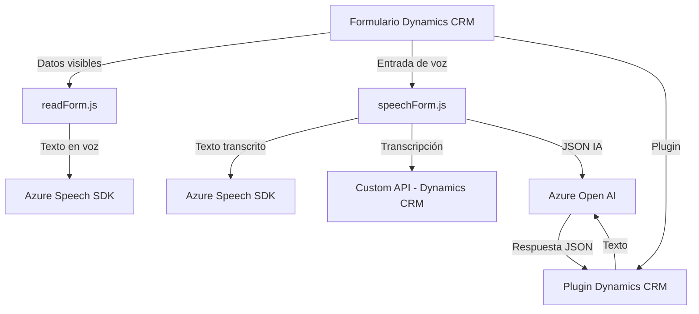

### Análisis técnico global del repositorio

#### Breve resumen técnico
El repositorio contiene una solución basada en componentes orientados al cliente y plugins backend que se integran con Microsoft Dynamics CRM y Azure para manejar entradas de voz, formularios, y transformaciones de texto. Utiliza APIs y SDKs de Azure (Azure Speech y Azure OpenAI) junto con una estructura modular de funciones y clases.

---

### 1. ¿Qué tipo de solución es?
En conjunto, la solución parece ser una **herramienta full-stack orientada al soporte de interacción de usuario con formularios en CRM**. Dentro de ella:
- **Frontend**: Los archivos `readForm.js` y `speechForm.js` supervisan formularios en Dynamics CRM y permiten reconocimiento/síntesis de voz, así como interacción con datos mediante la integración del SDK de Azure Speech.
- **Backend**: El archivo `TransformTextWithAzureAI.cs` es un plugin para Dynamics CRM que conecta con Azure OpenAI API para transformar texto según reglas definidas por el usuario.

En resumen:
- Es una solución híbrida (mezcla de frontend y backend) con integración en una plataforma CRM y dependencias de servicios externos.

---

### 2. Tecnologías, frameworks y patrones usados
#### **Tecnologías:**
- **Frontend**:
  - **JavaScript** (DOM APIs, funciones modulares, e integración con Dynamics CRM).
  - **Azure Speech SDK**: Para síntesis y reconocimiento de voz.
  - **Custom API Dynamics CRM**: Para procesamiento de datos y soporte IA.
- **Backend**:
  - **C# Plugin Framework**: Amplía la funcionalidad de Dynamics CRM con extensibilidad.
  - **Azure OpenAI API**: Para manejo de transformaciones avanzadas de texto.
  - **Microsoft Dynamics SDK**: Para conectar y manipular entidades.

---

#### **Patrones:**
- **Frontend**:
  - Modularidad: Funciones con responsabilidades unívocas (ej. `speakText`, `ensureSpeechSDKLoaded`).
  - Integración dinámica: SDK de Azure se carga en tiempo de ejecución.
  - Delegate Pattern: Uso de funciones como callbacks para eventos dinámicos (ej. SDK cargado).
- **Backend**:
  - Plugin Pattern: Customización de procesos nativos en CRM mediante extensibilidad.
  - Delegación: Lógica del plugin delegada a métodos específicos (ej. `GetOpenAIResponse`).
  - Declarative Pattern: Configuración basada en reglas para transformación de texto vía API externa.

---

### 3. ¿Qué tipo de arquitectura tiene?
La solución tiene componentes tanto front-end como back-end:
1. **Multi-capa**:
   - Frontend: Compuesta por módulos basados en funciones para manejar la interacción desde formularios y entrada por voz.
   - Backend: Plugins en C# que se integran con Dynamics SDK.
2. **Service-Oriented Architecture (SOA)**:
   - Utiliza servicios externos (Azure Speech y OpenAI APIs) para procesos fundamentales, delegando su lógica.
3. **Client-Server**:
   - El frontend y los plugins funcionan como intermediarios entre Dynamics CRM y los servicios externos.

---

### 4. Dependencias o componentes externos presentes
#### Externos:
- API y SDK de **Azure Speech** (`SpeechSDK.SpeechConfig`, etc.) para síntesis y reconocimiento de voz.
- **Azure OpenAI API** para transformación de texto en el backend.
- Microsoft **Dynamics CRM API** para integrar con formularios y entidades gestionadas por el usuario.
- **System.Net.Http** (manejo de comunicación HTTP en el backend).
- **JSON libraries** (`Newtonsoft.Json.Linq`, `System.Text.Json`) para serialización/deserialización.

#### Internos:
- Custom APIs de Dynamics CRM en `speechForm.js` para analizar y procesar comandos de voz con IA (via lógica backend o Custom API endpoint).

---

### Diagrama Mermaid (GitHub Markdown compatible)
El diagrama explica los componentes y flujos principales entre frontend, backend y dependencias externas.

---

### Conclusión final
La solución combina una interacción avanzada entre usuarios y formularios en Dynamics CRM mediante integración con servicios de Azure (Speech y OpenAI). Utiliza una arquitectura modular y orientada a servicios (SOA), y destaca por su capacidad de adaptarse dinámicamente según las necesidades de procesamiento de voz y semántica.

Se recomienda revisar las dependencias externas para garantizar compatibilidad a largo plazo con actualizaciones de Azure SDK y APIs CRM. Además, la inclusión de pruebas unitarias o validaciones en el frontend y backend sería clave para fortalecer la robustez del proyecto.