### Breve Resumen Técnico
Este repositorio integra soluciones para habilitar entrada y salida de datos mediante voz en formularios de Dynamics CRM. Para el reconocimiento y síntesis de voz, utiliza el **Azure Speech SDK**, y emplea la **API de Azure OpenAI** para la transformación de texto en base a IA. Está diseñado principalmente como soporte de funcionalidad tanto para el frontend (basado en JavaScript) como para el backend (basado en C# .NET).

### Descripción de Arquitectura
1. **Arquitectura General:**
   - **Multicapa**: La solución tiene una clara separación de responsabilidades entre frontend y backend. En el nivel del cliente, scripts en JavaScript gestionan la interacción del usuario con el formulario (lectura y escritura de datos usando voz). En el nivel backend (.NET), se integra la lógica de procesamiento de textos mediante el plugin `TransformTextWithAzureAI`, que conecta con Azure OpenAI API para realizar transformación avanzada de texto.
   - **Service-Oriented Architecture (SOA)**: Utiliza servicios externos (Azure Speech SDK y Azure OpenAI API) para realizar operaciones avanzadas (reconocimiento de voz y procesamiento de texto).

2. **Componentes Principales:**
   - **Frontend**:
     - **readForm.js**: Extrae y sintetiza datos del formulario en voz utilizando Azure Speech SDK.
     - **speechForm.js**: Reconoce comandos de voz con Azure Speech SDK y los mapea a campos de formularios en Dynamics CRM. Utiliza APIs personalizadas para llamadas adicionales a Azure OpenAI API vía Dynamics CRM.
   - **Backend**:
     - **TransformTextWithAzureAI.cs**: Implementa un plugin en Dynamics CRM que procesa texto mediante Azure OpenAI y devuelve un JSON estructurado de acuerdo con reglas predefinidas.

---

### Tecnologías Usadas
1. **Frontend:**
   - **JavaScript**: Las capacidades de voz y mapeo son implementadas de manera modular.
   - **Azure Speech SDK (JS)**: Permite síntesis de voz y reconocimiento de voz.
   - **APIs y Eventos del DOM (window, document)**: Para manipulación dinámica de formularios web.

2. **Backend:**
   - **C# (.NET framework)**: Se implementa la lógica del plugin.
   - **Dynamics CRM SDK (`Microsoft.Xrm.Sdk`)**: Para generar plugins y manejar datos de entidades de forma programática en Dynamics CRM.
   - **Azure OpenAI API**: Provee capacidades de inteligencia artificial con GPT mediante la integración directa a través de solicitudes HTTP POST.
   - **JSON Libraries (`Newtonsoft.Json`, `System.Text.Json`)**: Para parseo y serialización de JSON.
   - **System.Net.Http**: Para consumir servicios externos como Azure OpenAI.

3. **Patrones de Diseño:**
   - **Modularización Funcional**: Las funciones con responsabilidades claras en el frontend y backend.
   - **Integración de servicios externos**:
     - Speech SDK: Para entrada y salida de voz.
     - OpenAI: Para procesamiento y normalización de texto.
   - **Callbacks y manejo asíncrono**: Carga dinámica de librerías y APIs.
   - **Plugin-Based Architecture** (Backend Dynamics CRM): Usando Dynamics coupling API para disparar eventos personalizados.

---

### Diagrama *Mermaid* (100 % compatible con **GitHub Markdown**)

```mermaid
graph TD
    A["Frontend/JS - readForm.js"] --> B["Azure Speech SDK - síntesis de voz"]
    A --> C["Extraer datos de campos visibles del formulario en ejecución"]
    A --> H["Convertir texto a audio - 'speakText()'"]
    A --> I["Dynamic SDK Loading - 'ensureSpeechSDKLoaded()'"]

    J["Frontend/JS - speechForm.js"] --> K["Azure Speech SDK - reconocimiento de voz"]
    J --> L["Procesar comandos de voz recibidos"]
    J --> M["Mapping dinámico - Mapear valores a formulario 'getFieldMap()'"]
    J --> N["Llamadas a custom API 'trial_TransformTextWithAzureAI'"]
    J --> O["Transcripción AI - Azure OpenAI API"]

    P["Backend/Plugins/TransformTextWithAzureAI.cs"] --> Q["Integración Dynamics CRM Plugin"]
    P --> O 
    P --> R["Procesar Texto con Azure OpenAI - JSON estructurado"]
    P --> S["Interacción dinámica con Dynamics CRM ['InputParameters', 'OutputParameters']"]
```

---

### Conclusión Final
- **Tipo de Solución:** La solución combina un frente de usuario interactivo basado en **funcionalidad soporte de voz** mediante Azure Speech SDK en el frontend y **procesamiento avanzado de texto con Azure OpenAI** en el backend.
  
- **Arquitectura:** Sigue una arquitectura **multicapa con integración de servicios externos (SOA)**, optimizada para la función de entrada y salida mediante voz. Esto lo hace ideal para aplicaciones que integren interfaces accesibles en entornos corporativos Dynamics CRM.

- **Futuro:** Es recomendable documentar más exhaustivamente las integraciones externas y el diseño de las solicitudes API ante posibles cambios en endpoints (como el de Azure OpenAI). También podría ganar robustez con pruebas unitarias y simulación de escenarios de fallos en dependencias.