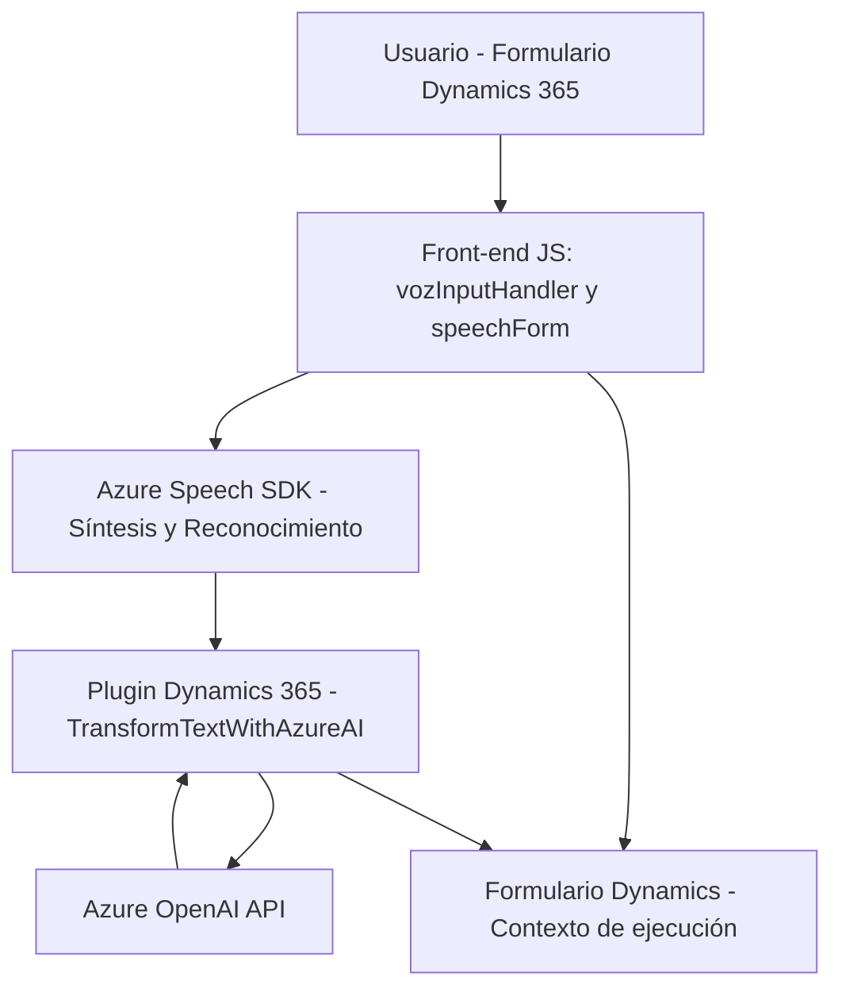

### Breve resumen técnico
El repositorio implementa una solución integral para gestionar interacción por voz y texto en Dynamics 365 integrando servicios de Azure. Consiste principalmente en módulos para:
1. **Front-end** (JavaScript): Interacción con formularios, manejando reconocimiento y síntesis de voz.
2. **Plugin en Dynamics 365** (.NET/C#): Transformación estructurada de texto mediante Azure OpenAI API.

Se utiliza una combinación de tecnologías como **Azure Speech SDK**, **Dynamics 365 Web API**, y servicios de IA de Azure. Cada módulo aprovecha patrones de diseño como **SDK Loader**, **Data Mapping**, y orquestación de procesos.

---

### Descripción de arquitectura
La solución combina dos arquitecturas:
1. **Arquitectura N-capas** para el sistema global (Dynamics 365, Plugins, API, Front-end).
2. **Arquitectura basada en microservicios** para las interacciones externas (Azure Speech SDK y Azure OpenAI API).

#### Componentes principales:
- **Front-end JS:** Maneja interacción del usuario en un navegador y gestiona el uso del SDK de Azure para síntesis y reconocimiento de voz.
- **Dynamics Plugin (.NET):** Actúa como middleware para integrar modelos IA con el sistema empresarial.
- **APIs Externas:** Azure OpenAI API para transformación de texto y Azure Speech SDK para operaciones de voz.

---

### Tecnologías usadas
1. **Front-end:**
   - Framework: JavaScript (Sin frameworks adicionales).
   - SDK: Azure Speech SDK.
   - Patrones: Funciones encapsuladas y carga dinámica (`ensureSpeechSDKLoaded`).

2. **Plugins (.NET):**
   - Lenguaje: C#.
   - APIs de Dynamics 365: `IPlugin`, `IOrganizationService`.
   - REST/HTTP: Para integrarse con Azure OpenAI API.
   - Manejador JSON: Newtonsoft.Json y System.Text.Json.

3. **Servicios en la nube:**
   - Azure Speech SDK.
   - Azure OpenAI API.

4. **Patrones:**
   - Orquestación para secuenciar operaciones front-end (voz → procesamiento → formulario).
   - SDK Loader para configuración dinámica.
   - Microservicio para delegar procesamiento complejo de texto (Azure OpenAI).

---

### Diagrama Mermaid

---

### Conclusión final
El repositorio muestra una solución híbrida que combina componentes front-end y back-end con procesamiento externo basado en IA. La integración con Azure permite dotar de capacidades avanzadas en reconocimiento de voz y transformación de texto, mientras los plugins en Dynamics aseguran la correcta manipulación de datos empresariales. Su diseño es robusto y extensible, ideal para entornos corporativos que manejan interacción avanzada con usuarios.