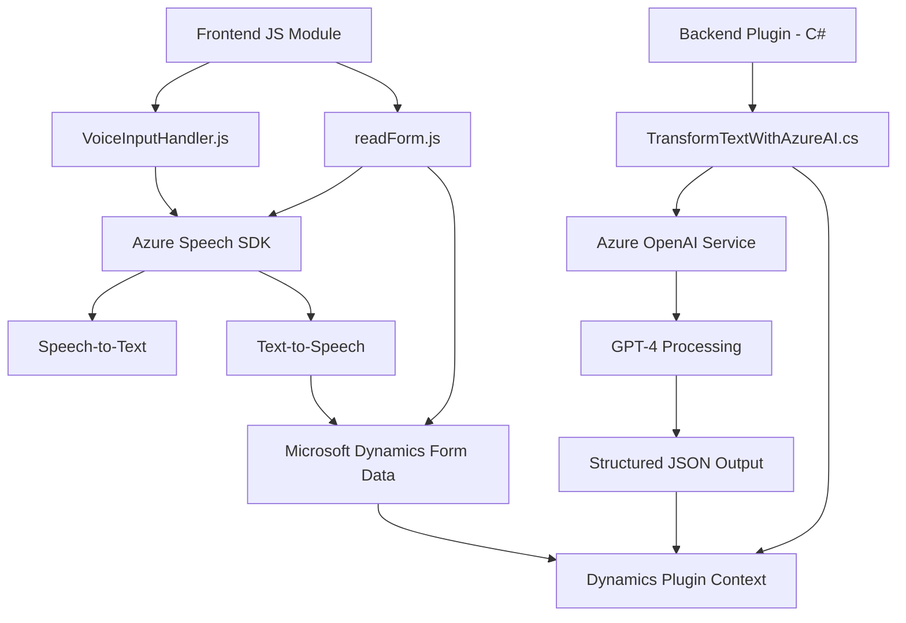

### Breve resumen técnico

El repositorio combina tres componentes principales: dos relacionados con el reconocimiento y procesamiento de voz en formularios (`readForm.js`, `voiceInputHandler.js`) y otro para transformar texto usando IA mediante un plugin de Dynamics CRM (`TransformTextWithAzureAI.cs`). La funcionalidad está orientada a integración de servicios basados en inteligencia artificial (Azure OpenAI y Azure Speech SDK) con el entorno Microsoft Dynamics, procesando datos de forma dinámica.

---

### Descripción de arquitectura

1. **Estructura general:**
   - Esta solución tiene una arquitectura híbrida que combina:
     - **Frontend modular:** Desarrollado con JavaScript para interactuar con el usuario y los formularios.
     - **Plugin basado en SOA:** Utiliza Microsoft Dynamics CRM para extender funcionalidades con llamadas al servicio OpenAI de Azure.
   - **Capa de integración:** Los archivos interactúan con APIs externas (Azure Speech SDK y Azure OpenAI Service) para procesamiento avanzado de datos.

2. **Arquitectura identificada:**
   - **N-Capas:** Combina capas independientes:
     - Presentación (frontend para la UI en Dynamics CRM).
     - Lógica de negocio (API y plugins para procesamiento de datos).
     - Acceso a datos (API de Microsoft CRM y servicios Azure).
   - Complementada con la integración de servicios externos basados en SOA (Service-Oriented Architecture).

---

### Tecnologías usadas

1. **Frontend:**
   - **JavaScript** para manipulación dinámica de formularios y reconocimiento de voz.
   - **Azure Speech SDK:** Reconocimiento de voz, síntesis de texto a voz (Text-to-Speech).
   - **Xrm.WebApi:** Para sincronización de datos con Microsoft Dynamics CRM.

2. **Backend:**
   - **C# con .NET Framework**: Implementación del plugin para transformación de texto.
   - **Azure OpenAI Service**: Uso del modelo GPT-4 para transformar texto según reglas definidas.
   - **Newtonsoft.Json**: Manejo de JSON.

---

### Dependencias o componentes externos

1. **Azure Speech SDK:**
   - Integración directa con el entorno para reconocimiento de comandos de voz y conversión de texto a voz.

2. **Azure OpenAI Service:**
   - Endpoint remoto para procesamiento de texto con el modelo GPT-4.

3. **Microsoft Dynamics CRM Backend:**
   - Como sistema base para formularios y lógica extendida mediante plugins (`Xrm.WebApi`).

4. **.NET SDKs:**
   - Manejo de datos JSON, solicitudes HTTP, y estándares de plugins para Dynamics CRM.

5. **Servicios HTTP dinámicos**:
   - Script en línea (`https://aka.ms/csspeech/jsbrowserpackageraw`) para cargar dependencias del SDK de Azure Speech.

---

### Diagrama Mermaid válido para GitHub

---

### Conclusión final

La solución está diseñada para integrarse con entornos Microsoft Dynamics CRM, extendiendo las capacidades nativas mediante la incorporación de servicios de inteligencia artificial y reconocimiento de voz de Azure. La arquitectura se distribuye en capas que separan presentación, lógica de negocio y acceso a datos. Se basa en patrones robustos como SOA y plugin para manejar eventos y flujos de datos.

**Recomendaciones:**
- Refactorizar la gestión de claves sensibles para cumplir mejores prácticas de seguridad.
- Definir validación más estricta en los puntos de entrada HTTP.
- Documentar exhaustivamente los endpoints externos para facilitar mantenimiento o transición.