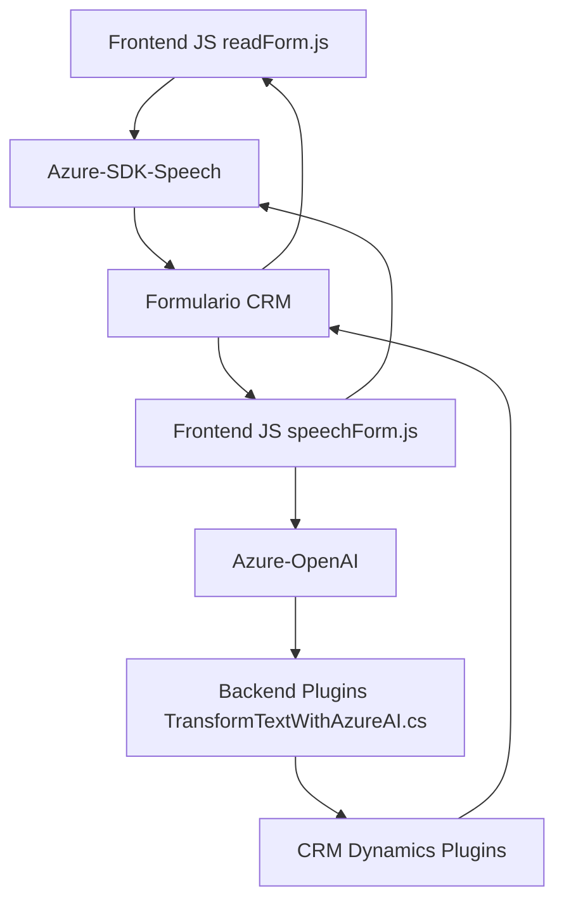

### Breve resumen técnico
El repositorio describe tres componentes principales que forman parte de una solución integrada para interacción de formularios en sistemas CRM mediante funcionalidades basadas en reconocimiento de voz, síntesis de voz, procesamiento de lenguaje natural y transformación de datos con Inteligencia Artificial (IA).

---

### Descripción de arquitectura
La solución es una combinación de **arquitectura modular por capas** con **integración de APIs externas**. Los archivos trabajan de forma colaborativa en siguientes niveles:
1. **Frontend/JS/readForm.js & speechForm.js**:
   - Se encargan de obtener datos de formularios y convertirlos mediante Azure Speech SDK para funciones como síntesis y reconocimiento de voz.
   - Procesan eventos y manejan la interacción del usuario (voice-to-text, text-to-voice).
2. **Backend/Plugins/TransformTextWithAzureAI.cs**:
   - Extiende funcionalidades del CRM mediante un plugin que utiliza servicios externos como Azure OpenAI para análisis y transformación de datos entrantes.
   - Devuelve resultados en formato JSON estructurado para automatización de flujo de trabajo.

La arquitectura combina **patrones de capas** y **integración de microservicios externos**:
- La comunicación con Azure Speech SDK y Azure OpenAI se realiza mediante RESTful APIs.
- El plugin en Dynamics CRM actúa como una extensión modular para lógica empresarial.

---

### Tecnologías y frameworks usados
1. **Frontend**:
   - **JavaScript**: Para lógica cliente.
   - **Azure Speech SDK**: Reconocimiento y síntesis de voz.
2. **Backend**:
   - **C# con .NET Framework**: Para desarrollo de plugins Dynamics CRM y procesamiento de datos.
   - **Azure OpenAI Service** (GPT-4): Para procesamiento de lenguaje natural y generación de datos estructurados JSON.
   - **REST APIs**: Comunicación bidireccional con servicios en la nube.
3. **CRM/Dynamics**:
   - Extensiones mediante `IPlugin` y objetos específicos del SDK (ej. `IOrganizationService`).

---

### Diagrama Mermaid válido para GitHub

---

### Conclusión final
La solución está diseñada para agregar accesibilidad y productividad en ambientes CRM utilizando tecnologías como reconocimiento y síntesis de voz, junto con capacidades de IA avanzadas para procesamiento y transformación de datos. La arquitectura modular facilita el manejo de responsabilidades en cada componente:
- **Frontend**: Interacción con el usuario y captura de datos.
- **Backend**: Transformación de texto con IA y extensión de funcionalidades CRM.

Esta combinación de módulos frontend-backend y el uso de servicios cloud apunta hacia una **arquitectura orientada a servicios (SOA)**, destacando por la integración fluida con APIs externas en un entorno empresarial.