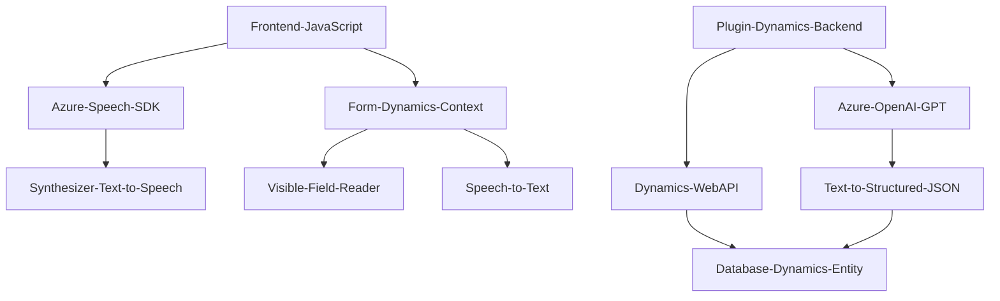

### Breve resumen técnico
Este repositorio contiene una solución orientada a facilitar la accesibilidad y la interacción dinámica con formularios en Dynamics 365. Los componentes principales integran múltiples tecnologías: un frontend basado en JavaScript interactúa con Microsoft Azure Speech SDK, mientras que un backend implementa un plugin en C# utilizando Dynamics CRM SDK y Azure OpenAI para el procesamiento avanzado de texto.

---

### Descripción de la arquitectura
1. **Tipo de solución**:  
   La solución tiene una estructura híbrida, combinando un módulo frontend en **JavaScript** para manejar entrada y salida de voz en una interfaz gráfica de usuario (usando Azure Speech SDK), y un plugin backend en **C#** que interactúa con Dynamics CRM, utilizando Azure OpenAI para insights empresariales y transformación avanzada de datos.
   
2. **Tecnologías, frameworks y patrones utilizados**:  
   - **Frontend**:
      - **Azure Speech SDK**: Gestión del reconocimiento de voz y síntesis.
      - **JavaScript**: Implementación modular basada en funciones.
      - **Dynamics Context (Xrm)**: Acceso y manipulación de datos dentro de formularios de Dynamics 365.
      - **Eventos y callbacks**: Módulos desacoplados que se comunican mediante callbacks y eventos del contexto.
   - **Backend**:
      - **Microsoft Dynamics SDK (C#)**: Plugins basados en eventos del sistema CRM.
      - **Azure OpenAI**: Integración mediante solicitudes HTTP para transformaciones de texto.
      - **JSON (Newtonsoft)**: Manipulación avanzada de datos mediante serialización y deserialización.

3. **Tipo de arquitectura**:
   - **Capas**: La solución es una arquitectura de n capas, donde:
      - **Frontend** se encarga de la interacción del usuario y la entrada/salida de voz (Capa de presentación).
      - **Plugin backend** actúa como una capa de lógica empresarial en el contexto de Dynamics CRM (Capa de procesamiento).
      - **Dependencia externa a Azure** añade una capa de servicios externos dedicada al procesamiento y análisis.

4. **Dependencias o componentes externos**:
   - Azure Speech SDK: Para la síntesis de voz y reconocimiento de entrada de voz.
   - Azure OpenAI: Transformación avanzada de texto en JSON estructurado.
   - Dynamics CRM SDK: Para manipular formularios y eventos.
   - HTTP Client: Para interactuar con servicios RESTful.
   - JSON Manipulación: Uso de Newtonsoft.Json y System.Text.Json para procesamiento de datos.

---

### Tecnologías usadas
- Frontend:
  - JavaScript (con orientación modular)
  - Dynamics Context (`Xrm`)
  - Azure Speech SDK.
- Backend:
  - C# (Dynamics SDK: Microsoft.Xrm.Sdk)
  - Azure OpenAI
  - Newtonsoft.Json / System.Text.Json
  - Expresiones regulares (`System.Text.RegularExpressions`)

---

### Diagrama Mermaid

---

### Conclusión final
La solución descrita es un sistema híbrido que combina un **frontend accesible** y dinámico para interacción mediante voz, con un **backend robusto** basado en plugins de Dynamics CRM. Este diseño aprovecha servicios avanzados de **Azure Speech SDK** y **OpenAI** para mejorar la accesibilidad y productividad en entornos empresariales. La arquitectura modular y basada en capas promueve el desacoplamiento, la extensibilidad y la integración con servicios externos. Aunque no se trata de una arquitectura estrictamente hexagonal ni microservicios, se observa un fuerte enfoque en la separación de responsabilidades.