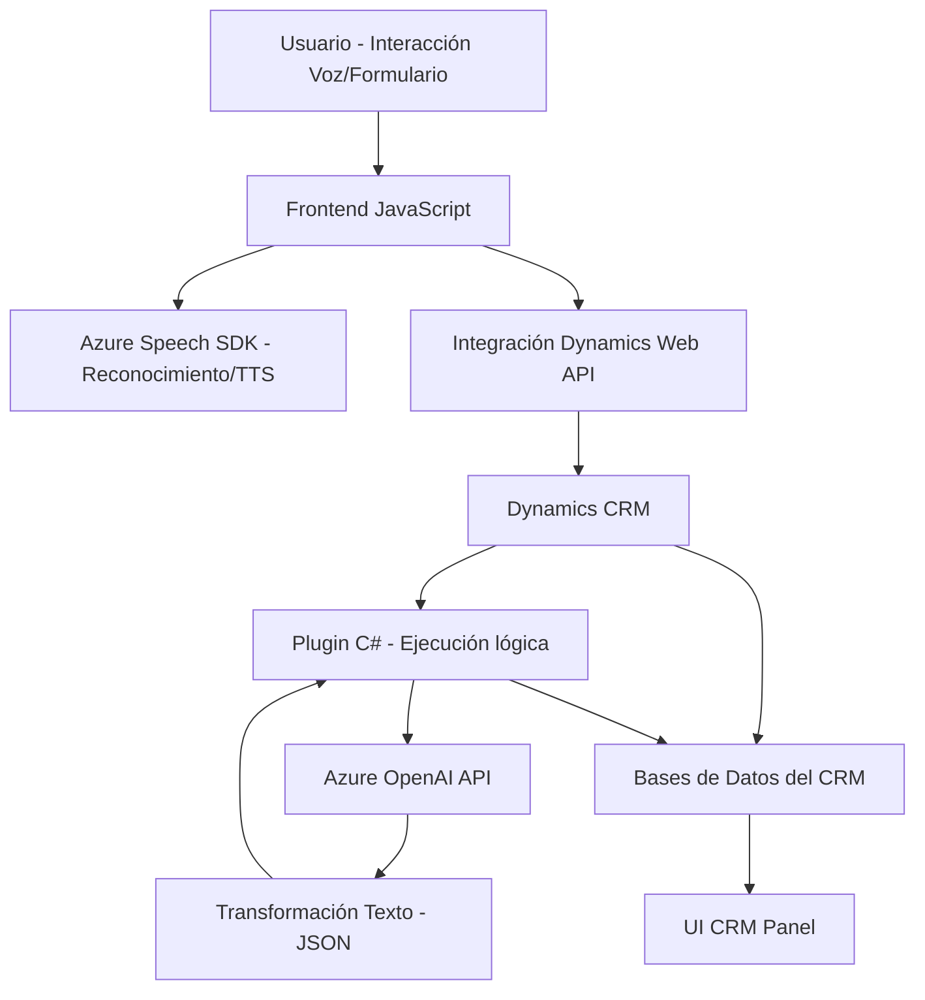

### Breve resumen técnico
El repositorio presenta una solución que integra funcionalidades de procesamiento de texto y voz mediante **Azure SDKs**, adaptadas para su uso en **Microsoft Dynamics 365 CRM**. La solución incluye un sistema de entrada y salida de voz en formularios, además de un plugin que transforma texto utilizando Azure OpenAI y devuelve datos estructurados como JSON.

---

### Descripción de arquitectura

La solución está diseñada como un sistema **modular** orientado a funciones y componentes. Posee tres capas principales:

1. **Frontend (JavaScript en Dynamics 365):**
   - Gestiona la interacción directa con los usuarios, permitiendo reconocer voz, transformar texto a voz y enviar comandos/formularios.  
   - Utiliza un patrón de **Integración de SDK** para conectar servicios como Azure Speech SDK (texto a voz / procesamiento de voz).

2. **Backend (Dynamics Plugins en C#):**
   - Implementa lógica empresarial como transformar texto mediante OpenAI y enviar datos hacia el CRM.
   - Responde a eventos personalizados a través de la arquitectura de plugin de Dynamics 365.

3. **Servicios externos (Azure APIs):**
   - **Azure Speech SDK:** Proceso de texto y voz (Texto a voz y reconocimiento automático de voz).
   - **Azure OpenAI:** Transformación de texto dinámica basada en reglas específicas.

La arquitectura general de la solución está organizada como **n capas**, donde cada capa se encarga de su rol específico (Interfaz cliente con JavaScript, lógica empresarial en Plugins de Dynamics, servicios en la nube para procesamiento avanzado).

Adicionalmente, el diseño adopta patrones como el **Patrón de Plugins**, **Integración de Servicios Externos** y **Data Mapping**, lo cual permite manejar diferentes esquemas y datos en formularios.

---

### Tecnologías usadas
#### Tecnologías Frontend:
- **JavaScript**: Para el procesamiento del formulario y su integración con Azure Speech SDK.  
- **Azure Speech SDK**: Reconocimiento de voz y síntesis de texto a audio.  
- **Dynamics 365 Web API (Xrm.WebApi)**: Para la manipulación de datos dentro del CRM y servicios personalizados.

#### Tecnologías backend:
- **C#**: Implementación del plugin en Dynamics CRM.  
- **Microsoft Dynamics CRM SDK (IPlugin)**: Para extender la funcionalidad del sistema CRM.  
- **Azure OpenAI API**: Para transformación del texto basado en IA.  
- **Dependency Injection**: Uso de servicios dentro del contexto del plugin (`IOrganizationServiceFactory`, `IOrganizationService`).  
- **System.Net.Http / Newtonsoft.Json**: Envío de solicitudes HTTP y manejo avanzado de datos JSON.

---

### Diagrama Mermaid válido para GitHub Markdown

---

### Conclusión final

La solución presentada es un caso típico de arquitectura **n capas**, centrada en la integración entre APIs de Azure y una plataforma empresarial como Dynamics 365. Este sistema distribuye adecuadamente la funcionalidad entre el frontend (interacción usuario/SDK en Dynamics CRM), el backend (plugins personalizados que encapsulan la lógica empresarial), y los servicios en la nube (Azure Speech y OpenAI API).

El uso de patrones como **plugin-based architecture**, **data mapping** y **service integration** permite mantener una separación de responsabilidades clara, que fortalece la mantenibilidad, modularidad y escalabilidad. Sin embargo, se identifican posibles áreas de mejora como el robustecimiento de la seguridad del manejo de credenciales y el tratamiento de errores en la conexión con servicios remotos.  

Esta solución encaja bien en un entorno empresarial que combine interacción directa con el usuario en un CRM y análisis avanzado/personalizado de datos.