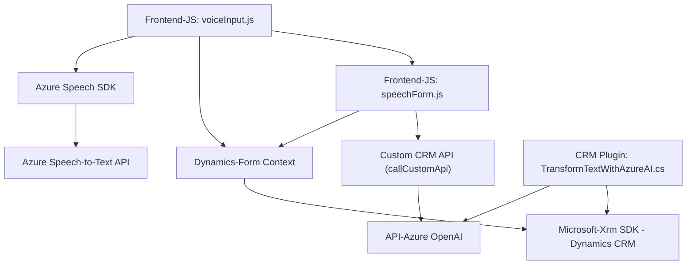

### Breve Resumen Técnico
El repositorio describe una solución que combina la funcionalidad de un **frontend** desarrollado en **JavaScript**, encargado de interactuar con formularios web y servicios de reconocimiento y síntesis de voz de Azure, y un **plugin backend** para un sistema de **Microsoft Dynamics CRM**, que utiliza la API de **Azure OpenAI** para la transformación avanzada de texto. Esto sugiere que la solución opera en un escenario híbrido, integrando frontend, APIs de terceros y plugins personalizados para un CRM.

---

### Descripción de la Arquitectura
La solución parece tener una arquitectura **n capas** que incluye las siguientes responsabilidades:
1. **Presentación (Frontend)**: Archivos JavaScript que manejan la interacción con formularios y la integración del SDK de Azure Speech para funcionalidades de reconocimiento y síntesis.
2. **Lógica de Negocio (CRM Plugin)**: Implementado como un complemento personalizado para Dynamics CRM, vinculando los formularios a la OpenAI API para procesamiento de texto.
3. **Acceso a datos**: El sistema interactúa tanto con formularios web como con el backend del CRM, y utiliza la API de Azure OpenAI como un recurso externo (semánticamente se comporta como un servicio).

En cuanto a estilos arquitectónicos, el proyecto combina **n-capas** para la organización del código y componentes con la integración de servicios basados en **API externa**, incluyendo una ligera influencia del patrón **Facade** para la adecuación y transformación de datos.

---

### Tecnologías Usadas
1. **Frontend**:
   - **JavaScript** para la programación del frontend.
   - **Azure Speech SDK** para reconocimiento y síntesis de voz.
   - **Dynamics CRM context** para interacción con formularios del CRM.
2. **Backend**:
   - **Microsoft Dynamics CRM SDK** (`IPlugin`, `IOrganizationService`) para la creación de plugins personalizados.
   - **Azure OpenAI API** (OpenAI Integration). 
   - **System.Net.Http** para llamadas HTTP hacia servicios de OpenAI.
   - **JSON Manipulation Libraries**: `System.Text.Json` y `Newtonsoft.Json.Linq`.
3. **Patrones de Diseño**:
   - Event-Driven Design (carga del SDK, callbacks).
   - Facade Pattern (abstrae las operaciones complicadas en APIs externas).
   - Plugin extensible para Dynamics CRM.

---

### Diagrama Mermaid para GitHub

---

### Conclusión Final
La solución descrita combina una fuerte integración entre un **CRM basado en Dynamics**, servicios de reconocimiento y síntesis de voz mediante **Azure Speech SDK**, y transformación avanzada de texto gracias a **Azure OpenAI API**. Esta configuración es ideal para aplicaciones empresariales orientadas a la gestión de datos mediante interfaces dinámicas que utilizan IA para enriquecer la experiencia de usuario. Sin embargo, hay áreas a mejorar, como el manejo de configuraciones sensibles (API keys) y robustez en el control de errores en llamas externas.