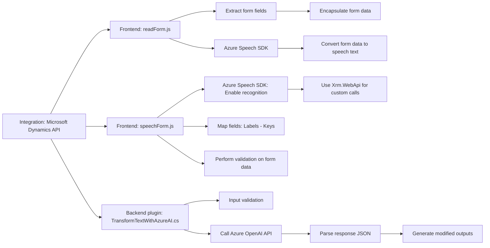

### Breve resumen técnico
La solución planteada en el repositorio integra capacidades de reconocimiento y síntesis de voz mediante servicios de Azure, y un plugin con IA que utiliza la API de Azure OpenAI en el contexto de Microsoft Dynamics CRM. Está orientada a mejorar la experiencia de usuario en formularios y optimizar la interacción mediante el uso de voz y transformación de datos.

---

### Descripción de arquitectura
La arquitectura es híbrida, con los siguientes componentes:
1. **MVC/MVP**: El lado frontend (JavaScript) organiza la funcionalidad en módulos donde se separan las tareas de control (gestión de eventos y llamadas) y visualización de datos desde/hacia formularios.
2. **Microservicios**: Uso de la API de Microsoft Dynamics y servicios de Azure (Azure Speech SDK y Azure OpenAI) para procesamiento y almacenamiento de datos. Las dependencias se cargan de manera dinámica durante la ejecución.
3. **Interfaz plugin de Dynamics CRM**: La solución despliega un plugin que opera sobre inputs y outputs de Dynamics CRM, siguiendo un patròn de tipo "dependency injection" para la interacción con servicios de la plataforma.
4. El flujo general es interactivo y asíncrono, basado en eventos disparados por interacción de usuario y respuesta de servicios en la nube.

---

### Tecnologías usadas
**Frontend**:
1. **JavaScript**:
   - Logicamente modular: con funciones específicas para tareas (síntesis de voz, reconocimiento de voz, gestión de datos).
   - Patrones de diseño: modularización, delegación de responsabilidad.
   - Usa programación asíncrona (`async/await` y callbacks).
   
2. **Azure Speech SDK**:
   - Reconocimiento de voz y síntesis.
   - URL SDK: `https://aka.ms/csspeech/jsbrowserpackageraw`.

3. **Dynamics CRM WebAPI** (`Xrm.WebApi`): 
   - Para procesamiento de datos de formularios.
   - Interacción con servicios REST del sistema.

**Servidor (Backend)**:
1. **Microsoft Dynamics SDK**:
   - Manejo de plugins utilizando `IPlugin` (detección de eventos y ejecución de lógica inyectada en CRM).
   
2. **Azure OpenAI**:
   - Consumido vía HTTP mediante `System.Net.Http` para procesamiento de texto y adaptación IA.
   
3. **Newtonsoft.Json**:
   - Para serialización y deserialización de datos estructurados response JSON.

4. **C#**:
   - Implementación del plugin, siguiendo prácticas basadas en SRP y manejo de servicios externos.

---

### Diagrama Mermaid

---

### Conclusión final
La solución presentada en el repositorio combina un enfoque moderno de desarrollo web con APIs, SDKs y capacidades de inteligencia artificial en la nube. Este es un sistema orientado a mejorar la interacción de usuarios con formularios a través de asistencia de voz y transformación inteligente basada en IA de Azure. La arquitectura evidencia patrones como **modularidad**, **event-driven programming**, **single responsibility principle (SRP)** y **microservicios**, mostrando una inclinación hacia sistemas escalables que integran servicios externos y dependencias claves como Azure Speech y OpenAI.