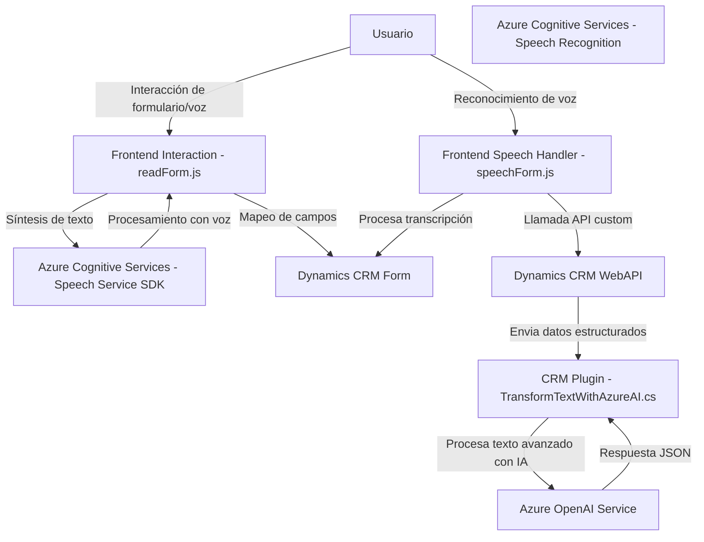

### Análisis detallado de la solución proporcionada:

---

#### **Breve resumen técnico:**

Este repositorio presenta una solución orientada a la interacción entre interfaces de usuario basadas en formularios (Frontend) y servicios de reconocimiento y procesamiento de texto o voz (Speech AI) mediante tecnologías de Azure (Azure Cognitive Services) y Microsoft Dynamics CRM. Además, incluye un componente Backend específico (a través de un plugin para Dynamics CRM).

---

#### **Descripción de arquitectura:**

La solución sigue una arquitectura **multicapa**, con una clara separación entre Frontend, la lógica de middleware, y el Backend que está acoplado a un sistema CRM (Dynamics CRM). También incluye características de integración con servicios externos, como Azure AI y Speech SDK.

1. **Frontend**: Los archivos `FrontEnd/JS/readForm.js` y `FrontEnd/JS/speechForm.js` manejan la interacción directa con el usuario (UI), donde el flujo principal es la captura de texto o voz para procesarlo con servicios externos.
   
2. **Middleware**: Algunas funciones en el Frontend actúan como intermediarios entre el usuario, el formulario, y los servicios externos. Estas funciones encapsulan las llamadas a APIs externas y el mapeo de datos del formulario a estructuras específicas (como JSON).

3. **Backend**: El archivo C# `Plugins/TransformTextWithAzureAI.cs` integra un servicio de transformación IQS hospedado en Azure mediante un plugin para Dynamics CRM. Este actuará como un backend que recibe información del frontend, realiza las transformaciones y gestiona la integración con APIs de Azure.

---

#### **Tecnologías usadas:**

1. **Frontend:**
   - **Lenguaje**: JavaScript
   - **Frameworks y SDKs**: 
      - **Azure Speech SDK** para reconocimiento y síntesis de voz.
      - **Dynamics CRM WebAPI y Xrm.WebApi.online** para interacción con los formularios del CRM.  

2. **Backend:**
   - **Lenguaje**: C#
   - **SDK y Frameworks**:
      - **Microsoft.Xrm.Sdk**: Para la interacción con Dynamics CRM.
      - **System.Net.Http**: Para realizar solicitudes a APIs.
      - **Azure OpenAI Service**: Integra el servicio GP para transformar texto en JSON.

3. **Servicios externos:**
   - **Azure Cognitive Services (Speech Service):** Para el reconocimiento y síntesis de voz en los archivos `readForm.js` y `speechForm.js`.
   - **Azure OpenAI API:** Para el procesamiento IA avanzado en el archivo `TransformTextWithAzureAI.cs`.

#### **Patrones principales:**

- **Patrón de integración con APIs externas**: La solución utiliza múltiples servicios externos (Azure Speech, Azure OpenAI, Dynamics CRM WebAPI) mediante llamadas HTTP y SDKs especializados.
- **Orquestador (Mediador)**: Los controladores frontend y el backend actúan como orquestadores para gestionar la comunicación entre el usuario final, los formularios en Dynamics CRM y las APIs externas.
- **Modularidad**: Cada funcionalidad está segregada en funciones independientes que se encargan de tareas específicas, como reconocimiento de voz, síntesis de texto o mapeo de valores.
- **Cliente-Servidor**: La solución parece ser un front-back estructurado en capas, con el frontend como punto de entrada del usuario, el middleware manejando la lógica orquestadora y el backend integrándose con CRM y servicios de IA.

---

#### **Dependencias y componentes externos:**

1. **Dependencias en Frontend**:
   - **Azure Speech SDK**: Manejo de reconocimiento y síntesis de voz.
   - **Dynamics CRM WebAPI**: Para lectura y escritura de datos en formularios y para invocar Custom APIs.

2. **Dependencias en Backend**:
   - **Microsoft Dynamics CRM SDK**: Asistencia en operaciones de plugins dentro del ecosistema CRM.
   - **Azure OpenAI API**: Para procesamiento de texto por IA.
   - **System.Net.Http**: Para realizar llamadas HTTP al servicio OpenAI.
   - **System.Text.Json / Newtonsoft.Json.Linq**: Para el manejo de JSON en la comunicación con OpenAI.

---

#### **Diagrama Mermaid válido para GitHub:**

---

#### **Conclusión final:**
La solución descrita representa una arquitectura **multicapa al estilo cliente-servidor**, con evidentes características de integración con servicios externos como API de Azure Speech y OpenAI, además de la interacción con Dynamics CRM (Frontend y Backend). La lógica en JavaScript está bien segmentada, funcional y orientada a interactuar con el usuario. Por otro lado, la arquitectura del plugin C# está claramente diseñada para procesar la entrada y comunicarla con Azure OpenAI. En general, la implementación sigue patrones sólidos y se adapta a los requisitos del dominio.