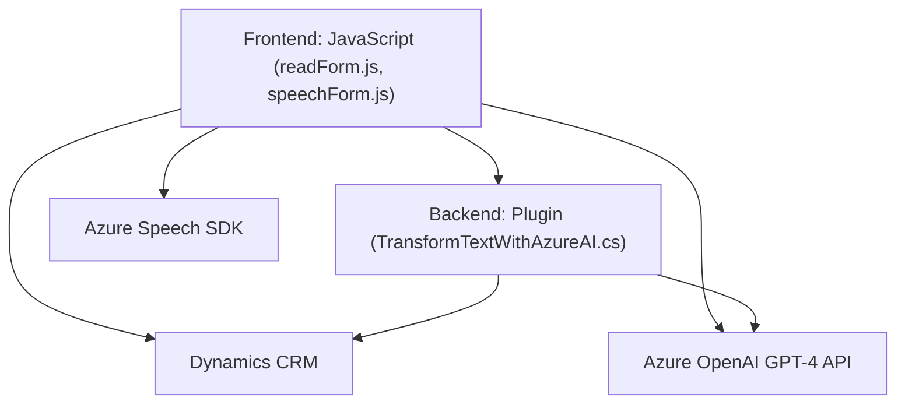

### Resumen técnico
La solución presentada combina aspectos **frontend (JavaScript)** y **backend (.NET)** con integración a servicios de **Microsoft Azure**, específicamente el **Speech SDK** y **Azure OpenAI**, para tratar formularios dinámicos en entornos **Dynamics CRM**. Está diseñada para recibir datos de formularios, transformarlos, y procesarlos mediante reconocimiento de voz y modelos de IA.

---

### Descripción de arquitectura
La arquitectura sigue un patrón **modular orientado a eventos**, dividido en dos principales capas funcionales:
- **Frontend**: La interfaz del usuario escrita en JavaScript con funciones que interactúan con formularios y el Speech SDK para el reconocimiento y síntesis de voz.
- **Backend**: Implementado como un plugin en Dynamics CRM utilizando C#, procesando datos textual con la ayuda de Azure OpenAI GPT-4.

La solución utiliza una **arquitectura de integración** con servicios externos (Azure Speech SDK y OpenAI), indicando principios de **Service-Oriented Architecture (SOA)**. Está estructurada en una capa de presentación (frontend) y una capa de negocio (backend). No se identifica como una arquitectura estrictamente monolítica ni totalmente desacoplada como sería el caso de microservicios o hexagonal por su dependencia directa entre el frontend y Dynamics CRM.

---

### Tecnologías usadas
1. **Frontend (JavaScript)**:
   - Entorno de ejecución en el navegador.
   - **Azure Speech SDK** para síntesis de texto y reconocimiento de voz.
   - Dynamics CRM context (`Xrm.WebApi`), que permite manipular formularios y hacer llamadas a APIs de Dynamics.
   - Promesas (`Promise`) y funciones asíncronas para manejar datos de forma no bloqueante.

2. **Backend (.NET)**:
   - Lenguaje **C#**.
   - **Microsoft.Xrm.Sdk** para el plugin de Dynamics CRM.
   - **Azure OpenAI GPT-4** para transformar contenido de texto de entrada basado en reglas definidas.
   - Librerías estándar como `System.Text.Json` y `Newtonsoft.Json.Linq` para manipulación de JSON.
   - Uso de patrones como cliente HTTP para integración con servicios remotos.

3. **Microsoft Azure**:
   - **Azure Speech SDK**: Servicios de texto a voz y reconocimiento de voz.
   - **Azure OpenAI GPT-4**: Utilizado para procesar texto.

4. **Patrones presentes**:
   - **SRP (Principio de Responsabilidad Única)**: Cada función tiene una tarea específica.
   - **SOA**: Comunicación entre frontend y servicios externos como el SDK y la API GPT.
   - **Plugin Pattern**: En el backend, para añadir funcionalidad específica al entorno Dynamics CRM.

---

### Dependencias o componentes externos
1. **Azure Speech SDK**:
   - Funciona como librería externa para habilitar la síntesis de voz y el reconocimiento de voz.
   - Carga dinámica desde URL remota.

2. **Azure OpenAI**:
   - API de procesamiento de texto basada en inteligencia artificial, utilizada en el plugin.

3. **Dynamics CRM API**:
   - `Xrm.WebApi` para el acceso al contexto de formularios y datos CRM, manejado principalmente en el frontend.
   - `Microsoft.Xrm.Sdk` para construir plugins en C#.

4. **JavaScript**:
   - Lo más probable es que se desarrolle utilizando un framework o librerías adicionales, aunque no están especificadas directamente en el ejemplo.

5. **Bibliotecas estándar**:
   - **Newtonsoft.Json** para manejo de JSON.
   - **System.Net.Http** para llamadas HTTP a servicios web.
   - **System.Text** para trabajar con cadenas de texto en C#.
   
---

### Diagrama **Mermaid** válido para GitHub

---

### Conclusión final
La solución presentada utiliza un enfoque **modular y orientado a eventos** para processar formularios con apoyo de tecnologías en la nube de **Microsoft Azure**. Combina procesamiento de voz y contenido textual mediante reconocimiento de voz y modelos de inteligencia artificial. Su arquitectura es parcialmente modular con componentes tanto en el **frontend** como en el **backend**, y se integra con servicios de Dynamics CRM para permitir manipulación avanzada de formularios en este entorno.

Este diseño es una solución adecuada para sistemas que necesiten integrar funcionalidades de síntesis y reconocimiento de voz, así como capacidades de procesamiento textual utilizando IA en el contexto de formularios dinámicos. Sin embargo, un enfoque completamente desacoplado a nivel de microservicios podría ofrecer mayor extensibilidad para aplicaciones más complejas.