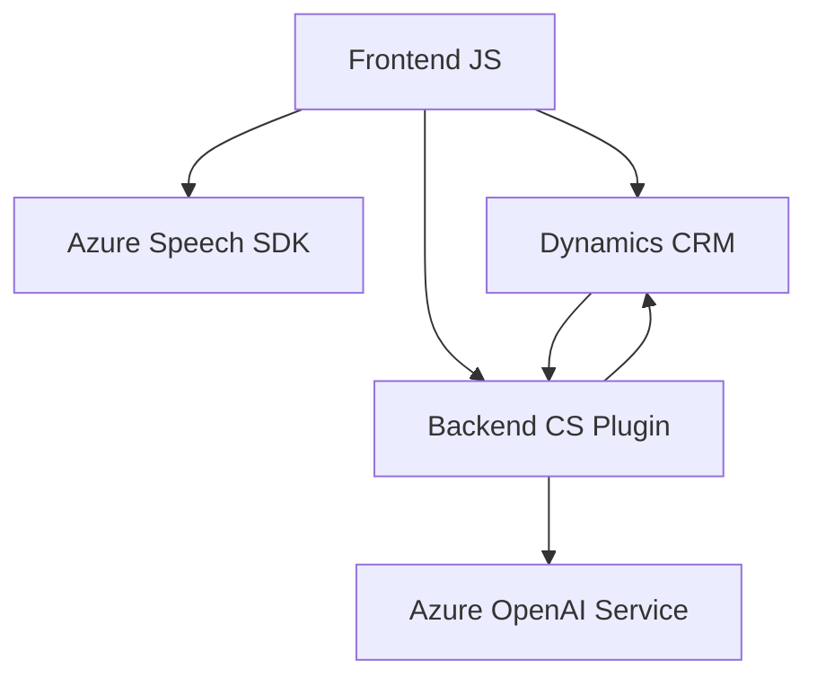

### Breve Resumen Técnico
El repositorio está diseñado como parte de un conjunto de servicios enfocados en integrar tecnologías de inteligencia artificial, servicios de voz y gestión de datos en Dynamics CRM. Los archivos muestran la interacción con Azure Speech SDK y Azure OpenAI, lo que permite sintetizar texto, procesar transcripciones y transformar datos. La solución expande la funcionalidad de formularios y plugins en Dynamics CRM mediante modularización y comunicación asincrónica con APIs externas.

---

### Descripción de Arquitectura
El sistema implementa una **arquitectura modular en múltiples capas**, con una combinación de patrones monolíticos para el Dynamics CRM (usando plugins) y funcionalidades distribuidas mediante servicios como Azure Speech SDK y Azure OpenAI. Está estructurado en 3 partes principales:
1. **Frontend (JavaScript):** Gestión de la entrada y salida de voz, procesamiento de datos del formulario y transcripciones utilizando Speech SDK.
2. **Backend (Dynamics CRM Plugins):** Lógica para transformar y estructurar datos mediante Azure OpenAI a través de plugins .NET.
3. **Integración Externa:** Comunicación asincrónica con APIs de Azure (Speech y OpenAI).

La solución puede considerarse una **arquitectura híbrida**, con procesos distribuidos para la interacción con servicios en la nube y una estructura monolítica para el resto de la aplicación.

---

### Tecnologías usadas
1. **Lenguajes de programación:** JavaScript (frontend), C# (backend).
2. **Bibliotecas y SDKs:**
   - Microsoft Azure Speech SDK.
   - Microsoft Dynamics CRM SDK (`Xrm.WebApi`, `IPlugin`).
   - API de Azure OpenAI.
3. **Framework de Desarrollo:** Dynamics CRM extensibilidad estándar (`IPlugin` y llamada a APIs).
4. **Patrones:**
   - Cargador dinámico de SDK.
   - Modularización de lógica CSSpeech en el frontend.
   - Proveedor de servicios (Dependency Injection con `IServiceProvider` en plugins).
   - Adaptadores para transformar datos del formulario en objetos más precisos.
5. **Servicios externos:** Azure Speech Service, Azure OpenAI Service.

---

### Diagrama Mermaid (100% compatible con GitHub Markdown)

---

### Conclusión Final
La solución presentada implementa un sistema que integra la interacción con servicios de voz y transformación de texto mediante inteligencia artificial para formularios dinámicos en Dynamics CRM. La elección de tecnologías como Azure Speech SDK y OpenAI junto con los elementos nativos del CRM como plugins y APIs asegura una integración sólida con capacidades avanzadas. Aunque utiliza un enfoque de arquitectura híbrida, el diseño sigue una estructura limpia con modularización y patrones como adaptadores y una separación de responsabilidades acorde. Con esta solución, se mejoran considerablemente las capacidades del CRM en términos de accesibilidad y manejo inteligente de datos.