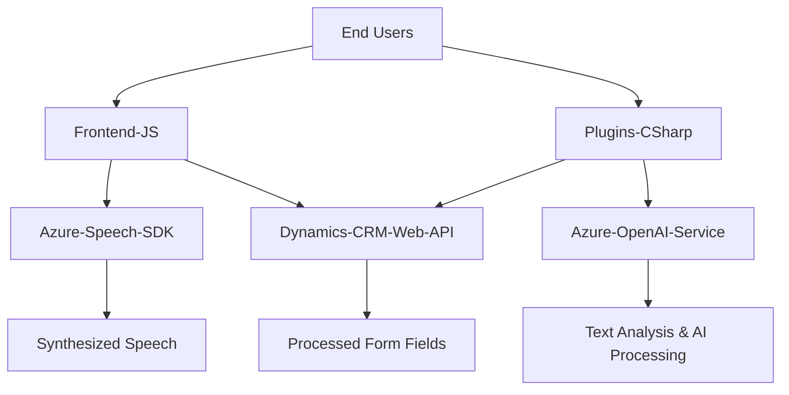

### **Análisis Técnico del Repositorio**

#### **Breve Resumen Técnico**
El repositorio parece estar orientado a la integración de servicios de voz y procesamiento de texto en un entorno Dynamics CRM. Incluye una combinación de frontend en JavaScript y backend basado en plugins C#, lo que sugiere una arquitectura híbrida con alto grado de integración entre sistemas.

---

### **Descripción de Arquitectura**

1. **Tipo de Solución**: Esta solución integra múltiples tecnologías para realizar reconocimiento de voz (Speech-to-Text), síntesis de voz (Text-to-Speech) y procesamiento avanzado mediante Inteligencia Artificial (Azure OpenAI). Es una solución que funciona como una extensión para Dynamics CRM, facilitando funcionalidades avanzadas en formularios y plugins personalizados.

2. **Patrones de Arquitectura Identificados**:
   - **Capas Múltiples**: La solución está organizada en capas:
     - **Frontend**: Procesa datos de formularios mediante JavaScript y coordina la interacción con Azure Speech SDK.
     - **Backend**: Plugins implementados en C# para manejar transformaciones de texto a través de Azure OpenAI y manipulación de datos dentro de Dynamics CRM.
   - **Integración de Servicios Externos**: Uso intensivo de SDKs de Azure Speech y Azure OpenAI para amplificar las capacidades del sistema.
   - **Plugin-Based Architecture**: Uso de la interfaz `IPlugin` para interactuar con Dynamics CRM, adheriéndose al patrón de extensibilidad.
   - **Responsabilidad Única**: Cada archivo y función tiene objetivos claramente definidos que apuntan a una arquitectura modular y escalable.

3. **Tipo de Arquitectura**: 
   - En general, la solución utiliza una **arquitectura de capas**:
     - Capa de Presentación (Frontend JS).
     - Capa de Lógica (Plugins en C#).
     - Capa de datos (Dynamics CRM).
   - Es también un ejemplo de **integración con servicios de terceros**, como Azure Speech SDK y Azure OpenAI.
   - Los módulos presentan un enfoque **modular y orientado a servicios**.

---

### **Tecnologías Usadas**
1. **Frontend**:
   - **JavaScript DOM API**: Para manipulación de formularios, datos y carga dinámica de scripts.
   - **Azure Speech SDK**: Para reconocimiento de voz (Speech-to-Text) y síntesis de voz (Text-to-Speech).
   - Posible uso del sistema Dynamics CRM como entorno de ejecución con capacidades extendidas mediante funciones JavaScript conectadas a formularios.

2. **Backend**:
   - **C#**: Lenguaje base para implementar plugins que amplían la funcionalidad de Dynamics CRM.
   - **Microsoft.Xrm.Sdk**: Framework para implementar y manipular plugins en el entorno de Dynamics CRM.
   - **Azure OpenAI Service**: Integración con el modelo GPT (potencialmente GPT-4) para procesamiento de texto.
   - **System.Net.Http** y **Newtonsoft.Json**: Para consumo de APIs REST y manejo de datos JSON.

3. **Dependencias Externas**:
   - SDKs de Azure Speech y OpenAI para interacción con los servicios cognitivos.
   - Dynamics CRM Web API para manipulación de datos CRM.

---

### **Dependencias Externas Presentes**
- **Azure Speech SDK**: Manejo de síntesis y reconocimiento de voz.
- **Azure OpenAI**: Uso de modelos de lenguaje para procesar datos y aplicarlos a formularios.
- **Dynamics CRM Web API**: Manipulación directa de datos CRM, como actualizaciones o búsquedas.

---

### **Mermaid Diagram**

---

### **Conclusión Final**
El repositorio implementa funcionalidades avanzadas en un sistema Dynamics CRM utilizando una arquitectura de múltiples capas con integración exhaustiva de servicios externos. La solución se concentra en el procesamiento de voz y texto mediante Azure Speech SDK y Azure OpenAI. Esto permite que los usuarios interactúen con el sistema CRM de manera más eficiente, ampliando la experiencia de usuario mediante características como entrada de voz, síntesis de voz y procesamiento de datos con Inteligencia Artificial.

La estructura es modular, reutilizable y escalable, pero podría mejorarse en términos de eficiencia, especialmente en la gestión de dependencias como `Microsoft.SqlServer.Server` en el backend. Esto demuestra un enfoque bien pensado para soluciones empresariales.