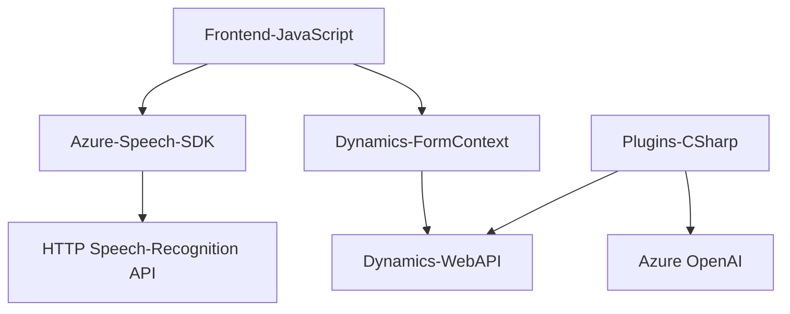

### Breve Resumen Técnico

El repositorio presenta una solución híbrida que integra una interfaz orientada a la interacción con formularios (Frontend), servicios de reconocimiento y síntesis de voz (Azure Speech SDK), lógica de negocio basada en plugins (Dynamics 365), y servicios de inteligencia artificial (Azure OpenAI). La solución está diseñada para flujos empresariales, particularmente en entornos de Dynamics CRM.

---

### Descripción de Arquitectura

La arquitectura de la solución es **modular y orientada a servicios (SOA)**. Combina un frontend con lógica de negocio distribuida (plugins de Dynamics CRM), y componentes que integran APIs y servicios externos. Aunque utiliza elementos centralizados (Dynamics CRM como plataforma base), se conecta con servicios desacoplados en la nube (Azure Speech SDK y Azure OpenAI).

La solución parece basarse en las siguientes capas:
1. **Frontend y cliente (JavaScript):** Recopila datos, habilita reconocimiento de voz y sintetiza audio.
2. **Lógica de negocio (Dynamics CRM plugins):** Procesa datos específicos y genera respuestas basadas en IA.
3. **Servicios Externos:** Azure Speech SDK y Azure OpenAI para reconocimiento de voz, síntesis de texto a voz y procesamiento de texto.

Patrones de diseño:
- **Callback y Promesas:** Gestión de flujos asincrónicos en el frontend mientras asegura la disponibilidad del SDK.
- **DTO (Data Transfer Object):** Uso de estructuras legibles y JSON para transportar datos entre capas.
- **Plugin Architecture:** Extensiones específicas en Dynamics CRM para lógica empresarial personalizada.

---

### Tecnologías Usadas

1. **Frontend:**
   - **JavaScript:** Gestión de funcionalidades del navegador.
   - **Azure Speech SDK:** Reconocimiento y síntesis de voz.
   - **Dynamics CRM API:** Interacción directa con objetos de formulario y API personalizada.

2. **Backend (Plugins):**
   - **Azure OpenAI REST API:** Procesamiento de texto con IA en la nube.
   - **Dynamics CRM Plugins (C#):** Extensiones que interactúan con los servicios externos.

3. **Comunicación:**
   - **HTTP client libraries:** Para consumir APIs externas como Azure OpenAI.

---

### Diagrama Mermaid

---

### Conclusión Final

La solución combina funcionalidades avanzadas de frontend con una integración de servicios en la nube y lógica empresarial robusta mediante plugins. La arquitectura modular permite responder fácilmente a los requerimientos de la organización, siendo flexible al consumir servicios externos (Azure Speech, Azure OpenAI) y utilizar barreras de integración con una plataforma empresarial como Dynamics CRM. La elección de tecnologías y patrones garantiza un alto grado de cohesión y bajo acoplamiento, ideal para entornos empresariales dinámicos.