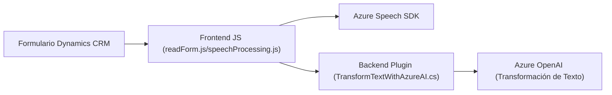

### Breve Resumen Técnico
El conjunto de archivos descritos en el repositorio muestra una solución orientada a la integración de formularios y servicios en la nube (Azure Speech SDK y Azure OpenAI). La principal funcionalidad consiste en manipular formularios (lectura, modificación y sistetización en voz) usando el SDK de Azure Speech y plugins de Dynamics CRM. Adicionalmente, interactúa con IA de Azure OpenAI para realizar transformaciones avanzadas de texto.

---

### Descripción de Arquitectura
La arquitectura de esta solución es **modular en capas**:
1. **Frontend (JavaScript)**: Interactúa con formularios y el SDK de Azure Speech, divide las responsabilidades en funciones específicas para lectura de datos, síntesis de texto a voz y reconocimiento de voz.
2. **Backend (Dynamics Plugins)**: Extiende la lógica de negocio de Dynamics CRM mediante el plugin `TransformTextWithAzureAI`, integrándose con servicios de IA para transformar texto.
3. **Integración Cloud (Azure Speech SDK/OpenAI)**: La lógica está distribuida entre el frontend y backend, utilizando servicios en la nube para la síntesis de voz y transformación de texto.

El diseño separa tareas principales (frontend de interacción y backend de operaciones integradas) y emplea patrones como **Facade Pattern** para un punto central de entrada en procesos complejos.

---

### Tecnologías Usadas
1. **Frontend**:
   - Programación: JavaScript.
   - Framework o Entorno: Dynamics CRM Form Context.
   - Azure Speech SDK (JavaScript SDK para servicios cloud de voz).

2. **Backend**:
   - Lenguaje: C# (plugin para Dynamics CRM).
   - Framework: .NET Framework para desarrollo de plugins.
   - Integración con **Dynamics CRM Web API** y **Azure OpenAI** mediante HttpClient.

3. **Patrones**:
   - **Modular Architecture**: Separación de responsabilidades por funciones específicas.
   - **Facade Pattern**: Centraliza procesos complejos a través de puntos de entrada como `startVoiceInput` o el `Execute` del plugin.
   - **Interfaz Plugin de Dynamics CRM**: Extiende la lógica de negocio dentro del entorno Dynamics.

---

### Dependencias Externas
1. **Azure Speech SDK**: Para reconocimiento y síntesis de voz en la nube.
2. **Azure OpenAI**: Transformación de datos en texto usando IA en el plugin del backend.
3. **Microsoft Dynamics CRM**:
   - Web API para interactuar con formularios y modificar campos.
   - Sistema de plugins para ejecutar lógica personalizada.
4. **Librerías en C#**:
   - `System.Net.Http` y `Newtonsoft.Json` para las interacciones con servicios externos.
5. Formulario **Xrm.FormContext** y campos como elementos clave en la interacción tanto del frontend como del backend.

---

### Diagrama Mermaid
Este diagrama describe el flujo de interacciones entre componentes.

---

### Conclusión Final
La solución implementada es una **aplicación integrada en Dynamics CRM** que utiliza servicios de nube (Azure Speech y OpenAI) para mejorar la interacción con formularios. Posee una arquitectura modular basada en capas:
- **Frontend**: Manipula formularios y comunica resultados al backend.
- **Backend**: Extiende la lógica de Dynamics CRM mediante interfaces de plugins y APIs externas.

Los patrones de diseño implementados aseguran claridad y separación de responsabilidades. La integración con servicios externos hace de esta solución escalable y centrada en mejorar la experiencia de usuario mediante IA y síntesis de voz.