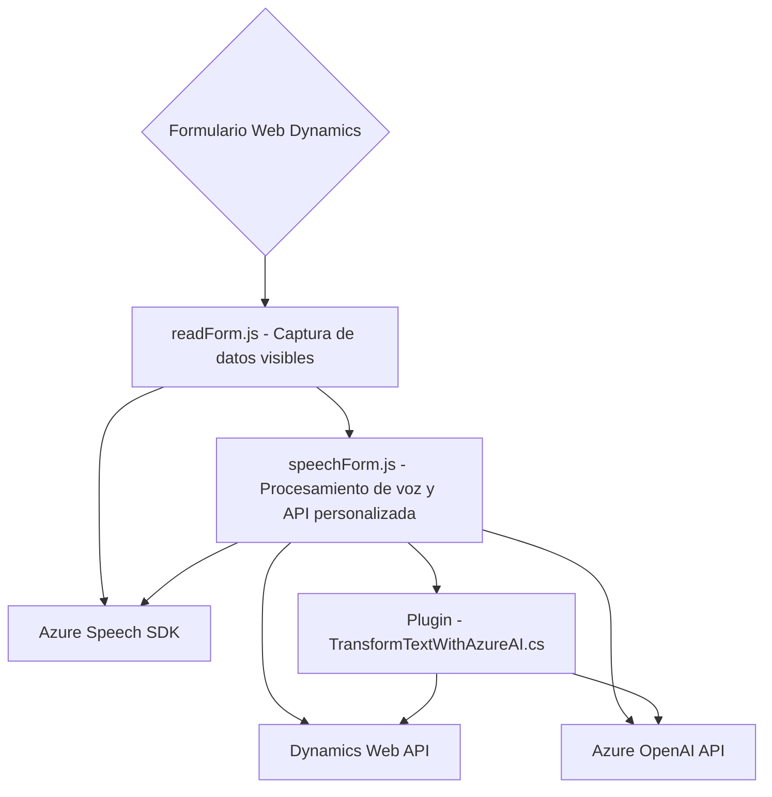

# Breve resumen técnico
El repositorio describe tres archivos enfocados en la integración entre un frontend basado en formularios web y servicios externos de inteligencia artificial proporcionados por Azure OpenAI y Azure Speech SDK, además de un plugin de Dynamics CRM. La solución está diseñada para operar como parte de una plataforma de aplicaciones empresariales (Dynamics 365) que incorpora funcionalidades avanzadas como reconocimiento de voz, síntesis de texto y ejecución de transformaciones mediante servicios en la nube.

---

# Descripción de arquitectura
La solución utiliza una arquitectura híbrida basada en principios de **n capas** y **integración con microservicios externos**:
1. El **frontend** (archivos `readForm.js` y `speechForm.js`) contiene la lógica para interactuar con los formularios en Dynamics 365, habilitando el reconocimiento de voz y la automatización de datos.
2. El **middleware/plugin** (`TransformTextWithAzureAI.cs`) implementa un patrón basado en extensibilidad de Dynamics CRM para llamar a la API de Azure OpenAI.
3. **Servicios externos** (Azure Speech SDK y Azure OpenAI API) son empleados para tareas específicas como reconocimiento de voz y procesamiento de texto, respetando patrones de descomposición de dominios y delegación de lógica especializada.

Este diseño refleja una arquitectura orientada a servicios (SOA) con una implementación modular, escalable y extensible.

---

# Tecnologías usadas
1. **Frontend web**:
   - **JavaScript**: Lógica principal para interactuar con formularios y SDKs.
   - **Azure Speech SDK**: Reconocimiento de voz y síntesis de texto a voz.
   - **Dynamics Web API**: Manipulación de datos en formularios y entidades.

2. **Plugin (backend)**:
   - **C#**: Desarrollo del plugin para eventos en Dynamics 365.
   - **Microsoft Dynamics CRM SDK**: Extensión nativa de Dynamics CRM para plugins.
   - **Azure OpenAI API**: Interfaz para modelos de procesamiento de lenguaje como GPT.
   - **Newtonsoft.Json** y **System.Text.Json**: Serialización/deserialización JSON.
   - **System.Net.Http**: Realización de llamadas HTTP.

3. **Servicios externos**:
   - **Azure Speech SDK**: Reconocimiento y síntesis de voz.
   - **Azure OpenAI API**: Modelo de lenguaje GPT para transformaciones de texto.

4. **Patrones aplicados**:
   - **Plugin Pattern**: Extensibilidad en Dynamics CRM mediante la interfaz `IPlugin`.
   - **Delegación lógica**: División clara de responsabilidades en funciones.
   - **Integración de servicios externos**: Consumo de APIs basadas en REST para procesamiento de datos.

---

# Diagrama Mermaid válido para GitHub

---

# Conclusión final
La solución presenta una integración sólida entre un frontend orientado a formularios, un backend basado en el plugin de Dynamics CRM y servicios en la nube. Con un diseño modular y orientado a servicios, este repositorio destaca por su capacidad de combinar múltiples tecnologías, como Azure Speech SDK y OpenAI API, para crear una experiencia enriquecida en la captura y procesamiento de datos. La arquitectura híbrida n capas respalda la integración empresarial, siendo flexible y escalable.