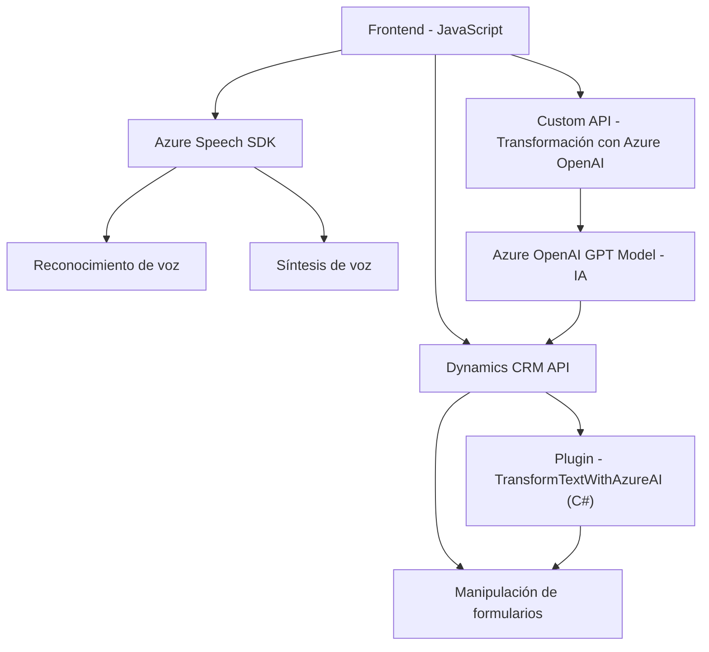

## Breve resumen técnico

El repositorio que compartiste parece estar diseñado para integrar funcionalidades avanzadas basadas en la inteligencia artificial y el reconocimiento de voz dentro del ecosistema de Microsoft Dynamics CRM. Está compuesto por módulos frontend en JavaScript que interactúan con Dynamics CRM, Azure Speech SDK, y una API personalizada desarrollada en C#. Específicamente, implementa funcionalidades para entrada y procesamiento de voz, transformación de texto mediante IA, y la actualización dinámica de los campos del formulario en la plataforma CRM.

## Descripción de arquitectura

Este sistema se configura como una solución híbrida con componentes **event-driven** y arquitectura en **n capas**. Está compuesto por:

1. **Frontend dinámico en JavaScript**: Funciona directamente en la interfaz de Dynamics CRM y realiza tareas de reconocimiento de voz y manipulación de formularios.
2. **Backend con plugins de Dynamics CRM**: Actúan como intermediarios entre Dynamics CRM y Azure OpenAI propietarios.
3. **Dependencias externas**: Azure Speech SDK y Azure OpenAI API (modelo GPT), que son servicios cognitivos complementarios.
4. **Patrón plugin en CRM**: Se integra con Dynamics CRM mediante plugins que procesan el flujo de datos en tiempo real.
5. **Interoperabilidad**: Utiliza APIs personalizadas (Custom API) dentro del propio ecosistema CRM para manejar transcripciones avanzadas procesadas con IA.

### Componentes clave de la arquitectura

- **Lógica modular**: En todos los archivos, cada función está altamente especializada en abordar una tarea concreta (e.g., recopilación de datos visibles, manejo del SDK de Azure Speech, transformación mediante OpenAI, etc.).
- **Integración dinámica**: Uso de dependencias externas como el SDK y la API de Azure.
- **Ejecución distribuida**: Procesos frontend y backend que cooperan para entregar el resultado final de entrada y procesamiento de datos.

---

## Tecnologías usadas

1. **Frontend**:
   - **JavaScript puro** (sin frameworks específicos mencionados).
   - **Azure Speech SDK**: Análisis y síntesis de voz.
   - Integración con Dynamics CRM.

2. **Backend**:
   - **C#** con Dynamics CRM SDK para desarrollo de plugins.
   - Comunicación HTTP hacia APIs externas (Azure OpenAI).
   - **Newtonsoft.Json** y **System.Text.Json**: Para manejo de respuestas y estructuras JSON.

3. **Servicios externos**:
   - **Azure OpenAI GPT Model**: Transformación de texto según contexto especificado.
   - **Azure Speech SDK**: Reconocimiento y síntesis de voz.

---

## Diagrama Mermaid válido para GitHub

---

## Conclusión final

El repositorio se alinea con una arquitectura basada en capas adaptadas al ecosistema Dynamics CRM. Combina funcionalidad avanzada de reconocimiento de voz, procesamiento de transcripciones con IA, y una integración estrecha entre frontend y backend. Los patrones de diseño se adhieren a una lógica modular y un flujo bien estructurado de interacción entre la interfaz de CRM, Azure Speech SDK, y Azure OpenAI. Aunque la arquitectura es flexible y extendible, hay áreas que podrían mejorarse, como la parametrización de credenciales y configuraciones sensibles para garantizar seguridad en entornos de producción.